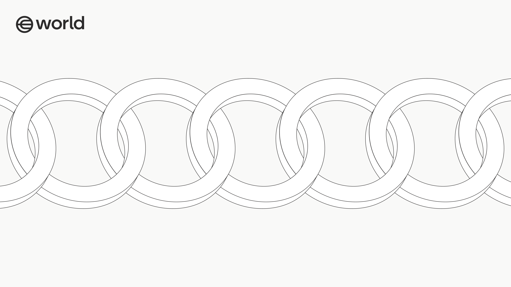

  

# World Chain

World Chain is a blockchain designed for humans. Built on the [OP Stack](https://stack.optimism.io/) and powered by [reth](https://github.com/paradigmxyz/reth), World Chain prioritizes scalability and accessibility for real users, providing the rails for a frictionless onchain UX. 

See the [Development Guide](specs/development.md), and the [Specs](specs/overview.md) for documentation on the protocol.

## License

This project is licensed under the MIT License - see the [LICENSE](LICENSE) file for details.
