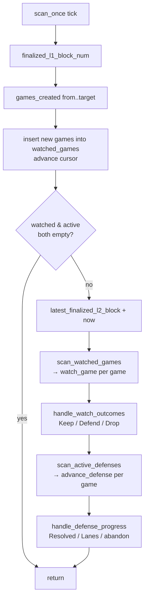
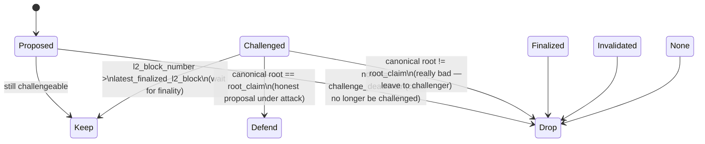
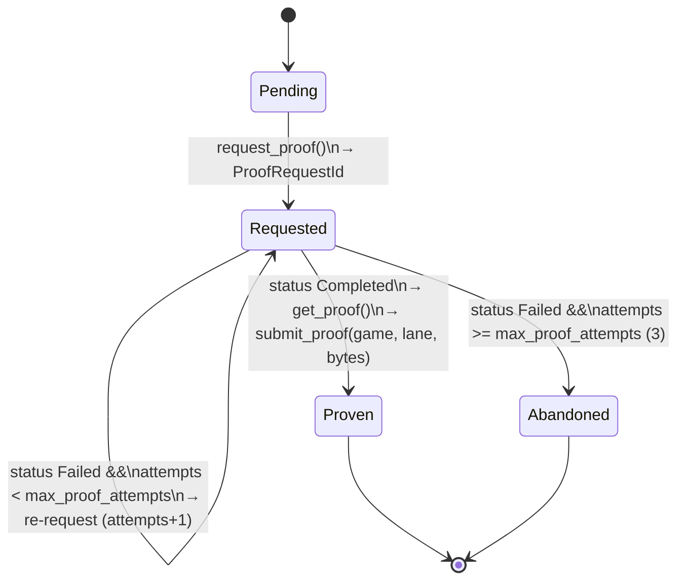

# World Chain Defender — End-to-End Flow

> Crate: `proofs/defender` (`world-chain-defender`)
> Entry point: `WorldChainDefender::run_forever` (`src/defender.rs:374`)

The **defender** is the actor that rescues *honest* output proposals that have
been challenged. It watches dispute games on L1, and when it finds a
**challenged game whose root claim is actually correct**, it requests validity
proofs from the `prover-service` and submits them on-chain to defend the game.

It is the mirror image of the **challenger**:

| Actor | Acts on a game whose root claim is… | Action |
|-------|-------------------------------------|--------|
| Challenger | **wrong** | `challenge()` with a bond |
| Defender | **correct but challenged** | prove validity → `submitProofLane()` |

---

## 1. Where the defender sits

```
                          ┌────────────────────────────────────────┐
                          │                  L1                     │
                          │  WorldChainProofSystemFactory / Game    │
                          └───────▲───────────────┬─────────────────┘
              GameCreated /       │               │  submitProofLane(lane, proof)
              state() / proofBitmap()             │
                                  │               │
                          ┌───────┴───────────────┴─────────────────┐
                          │            WorldChainDefender            │
                          │  watched_games  ──►  active_defenses     │
                          └───────┬───────────────────────┬─────────┘
        output_root_at_block()    │                       │  request_proof / proof_status / get_proof
                                  ▼                       ▼
                    ┌───────────────────────┐   ┌───────────────────────┐
                    │   ConsensusProvider    │   │     prover-service     │
                    │ (canonical L2 roots)   │   │  sp1_queue/nitro_queue │
                    └───────────────────────┘   └───────────┬───────────┘
                                                            │ getNextProof / submitProof
                                                            ▼
                                                  ┌───────────────────────┐
                                                  │  sp1-worker / (nitro)  │
                                                  │  generates the proof   │
                                                  └───────────────────────┘
```

The defender is generic over three collaborators (`src/defender.rs:32`):

| Type param | Trait | Responsibility |
|------------|-------|----------------|
| `E` | `DefenderClient` (`src/traits.rs:7`) | L1 contract reads/writes: `root_state`, `games_created`, `challenge_deadline`, `proof_bitmap`, `submit_proof` |
| `C` | `ConsensusProvider` | Canonical output root (ground truth) at a given L2 block |
| `P` | `ProofRequester` | prover-service client: `request_proof`, `proof_status`, `get_proof` |

---

## 2. The two-phase lifecycle

Every game moves through two in-memory maps (`src/defender.rs:38-39`):

```
                 GameCreated event
                        │
                        ▼
              ┌──────────────────┐     root invalid / deadline passed / terminal
              │  watched_games   │ ───────────────────────────────────────────────► DROP
              │ (WatchedGame)    │
              └────────┬─────────┘
                       │  state == Challenged
                       │  AND canonical root == root_claim   (WatchOutcome::Defend)
                       ▼
              ┌──────────────────┐     all lanes Proven  ──► defense complete
              │ active_defenses  │     game left Challenged ► resolved
              │ (ActiveDefense)  │     all lanes terminal  ─► abandoned
              └──────────────────┘
```

- **`watched_games`** — games seen but not yet actionable (still `Proposed`, or
  `Challenged` but L2 not yet finalized).
- **`active_defenses`** — games confirmed valid-but-challenged, now being proven
  lane-by-lane.

---

## 3. The main tick — `scan_once` (`src/defender.rs:328`)

Driven by `run_forever` on `config.poll_interval` (default **1 minute**,
`src/config.rs`). Each tick runs three stages:



**Stage 1 — Discover (`:329-354`):** read finalized L1 head; on first run scan
back `ONE_DAY_OF_L1_BLOCKS + MARGIN` (≈7,700 blocks, `:20-22`), otherwise from
the saved `cursor`. `games_created(from, target)` reads `GameCreated` events
(`src/alloy.rs:60`). New games go into `watched_games`; the cursor advances.

**Stage 2 — Watch (`:131-174`):** evaluate each watched game concurrently (up
to `max_game_concurrency`, default 10) and apply the outcome.

**Stage 3 — Defend (`:286-326`):** advance each active defense's proof lanes.

---

## 4. The watch decision — `watch_game` (`src/defender.rs:84`)

Reads the on-chain `root_state(game)` and returns `Keep` / `Defend` / `Drop`:



Key safety rule: a `Challenged` game is **only judged against finalized L2
state** (`:108`). The canonical root comes from
`consensus_provider.output_root_at_block` (`:113`).

A `Defend` outcome promotes the game from `watched_games` into a fresh
`ActiveDefense` (`:158`).

---

## 5. Defending a game — `advance_defense` (`src/defender.rs:261`)

A defense submits **two** proofs, one per lane (`src/types.rs:17`):

```
DEFENDED_LANES = [
    (ProofLane::ValidityProof, ProofBackend::Sp1),    // lane bit 0
    (ProofLane::TeeAttestation, ProofBackend::Nitro),  // lane bit 1
]
```

Each tick, for each active defense:

1. Re-check the game is still `Challenged`; if not → `Resolved`, close it (`:267`).
2. Read the on-chain `proof_bitmap` (`:270`).
3. For each lane:
   - If the bitmap already has the lane's bit set (proven by anyone) → mark
     `Proven`, skip (`:275`).
   - Otherwise advance the lane's state machine (`advance_lane`).

---

## 6. The per-lane state machine — `advance_lane` (`src/defender.rs:176`)

This is the request → poll → submit loop. One transition per tick:



The `ProofRequest` (`src/defender.rs:388`):

```rust
ProofRequest {
    backend,                                   // Sp1 or Nitro (per lane)
    game:            game_created.game,
    root_claim:      game_created.root_claim,
    l2_block_number: game_created.l2_block_number,
    l1_head:         game_created.l1_origin_hash, // L1 origin pinned at proposal time
}
```

`l1_head` is pinned to the proposal-time L1 origin so the request's
deterministic `id()` is **stable across defender restarts** and dedupes against
an already-queued job in the prover-service.

---

## 7. The SP1 worker — how the proof actually gets generated

When the defender calls `request_proof` for the SP1 lane, **nothing in the
defender or the prover-service generates a proof**. The request is just
enqueued. The `prover-service` is a passive store: it parks the `ProofRequest`
in its `sp1_queue` and waits. The actual proving is done by a **separate,
independently-running process** — the `sp1-worker` binary
(`proofs/sp1-worker`) — which *pulls* work from the service. The two sides are
fully decoupled: the defender never talks to the worker, and the service never
pushes to it.

```
   Defender                prover-service                 sp1-worker (separate process)
      │                         │                                │
      │  request_proof(Sp1) ───►│  [push to sp1_queue]           │
      │                         │                                │
      │                         │◄──── getNextProof(Sp1) ────────│  (worker polls)
      │                         │───── ProofRequest ────────────►│
      │                         │                                │  Sp1Backend::prove(...)
      │                         │                                │    1. build witness over RPC
      │  proof_status(id) ─────►│  (Queued / InProgress)         │    2. SP1 range + aggregation
      │                         │                                │    3. check_artifact binds proof
      │                         │◄──── submitProof(Sp1{...}) ─────│       to the request
      │  proof_status(id) ─────►│  (Completed)                   │
      │  get_proof(id) ────────►│───── ProofData::Sp1 ──────────►│ (back to defender)
```

### 7.1 The generic worker loop (`proofs/worker/src/worker.rs`)

The worker is a self-driving `Future` (`ProofWorker<Q, B>`) polled by the tokio
runtime. Its loop:

1. **Lease** — call `queue.get_next_proof(Sp1)` (`worker.rs:95`). The `lane` is
   pinned at construction from `backend.lane()`, which for SP1 is
   `ProofBackend::Sp1` (`sp1-worker/src/backend.rs:54`).
2. **Prove** — on a leased job, `spawn_job` (`worker.rs:248`) dispatches
   `backend.prove(&request)` onto the **blocking pool**, wrapped in
   `catch_unwind` so a prover panic becomes a failure instead of killing the
   worker (`worker.rs:270`).
3. **Report** — on success, `queue.submit_proof(ProofResponse{ id, proof })`;
   on error, `queue.fail_proof(id, reason)` (`worker.rs:298`, `:309`). Both go
   back over the same `ProofJobQueue` RPC the defender's request rode in on.

Concurrency is bounded by a per-worker semaphore (`max_concurrent_jobs`); when
the queue is empty the worker idles for `poll_interval` and re-polls.

### 7.2 The SP1 backend — `Sp1Backend::prove` (`proofs/sp1-worker/src/backend.rs:58`)

This is where a `ProofRequest` becomes an SP1 proof:

```rust
// 1. Derive the proved range from the request the DEFENDER built.
let start_block = request.l2_block_number - block_interval;

// 2. Build the Kona witness over L1/L2/beacon RPC and drive SP1 through
//    range proving + aggregation (cpu | mock | network prover).
let artifact = prove_validity(&self.host, &self.prover,
    ValidityProofRequest::new(
        start_block, request.l2_block_number, Some(request.l1_head),
        allow_unfinalized, split_count, prover_address));

// 3. Verify the proof's committed outputs defend EXACTLY the requested root.
check_artifact(request, &artifact)?;          // backend.rs:103

// 4. Hand back the lane-shaped proof the defender will submit on-chain.
Ok(ProofData::Sp1 {
    proof:          artifact.proof.into(),
    public_values:  artifact.outputs.abi_encode().into(),
})
```

The crucial link back to the defender is **step 3**. `check_artifact`
(`backend.rs:103`) rejects the proof unless its committed aggregation outputs
match the request field-for-field:

| Aggregation output | Must equal | Set by the defender in |
|--------------------|-----------|------------------------|
| `l2PostRoot` | `request.root_claim` | `proof_request` (`defender.rs:392`) |
| `l2BlockNumber` | `request.l2_block_number` | `proof_request` (`defender.rs:393`) |
| `l1Head` | `request.l1_head` (= `l1_origin_hash`) | `proof_request` (`defender.rs:396`) |

So the proof the defender eventually submits on-chain is cryptographically
bound to the exact `(root_claim, l2_block_number, l1_head)` it asked to defend
— the worker cannot return a proof for a different claim.

### 7.3 Prover backend selection (`proofs/sp1-worker/src/main.rs:108-162`)

The worker binary chooses the SP1 prover via `--prover` / `SP1_PROVER`:

| Kind | Behavior |
|------|----------|
| `cpu` (default) | Real local proving on CPU |
| `mock` | Fast, no real proof — for dev/devnet |
| `network` | Offloads to the Succinct proving network |

Proofs are produced in **Groth16** mode (`main.rs:162`) so on-chain
verification stays ~100k gas.

### 7.4 What the defender sees

From the defender's side this is all invisible: it polls `proof_status(id)`,
which returns `Queued` (parked in `sp1_queue`), then `InProgress` (leased by the
worker), then `Completed` (worker called `submitProof`). Only then does
`get_proof(id)` return the `ProofData::Sp1 { proof, public_values }` that
`encode_proof` packs into the `submitProofLane` calldata.

> **Lane coupling caveat (revisited):** because the worker is what moves a job
> from `Queued` → `Completed`, a lane with **no running worker never
> progresses**. The SP1 lane completes only if an `sp1-worker` process is up and
> polling; the Nitro lane never completes at all because no Nitro worker exists
> (see §11).

---

## 8. Full end-to-end sequence

```mermaid
sequenceDiagram
    participant L1 as L1 (Factory / Game)
    participant D as Defender
    participant C as ConsensusProvider
    participant PS as prover-service
    participant W as sp1-worker

    Note over L1: Proposer posts proposal → GameCreated
    L1-->>L1: Challenger challenges → state = Challenged

    loop every poll_interval
        D->>L1: games_created(from, target)
        L1-->>D: [GameCreated...]
        D->>L1: root_state(game)
        L1-->>D: Challenged
        D->>C: output_root_at_block(l2_block)
        C-->>D: canonical root
        Note over D: canonical root == root_claim → Defend
        D->>PS: request_proof(Sp1 lane)
        PS-->>D: ProofRequestId
    end

    Note over W: separate process, polls the queue
    W->>PS: getNextProof(Sp1)
    PS-->>W: ProofRequest (leased)
    W->>W: Sp1Backend::prove — build Kona witness over RPC
    W->>W: SP1 range proofs + aggregation (Groth16)
    W->>W: check_artifact: outputs == request\n(root_claim, l2_block, l1_head)
    W->>PS: submitProof(ProofData::Sp1 { proof, public_values })

    loop until Completed
        D->>PS: proof_status(id)
        PS-->>D: Queued / InProgress / Completed
    end
    D->>PS: get_proof(id)
    PS-->>D: ProofData::Sp1 { proof, public_values }
    D->>L1: submitProofLane(lane, encode_proof(proof))
    L1-->>D: receipt (status ok)
    Note over D: lane Proven; when all lanes proven → defense complete
```

---

## 9. On-chain submission — `submit_proof` (`src/alloy.rs:117`)

```rust
game.submitProofLane(lane, proof)   // proof = encode_proof(ProofData)
    .send().await?;
// wait for receipt; DefenderError::Revert if status == false
```

`encode_proof` (`src/defender.rs:404`):

```rust
ProofData::Sp1   { proof, public_values } => public_values ++ proof
ProofData::Nitro { attestation, signature } => attestation ++ signature
```

---

## 10. Completion — `handle_defense_progress` (`src/defender.rs:299`)

| Result | Action |
|--------|--------|
| Game left `Challenged` (`Resolved`) | Close defense |
| All lanes `Proven` | "defense completed" → close |
| All lanes terminal, not all proven (some `Abandoned`) | "defense abandoned" → close |
| Otherwise | Persist updated lane states for the next tick |

---

## 11. Caveats / open items

> These are current limitations on the `ale/add-defender` branch, not finished behavior.

1. **`encode_proof` is a placeholder** (`src/defender.rs:401-415`): the comment
   states *"the on-chain proof calldata format is not defined yet."* It
   currently concatenates `public_values ++ proof`. `submitProofLane` will
   likely revert until the game contract's expected calldata format is pinned
   down.

2. **The Nitro lane depends on a Nitro worker that does not exist.** The
   defender requests a `ProofBackend::Nitro` proof for every defense, but
   nothing consumes the `nitro_queue` in the prover-service. That lane's
   `proof_status` stays `Queued` indefinitely — it never reaches `Failed`, so
   the `Abandoned` path never triggers, and the defense never sees "all lanes
   terminal." **A defense can stall with the SP1 lane proven but the Nitro lane
   pending forever**, unless the on-chain `proof_bitmap` Nitro bit is set by
   another party (the bitmap shortcut at `src/defender.rs:275` is the only
   escape).

---

## Key file reference

| Concern | File:line |
|---------|-----------|
| Defender struct + maps | `src/defender.rs:32-40` |
| `run_forever` loop | `src/defender.rs:374` |
| `scan_once` tick | `src/defender.rs:328` |
| `watch_game` decision | `src/defender.rs:84` |
| `advance_defense` | `src/defender.rs:261` |
| `advance_lane` state machine | `src/defender.rs:176` |
| `proof_request` builder | `src/defender.rs:388` |
| `encode_proof` (placeholder) | `src/defender.rs:404` |
| `DefenderClient` trait | `src/traits.rs:7` |
| Alloy contract client | `src/alloy.rs` |
| `submitProofLane` call | `src/alloy.rs:117` |
| Lane / state types | `src/types.rs` |
| Config + defaults | `src/config.rs` |
| Generic worker loop | `proofs/worker/src/worker.rs:95,248,298` |
| `Sp1Backend::prove` | `proofs/sp1-worker/src/backend.rs:58` |
| `check_artifact` (binds proof to request) | `proofs/sp1-worker/src/backend.rs:103` |
| Worker binary / prover kind | `proofs/sp1-worker/src/main.rs:108,162` |
