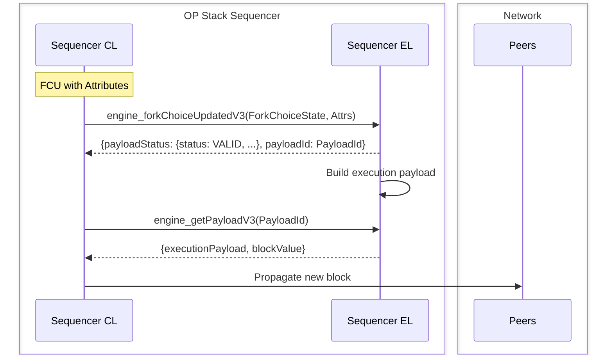

# PBH Architecture
World Chain is an OP Stack chain that enables Priority Blockspace for Humans (PBH) through the World Chain Builder. World Chain leverages [rollup-boost](https://github.com/flashbots/rollup-boost) to support external block production, allowing the builder to propose PBH blocks to the sequencer while remaining fully compatible with the OP Stack.

 
 ## Block Production on the OP Stack
 The [Engine API](https://specs.optimism.io/protocol/exec-engine.html#engine-api) defines the communication protocol between the Consensus Layer (CL) and the Execution Layer (EL) and is responsible for orchestrating block production on the OP Stack. Periodically, the sequencer's consensus client will send a fork choice update (FCU) to its execution client, signaling for a new block to be built. After a series of API calls between the CL and EL, the EL will return a new `ExecutionPayload` containing a newly constructed block. The CL will then advance the unsafe head of the chain and peer the new block to other nodes in the network.
 

 For a detailed look at how block production works on the OP Stack, see the [OP Stack specs](https://specs.optimism.io/protocol/exec-engine.html#engine-api).

 ## Rollup Boost
`rollup-boost` is a block building sidecar for OP Stack chains, enabling external block production while remaining fully compatible with the OP Stack. `rollup-boost` acts as an intermediary between the sequencer's consensus and execution client. When `sequencer-cl` sends a new FCU to `rollup-boost`, the request will be multiplexed to both the sequencer's execution client and external block builders signaling that a new block should be built. 

When the sequencer is ready to propose a new block, `op-node` will send an `engine_getPayload` request to `rollup-boost` which is forwarded to the default execution client and external block builders.  

Once `rollup-boost` receives the built block from external builder, it will then validate the block by sending it to the sequencer's execution client via `engine_newPayload`. If the external block is valid, it is returned to the sequencer's `op-node`, otherwise `rollup-boost` will return the fallback block. Note that `rollup-boost` will always fallback to the default execution client's block in the case that the external builder does not respond in time or returns an invalid block.

In addition to Engine API requests, `rollup-boost` will proxy all RPC calls from the sequencer `op-node` to its local execution client. The following RPC calls will also be forwarded to external builders:
- `miner_*`
    - The Miner API is used to notify execution clients of changes in effective gas price, extra data, and DA throttling requests from the batcher.
- `eth_sendRawTransaction*`
    - Forwards transactions the sequencer receives to the builder for block building.
 
  
 
 ## Block Production on World Chain

World Chain leverages `rollup-boost` to enable external block production and integrates the World Chain Builder as a block builder in the network. The World Chain Builder implements a custom block ordering policy (ie. PBH) to provide priority inclusion for transactions with a valid World ID proof. Note that the custom ordering policy adheres to the OP Stack spec. 

Each block has a "PBH blockspace capacity", which determines how many PBH transactions will be included in the block. Blocks on World Chain will always reserve a percentage of blockspace for non-PBH transactions to ensure inclusion for automated systems and non-verified users. If there are not enough pending PBH transactions to fill the entirety of PBH blockspace, standard transactions will be used to fill the remainder of the block. 

 

  

    
Default Block

    <table style="width: 100%; margin-top: 10px;">
      <tr>
        <th style="width: 50%; border-bottom: 1px solid white;">Tx Hash</th>
        <th style="width: 50%; border-bottom: 1px solid white;">Fee</th>
      </tr>
      <tr><td>0xaaaa</td><td>$0.04</td></tr>
      <tr><td>0xbbbb</td><td>$0.04</td></tr>
      <tr><td>0xcccc</td><td>$0.03</td></tr>
      <tr><td>0xdddd</td><td>$0.03</td></tr>
      <tr><td>0xeeee</td><td>$0.03</td></tr>
      <tr><td>0x2222</td><td>$0.02</td></tr>
      <tr><td>0x3333</td><td>$0.02</td></tr>
      <tr><td>0x4444</td><td>$0.02</td></tr>
      <tr><td>0x5555</td><td>$0.01</td></tr>
      <tr><td>0x6666</td><td>$0.01</td></tr>
    </table>
  

  

    
PBH Block

    <table style="width: 100%; margin-top: 10px;">
      <tr>
        <th style="width: 50%; border-bottom: 1px solid white;">Tx Hash</th>
        <th style="width: 50%; border-bottom: 1px solid white;">Fee</th>
      </tr>
      <tr style="color: #33ff33;"><td>0x3333</td><td>$0.02</td></tr>
      <tr style="color: #33ff33;"><td>0x4444</td><td>$0.02</td></tr>
      <tr style="color: #33ff33;"><td>0x5555</td><td>$0.01</td></tr>
      <tr style="color: #33ff33;"><td>0x6666</td><td>$0.01</td></tr>
      <tr><td>0xaaaa</td><td>$0.04</td></tr>
      <tr><td>0xbbbb</td><td>$0.04</td></tr>
      <tr><td>0xcccc</td><td>$0.03</td></tr>
      <tr><td>0xdddd</td><td>$0.03</td></tr>
      <tr><td>0xeeee</td><td>$0.03</td></tr>
      <tr><td>0x2222</td><td>$0.02</td></tr>
    </table>
  

 

If the amount of pending PBH transactions exceed the PBH blockspace capacity, the remaining PBH transactions will carry over to the next block. PBH transactions aim to provide verified users with faster, cheaper transaction inclusion, especially during network congestion. Note that transactions within PBH blockspace are ordered by priority fee.

In the event that the block builder is offline, `rollup-boost` will fallback to the block built by the default execution client with standard OP Stack ordering rules.

