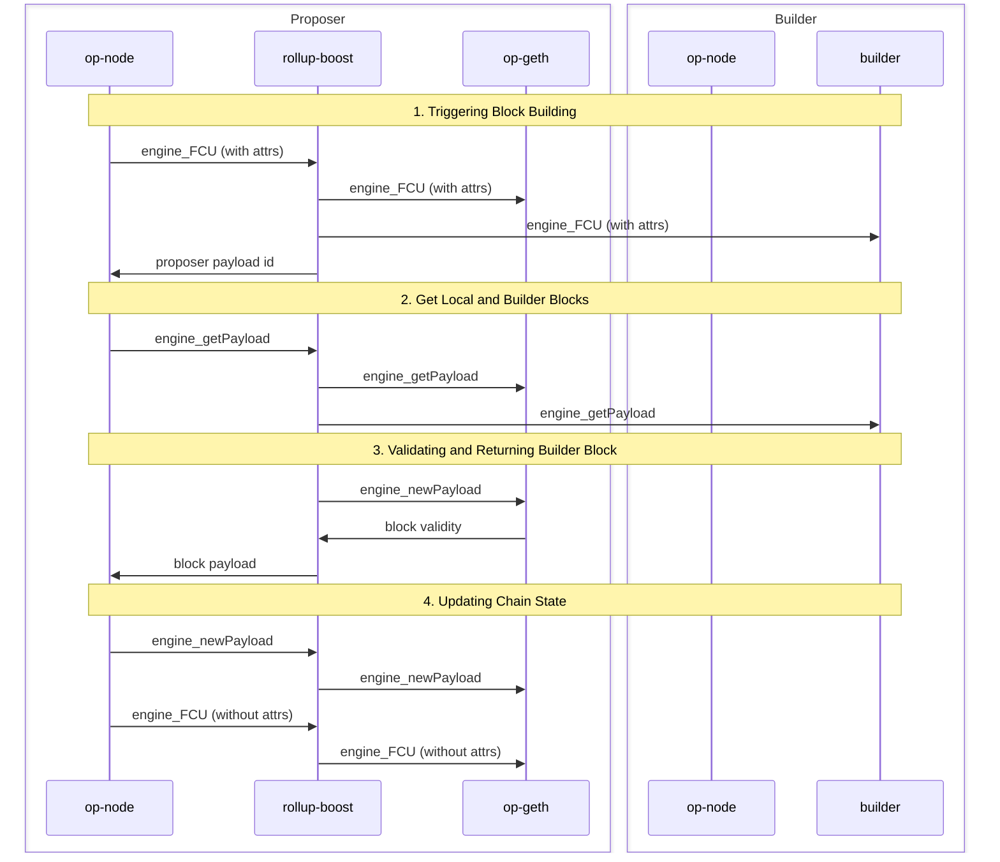

# PBH Architecture
World Chain is an OP Stack chain that enables Priority Blockspace for Humans (PBH) through the World Chain Builder. World Chain leverages [rollup-boost](https://github.com/flashbots/rollup-boost) to support external block production, allowing the builder to propose PBH blocks to the sequencer while remaining fully compatible with the OP Stack.

 
 ## Block Production on the OP Stack
 The [Engine API](https://specs.optimism.io/protocol/exec-engine.html#engine-api) defines the communication protocol between the Consensus Layer (CL) and the Execution Layer (EL) and is responsible for orchestrating block production on the OP Stack. Periodically, the sequencer's consensus client will send a fork choice update (FCU) to its execution client, signaling for a new block to be built. After a series of API calls between the CL and EL, the EL will return a new `ExecutionPayload` containing a newly constructed block. The CL will then advance the unsafe head of the chain and peer the new block to other nodes in the network.
 

<!-- TODO: insert diagram -->

 For a detailed look at how block production works on the OP Stack, see the [OP Stack specs](https://specs.optimism.io/protocol/exec-engine.html#engine-api).

 ## Rollup Boost
`rollup-boost` is a block building sidecar for OP Stack chains, enabling external block production while remaining fully compatible with the OP Stack. `rollup-boost` acts as an intermediary between the sequencer's consensus and execution client. When `op-node` sends a new FCU to `rollup-boost`, the request will be multiplexed to both the sequencer's execution client and external block builders signaling that a new block should be built. 

When the sequencer is ready to propose a new block, `op-node` will send an `engine_getPayload` request to `rollup-boost` which is forwarded to the default execution client and external block builders. Note that `rollup-boost` will always fallback to the default execution client's block in the case that the external builder does not respond in time or returns an invalid block. 

Once `rollup-boost` receives the external builder's block, it will then validate the block by sending it to the sequencer's execution client via `engine_newPayload`. If the external block is valid, it is returned to the sequencer `op-node`, otherwise, `rollup-boost` will return the fallback block.  

By default, `rollup-boost` will proxy all RPC calls from the proposer `op-node` to its local `op-geth` node. Additionally, specific RPC calls will also be forwarded to external builders:

- `engine_forkchoiceUpdatedV3`
    - This call is only multiplexed to the builder if the call contains payload attributes and the `no_tx_pool` attribute is `false`.
- `engine_getPayloadV3`
- `miner_*`
    - The Miner API is used to notify execution clients of changes in effective gas price, extra data, and DA throttling requests from the batcher.
- `eth_sendRawTransaction*`
    - Forwards transactions the sequencer receives to the builder for block building.

 
  
 
 ## Block Production on World Chain

<!-- TODO: -->
 

