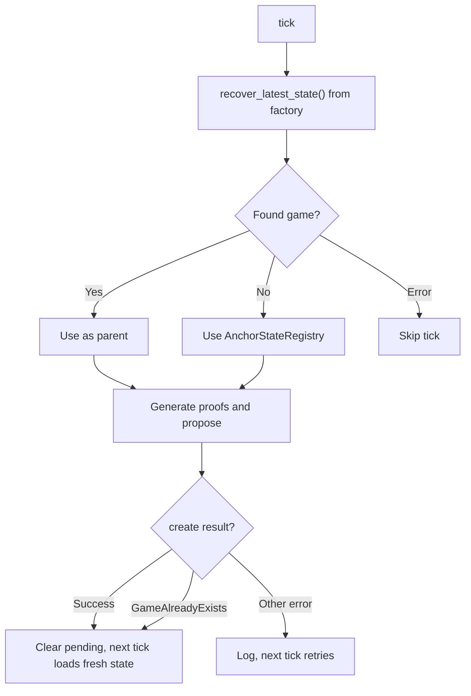

# `base-proposer`

<a href="https://github.com/base/base/actions/workflows/ci.yml"></a>
<a href="https://github.com/base/base/blob/main/LICENSE"></a>

TEE-based output proposer for Base.

## Overview

- **Service**: Top-level orchestrator that wires RPC clients, contracts, the proving pipeline, transaction management, and the admin server.
- **Pipeline**: Core proving pipeline that recovers on-chain state, generates proofs via an external prover, and coordinates proposal submission.
- **Output Proposer**: L1 transaction submission via `OutputProposer` (`ProposalSubmitter` and `DryRunProposer` implementations).
- **Driver**: Coordination loop that owns the pipeline tick and manages start/stop lifecycle.
- **Admin**: JSON-RPC server for runtime control (`admin_startProposer`, `admin_stopProposer`, `admin_proposerRunning`).
- **Metrics**: Prometheus metric definitions and recording.
- **CLI**: Command-line argument parsing and configuration validation.

## Architecture

### End-to-End Flow

```text
L2 RPC (Reth) ──► Proposer ──► TEE Enclave
Rollup RPC        │                │
L1 RPC            │                │ Signed proposal
                  │                ▼
                  │         Proposer verifies
                  │         output root locally
                  ▼
           DisputeGameFactory.createWithInitData()
                  │
                  ▼
           AggregateVerifier + TEEVerifier
           (on-chain verification)
```

The proposer independently recomputes the output root and rejects mismatches. It gates proposals on the rollup RPC's `safe_l2`/`finalized_l2` and checks for reorgs before submitting.

### Game Tracking and Parent Selection

Each dispute game references a parent game via `parent_address` in the factory. The proposer carries no cached parent state -- it loads the latest game from chain at the top of every tick:



`recover_latest_state()` walks backwards through the `DisputeGameFactory` (up to `MAX_FACTORY_SCAN_LOOKBACK` entries, default 5000) to find the most recent game matching the configured `game_type`. Because state is always loaded from chain, the proposer naturally chains off games created by any proposer, handles `GameAlreadyExists` without special recovery logic, and cannot enter stale-state livelocks.

## License

Licensed under the [MIT License](https://github.com/base/base/blob/main/LICENSE).
