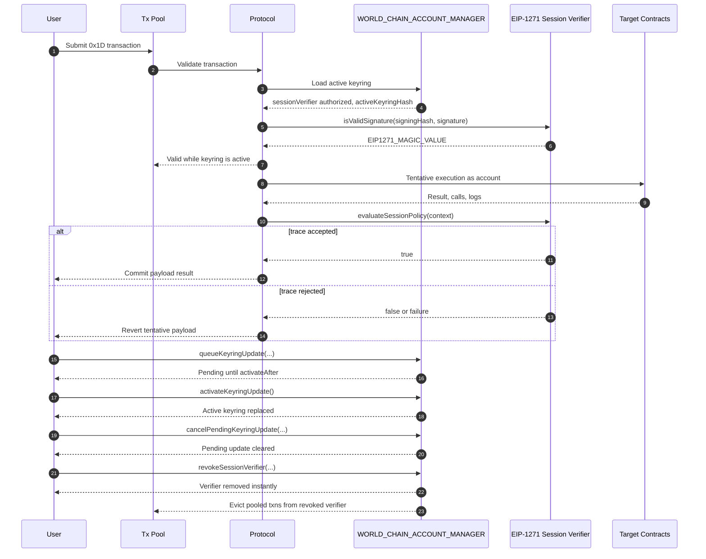

## Abstract

WIP-1001 defines a native World Chain account type managed by the `WORLD_CHAIN_ACCOUNT_MANAGER` predeploy.

Each account has one EIP-1271 admin signer and an active keyring of EIP-1271 session verifiers. The admin signer is the root authority for account management. Session verifiers are delegated authorities for `0x1D` transaction execution.

The protocol does not implement signature schemes directly. Instead, the protocol calls EIP-1271 signers in restricted validation frames. Signature schemes, proof systems, recovery policies, and execution policies are implemented by signer contracts. The protocol provides reusable cryptographic precompiles for common primitives.

Session verifiers also own their execution policy. After tentative transaction execution, the protocol asks the verifier whether the observed execution trace is valid. If the verifier rejects the trace, the tentative execution is reverted.

## Motivation

### One Authorization Path

World Chain accounts need programmable authentication without adding a protocol branch for every signature scheme or proof system. EIP-1271 gives the protocol one authorization path: call a signer contract and require the standard magic value.

Admin signers and session verifiers both use EIP-1271, but they have different protocol roles. An admin signer authorizes account-management operations. A session verifier authorizes transaction signatures and evaluates the resulting execution trace.

### Reusable Cryptography

Signer contracts need efficient cryptographic primitives, but those primitives should not define account semantics. WIP-1001 exposes reusable precompiles for supported curves and proof systems, while keeping account policy in contracts.

World ID is a reference signer implementation. It verifies an EIP-1271 signature that encodes a World ID proof. It is not a privileged protocol path.

### Programmability

Accounts need authorization logic that can evolve without protocol changes. EIP-1271 lets admin signers define arbitrary account-management authorization, including World ID, secp256k1, secp256r1, EdDSA, BLS12-381, multisig, programmable recovery, multi factor authentication and application-specific schemes.

Session verifiers extend that programmability to transaction execution. A verifier can authenticate a session key, inspect the canonical execution trace, and decide whether the transaction satisfies its policy. The protocol only provides deterministic inputs and enforces the verifier's evaluation according to its session signers corresponding policy.

### Stable Transaction Inclusion

Mempool validation and block inclusion must agree on which keyring is active. Keyring updates are therefore timelocked for longer than the transaction pool expiration window. A transaction that validates against an active keyring cannot become invalid before it expires from the pool because of a keyring update.

Default factories that support mutable signer or verifier state must apply the same rule to state that can invalidate already accepted transactions.

## Specification


The key words "MUST", "MUST NOT", "REQUIRED", "SHALL", "SHALL NOT", "SHOULD", "SHOULD NOT", "RECOMMENDED", "NOT RECOMMENDED", "MAY", and "OPTIONAL" in this document are to be interpreted as described in [RFC 2119](https://www.rfc-editor.org/rfc/rfc2119) and [RFC 8174](https://www.rfc-editor.org/rfc/rfc8174).


### Protocol Constants

| Name | Type | Value | Meaning |
| --- | --- | --- | --- |
| `WORLD_TX_TYPE` | `uint8` | `0x1D` | EIP-2718 transaction type for World Chain account transactions. |
| `MAX_SESSION_VERIFIERS` | `uint256` | `20` | Maximum active session verifiers per account. |
| `EIP1271_MAGIC_VALUE` | `bytes4` | `0x1626ba7e` | Required return value from `isValidSignature`. |
| `WORLD_CHAIN_RP_ID` | `uint64` | `480` | World Chain relying-party identifier for WebAuthn and World ID challenge binding. |
| `WORLD_ID_ACCOUNT_TAG` | `bytes` | `"WORLD_ID_ACCOUNT"` | Domain tag for World ID account action derivation. |
| `WIP1001_ACCOUNT_DOMAIN` | `bytes32` | `keccak256("WIP1001_ACCOUNT")` | Domain for account address derivation. |
| `WIP1001_ADMIN_CREATE_DOMAIN` | `bytes32` | `keccak256("WIP1001_ADMIN_CREATE")` | Domain for account creation authorization. |
| `WIP1001_QUEUE_KEYRING_UPDATE_DOMAIN` | `bytes32` | `keccak256("WIP1001_QUEUE_KEYRING_UPDATE")` | Domain for queueing a keyring update authorization. |
| `WIP1001_CANCEL_KEYRING_UPDATE_DOMAIN` | `bytes32` | `keccak256("WIP1001_CANCEL_KEYRING_UPDATE")` | Domain for cancelling a pending keyring update. |
| `WIP1001_REVOKE_SESSION_VERIFIER_DOMAIN` | `bytes32` | `keccak256("WIP1001_REVOKE_SESSION_VERIFIER")` | Domain for instant session-verifier revocation. |
| `WIP1001_SIGNER_DOMAIN` | `bytes32` | `keccak256("WIP1001_SIGNER")` | Domain for default factory `CREATE2` salts. |

### Activation Parameters

WIP-1001 MUST NOT activate until every parameter below is assigned in the fork configuration.

| Name | Type | Value | Requirement |
| --- | --- | --- | --- |
| `WORLD_CHAIN_ACCOUNT_MANAGER` | `address` | TBD | Predeploy address for the account manager. |
| `EIP1271_VALIDATION_GAS_LIMIT` | `uint64` | TBD | Fixed gas forwarded to `isValidSignature`. |
| `EXECUTION_TRACE_VALIDATION_GAS_LIMIT` | `uint64` | TBD | Fixed gas forwarded to `evaluateSessionPolicy`. |
| `BLOCK_VALIDATION_GAS_BUDGET` | `uint64` | TBD | Per-block gas budget reserved for `0x1D` validation calls. See "Validation Gas Accounting". |
| `MIN_VALIDATION_FAILURE_FEE` | `uint256` | TBD | Minimum wei charge to the account on validation failure. Anti-DoS floor. |
| `MAX_EXECUTION_TRACE_BYTES` | `uint32` | TBD | Maximum ABI-encoded trace size passed to a session verifier. |
| `MAX_PAYLOAD_DATA_BYTES` | `uint32` | TBD | Maximum length of `data` in the `0x1D` envelope. |
| `MAX_ACCESS_LIST_ENTRIES` | `uint32` | TBD | Maximum number of EIP-2930 access-list entries in the envelope. |
| `MAX_SESSION_SIGNATURE_BYTES` | `uint32` | TBD | Maximum length of the session `signature` field. |
| `MAX_ADMIN_AUTHORIZATION_BYTES` | `uint32` | TBD | Maximum length of `adminAuthorization` calldata. |
| `TXPOOL_TRANSACTION_EXPIRATION_WINDOW` | `uint64` | TBD | Maximum time (seconds) a valid transaction remains in the pool. |
| `MIN_KEYRING_UPDATE_DELAY` | `uint64` | TBD | MUST satisfy `MIN_KEYRING_UPDATE_DELAY > TXPOOL_TRANSACTION_EXPIRATION_WINDOW`. |
| `WORLD_ID_1271_SIGNER_FACTORY` | `address` | TBD | Default World ID EIP-1271 signer factory. |
| `SECP256K1_1271_SIGNER_FACTORY` | `address` | TBD | Default secp256k1 EIP-1271 signer factory. |
| `EDDSA_PRECOMPILE` | `address` | TBD | EdDSA verification precompile address and ABI. |
| `BLS12_381_PRECOMPILE` | `address` | TBD | BLS12-381 verification precompile address and ABI. |

### Reusable Crypto Precompiles

Signer contracts MAY call protocol-supported cryptographic precompiles from restricted validation frames.

The validation-frame precompile allowlist is:

| Primitive | Source |
| --- | --- |
| `ecrecover` | Ethereum precompile |
| `sha256` | Ethereum precompile |
| `ripemd160` | Ethereum precompile |
| `identity` | Ethereum precompile |
| `modexp` | Ethereum precompile |
| `bn254 add` | Ethereum precompile |
| `bn254 scalar multiplication` | Ethereum precompile |
| `bn254 pairing` | Ethereum precompile |
| `secp256r1 verify` | RIP-7212 |
| `EdDSA verify` | Activation parameter |
| `BLS12-381 verify` | Activation parameter |

World Chain clients MUST NOT expose private host validation APIs that are unavailable to contracts. Any primitive used by a default signer MUST be available through an allowlisted precompile.

### Account Model

World Chain accounts are created and managed by a `WORLD_CHAIN_ACCOUNT_MANAGER`.

An account has:

- one immutable account address;
- one EIP-1271 admin signer;
- one active keyring of EIP-1271 session verifiers;
- at most one pending keyring update;
- one admin nonce.

Account authority is hierarchical:

1. The account manager owns account state and enforces account-management rules.
2. The admin signer is the root account authority. It authorizes account creation and keyring updates through EIP-1271.
3. Session verifiers are delegated transaction authorities. They authorize `0x1D` transactions through EIP-1271 and approve or reject the observed execution trace through `evaluateSessionPolicy`.

The manager MUST NOT use the admin signer to authorize `0x1D` transaction execution unless the same address is also present in the active session keyring. The manager MUST NOT use a session verifier to authorize account-management operations unless the same address is also configured as the admin signer.

The manager stores account state:

```solidity
/// @notice Per-account state held by `WORLD_CHAIN_ACCOUNT_MANAGER`.
struct Account {
    /// @notice Immutable EIP-1271 admin signer contract. Bound into the account
    ///         address derivation; cannot be rotated without changing the address.
    address adminSigner;

    /// @notice Caller-supplied salt used in the account address derivation.
    ///         Stored for indexing / auditability; not consulted at runtime.
    bytes32 accountSalt;

    /// @notice Ordered list of currently active EIP-1271 session verifiers.
    ///         Length is in `[1, MAX_SESSION_VERIFIERS]`. Order is significant —
    ///         `activeKeyringHash` commits to ordering.
    SessionVerifier[] activeSessionVerifiers;

    /// @notice `keccak256(abi.encode(activeSessionVerifiers))`. Re-derivable
    ///         from `activeSessionVerifiers` but cached for cheap reads in
    ///         signing-hash construction and admin-operation hashing.
    bytes32 activeKeyringHash;

    /// @notice Slot for the at-most-one pending keyring update. See
    ///         `PendingKeyringUpdate.exists` for presence semantics.
    PendingKeyringUpdate pendingKeyringUpdate;

    /// @notice Strictly monotonically non-decreasing counter consumed by
    ///         admin-authorized operations (queue, cancel, revoke). Provides
    ///         replay protection for admin authorizations.
    uint64 adminNonce;
}

/// @notice An optional, time-locked queued keyring update. Solidity structs are
///         not nullable in storage, so the optional nature is encoded by the
///         explicit `exists` flag.
struct PendingKeyringUpdate {
    /// @notice The `activeKeyringHash` value that was current when this update
    ///         was queued. Re-checked at activation as a defense-in-depth guard
    ///         even though only one pending update may exist at a time.
    bytes32 expectedCurrentKeyringHash;

    /// @notice The verifier set that will replace `activeSessionVerifiers` on
    ///         successful activation. Subject to the same length and uniqueness
    ///         constraints as `activeSessionVerifiers`.
    SessionVerifier[] targetSessionVerifiers;

    /// @notice `keccak256(abi.encode(targetSessionVerifiers))`. Cached for the
    ///         same reason as `activeKeyringHash`.
    bytes32 targetKeyringHash;

    /// @notice Earliest UNIX timestamp at which `activateKeyringUpdate` may
    ///         succeed. MUST be at least `block.timestamp + MIN_KEYRING_UPDATE_DELAY`
    ///         at queueing time.
    uint64 activateAfter;

    /// @notice The `adminNonce` value consumed when this update was authorized.
    ///         Used as a replay-protection cookie by `cancelPendingKeyringUpdate`.
    uint64 queuedAtNonce;

    /// @notice Presence flag. `true` iff a pending update is currently queued.
    ///         When `false`, all other fields in this struct are meaningless and
    ///         MUST NOT be read by conforming implementations.
    bool exists;
}

/// @notice Single-field wrapper for an active session-verifier entry. The
///         struct exists (rather than a bare `address`) to allow forward-
///         compatible extension with per-verifier metadata (e.g., a label,
///         expiry, or stake reference) without changing `activeKeyringHash`
///         encoding semantics. New fields, if added, MUST be considered in the
///         keyring hash.
struct SessionVerifier {
    /// @notice EIP-1271 contract that also implements `IWorldChainSessionVerifier`.
    address verifier;
}
```

`Account.adminSigner` is an EIP-1271 contract. `SessionVerifier.verifier` is an EIP-1271 contract that also implements `IWorldChainSessionVerifier`.

The protocol does not inspect signer internals. It assigns semantics by account role: admin signer for account management, session verifier for transaction authorization and policy evaluation.

The active keyring MUST contain at least one session verifier and at most `MAX_SESSION_VERIFIERS` session verifiers. A keyring MUST NOT contain duplicate verifier addresses.

#### Account Address Permanence

The account address derives from `(WIP1001_ACCOUNT_DOMAIN, chainId, WORLD_CHAIN_ACCOUNT_MANAGER, adminSigner, accountSalt)`. `adminSigner` is therefore immutable for the life of the address. WIP-1001 defines no operation that rotates `adminSigner` for an existing account. A bug in the admin signer contract is uncorrectable without migrating assets to a new account.

The account address binds `chainId`, so the same `(adminSigner, accountSalt)` deployed via the same factory on a different chain produces a different account address. This eliminates any future possibility for cross-chain account-address replay.

### Address Derivation

The manager derives an account address as:

```solidity
account = address(
    uint160(
        uint256(
            keccak256(
                abi.encode(
                    WIP1001_ACCOUNT_DOMAIN,
                    chainId,
                    WORLD_CHAIN_ACCOUNT_MANAGER,
                    adminSigner,
                    accountSalt
                )
            )
        )
    )
);
```

This binds the account address to the admin signer, salt, chain, and manager instance.

### Keyring Hash

The manager computes:

```solidity
activeKeyringHash = keccak256(abi.encode(activeSessionVerifiers));
```

The hash commits to verifier addresses and ordering. Clients SHOULD preserve ordering when displaying, exporting, or signing over a keyring.

### Admin Operation Hashes

For every admin authorization, the manager computes a domain-separated `adminOperationHash` and passes it to:

```solidity
adminSigner.isValidSignature(adminOperationHash, adminAuthorization)
```

For example the account-creation admin operation hash is:

```solidity
adminOperationHash = keccak256(
    abi.encode(
        WIP1001_ADMIN_CREATE_DOMAIN,
        chainId,
        WORLD_CHAIN_ACCOUNT_MANAGER,
        account,
        adminSigner,
        accountSalt,
        activeKeyringHash
    )
);
```

### EIP-1271 Admin Signer Hierarchy

The admin signer is an EIP-1271 contract that authorizes account-management operations. It has no protocol ABI beyond EIP-1271:

```solidity
/// @notice Marker interface for an EIP-1271 admin signer. Carries no methods
///         beyond `IERC1271.isValidSignature(bytes32 hash, bytes signature)`.
///         The protocol identifies admin signers by role (assignment as
///         `Account.adminSigner`), not by interface.
interface IWorldChainAdminSigner is IERC1271 {}
```

The protocol calls the admin signer with a manager-defined operation hash. The signer returns `EIP1271_MAGIC_VALUE` if the operation is authorized.

Admin signer implementations include:

- World ID admin signers;
- secp256k1 admin signers;
- multisig admin signers;
- recovery admin signers;
- custom application admin signers.

Only the EIP-1271 boundary is protocol-significant. The implementation class is signer contract state, not account manager state.

#### World ID Admin Signer

A World ID admin signer is an EIP-1271 contract whose authorization is a World ID proof bound to the manager-defined operation hash.

The default World ID admin signer MUST expose immutable account-binding state:

```solidity
/// @notice Default World ID EIP-1271 admin signer interface.
/// @dev    All four view methods MUST return values that are fixed at signer
///         deployment time and that match the values committed to in the
///         CREATE2 salt of the deploying factory.
interface IWorldIDAdminSigner is IWorldChainAdminSigner {
    /// @notice The `accountSalt` used to derive the bound account address.
    /// @return The salt value committed to in the factory `configHash`.
    function accountSalt() external view returns (bytes32);

    /// @notice The account address this admin signer is bound to.
    /// @return Equal to the address that `WORLD_CHAIN_ACCOUNT_MANAGER` derives
    ///         from `(address(this), accountSalt())` per "Address Derivation".
    function account() external view returns (address);

    /// @notice The World ID relying-party identifier used in proof verification.
    /// @return MUST equal `WORLD_CHAIN_RP_ID`.
    function worldIdRpId() external view returns (uint64);

    /// @notice The World ID `action` field bound into proofs accepted by this
    ///         signer.
    /// @return `worldIdField(abi.encode(WORLD_ID_ACCOUNT_TAG, block.chainid,
    ///         WORLD_CHAIN_RP_ID, WORLD_CHAIN_ACCOUNT_MANAGER, account(),
    ///         address(this)))`.
    function worldIdAction() external view returns (uint256);
}
```

The default World ID admin signer uses the World ID v4 uniqueness-proof verifier shape. Its EIP-1271 signature payload is:

```solidity
/// @notice ABI-encoded payload passed as the `signature` argument to
///         `isValidSignature` for a default World ID admin signer.
struct WorldIDUniquenessProofSignature {
    /// @notice Public output. Unique-per-(user, rpId, action) one-time identifier
    ///         derived inside the circuit. Not consumed by the protocol — the
    ///         admin signer is `view`-only.
    uint256 nullifier;

    /// @notice Public input. Minimum credential expiration the proof was bound
    ///         to. Subject to the signer's freshness policy.
    uint64 expiresAtMin;

    /// @notice Public input. Identifies the credential schema and issuer pair.
    ///         MUST equal the signer's configured issuer schema ID.
    uint64 issuerSchemaId;

    /// @notice Public input. Minimum `genesis_issued_at` the proof was bound
    ///         to. Subject to the signer's freshness policy.
    uint256 credentialGenesisIssuedAtMin;

    /// @notice Encoded World ID v4 proof. Layout:
    ///         [0..3] compressed Groth16 proof `[a, b₁, b₂, c]`,
    ///         [4]    Merkle root from the `WorldIDRegistry`.
    uint256[5] zeroKnowledgeProof;
}
```

`account()` MUST return the account address derived by `WORLD_CHAIN_ACCOUNT_MANAGER` using `address(this)` as `adminSigner` and `accountSalt()` as `accountSalt`.

`worldIdRpId()` MUST return `WORLD_CHAIN_RP_ID`.

`worldIdAction()` MUST return:

```solidity
worldIdField(
    abi.encode(
        WORLD_ID_ACCOUNT_TAG,
        block.chainid,
        WORLD_CHAIN_RP_ID,
        WORLD_CHAIN_ACCOUNT_MANAGER,
        account(),
        address(this)
    )
)
```

where `worldIdField(input) = uint256(keccak256(input)) >> 8`, matching `FieldElement::from_arbitrary_raw_bytes` in the World ID v4 primitives. A reference implementation of this reduction is in `crates/primitives/src/lib.rs` (function `from_arbitrary_raw_bytes`) of the World ID protocol repository.

The inclusion of `block.chainid` in the `worldIdAction` derivation is required to prevent cross-chain replay of the World ID proof when the same admin signer contract address exists on multiple chains. The default factory's CREATE2 salt also binds chainId, so for default-factory-deployed signers this is defense-in-depth; for custom signers it is the primary safeguard.

`isValidSignature(hash, signature)` MUST:

- decode `signature` as `WorldIDUniquenessProofSignature`;
- compute `signalHash = worldIdField(abi.encode(hash))`;
- compute `nonce = worldIdField(abi.encode("WIP1001_WORLD_ID_ADMIN_NONCE", hash))`;
- require `issuerSchemaId` to equal the signer's configured issuer schema ID;
- require `zeroKnowledgeProof[4]` to be an accepted World ID registry root in the signer's verifier state;
- require `expiresAtMin` and `credentialGenesisIssuedAtMin` to satisfy the signer's configured credential freshness policy;
- verify the proof as a World ID v4 uniqueness proof equivalent to `IWorldIDVerifier.verify(nullifier, worldIdAction(), WORLD_CHAIN_RP_ID, nonce, signalHash, expiresAtMin, issuerSchemaId, credentialGenesisIssuedAtMin, zeroKnowledgeProof)`;
- return `EIP1271_MAGIC_VALUE` only if verification succeeds.

The signer MUST verify the same public inputs as the World ID v4 verifier: nullifier, issuer schema, credential issuer public key, credential expiration minimum, credential genesis minimum, Merkle root, tree depth, RP ID, action, OPRF public key, signal hash, nonce, and `sessionId = 0`.

The signer MUST NOT consume nullifiers as part of `isValidSignature`, because EIP-1271 validation is a `view` operation. Replay protection comes from the manager-defined operation hash, including `adminNonce`.

The signer MUST NOT call an external World ID verifier from a restricted validation frame. Any World ID registry roots, credential issuer public keys, OPRF public keys, verifier keys, tree depth, and credential freshness policy needed for verification MUST be available from the signer's own code, own storage, or allowlisted precompiles.

#### Secp256k1 Admin Signer

A secp256k1 admin signer is an EIP-1271 contract whose authorization is a secp256k1 signature by a configured owner.

The default secp256k1 admin signer MUST expose immutable owner state:

```solidity
/// @notice Default secp256k1 EIP-1271 admin signer interface.
interface ISecp256k1AdminSigner is IWorldChainAdminSigner {
    /// @notice The secp256k1 owner address authorizing admin operations.
    /// @return The owner address committed to in the factory `configHash`.
    ///         MUST be immutable for the life of the signer.
    function owner() external view returns (address);
}
```

The EIP-1271 signature payload is the standard 65-byte payload:

```text
r || s || v
```

`isValidSignature(hash, signature)` MUST:

- require `signature.length == 65`;
- decode `r`, `s`, and `v`;
- require `s` to be in the lower half order as specified by EIP-2;
- require `v` to be `27` or `28`;
- recover the signer with `ecrecover(hash, v, r, s)`;
- return `EIP1271_MAGIC_VALUE` only if the recovered address equals `owner()`.

The secp256k1 admin signer verifies the hash passed by the manager directly. Wallets that need EIP-191, EIP-712, or WebAuthn wrapping MUST implement that wrapping inside a different EIP-1271 signer contract.

### Session Verifier Interface

Session verifier contracts MUST implement this interface in addition to EIP-1271. Admin-only signers only need to implement EIP-1271.

```solidity
/// @notice Session verifier interface. Implemented by every contract eligible
///         to appear in `Account.activeSessionVerifiers`. Combines EIP-1271
///         signature verification with execution-trace policy evaluation.
interface IWorldChainSessionVerifier is IERC1271 {
    /// @notice EIP-2930 access list entry, mirrored into the trace context so
    ///         that policy evaluation can reason about pre-warmed state.
    struct AccessListEntry {
        /// @notice Address whose storage is pre-warmed by this entry.
        address account;
        /// @notice Storage slots pre-warmed at `account`.
        bytes32[] storageKeys;
    }

    /// @notice Canonical, deterministic snapshot of the `0x1D` transaction as
    ///         seen by the verifier. Built by the protocol from the envelope,
    ///         the loaded account state, and the computed signing hash.
    ///         Contains no block-context values other than `chainId`.
    struct WorldChainTransactionContext {
        /// @notice The EIP-2718 signing hash of the transaction (see "Envelope").
        bytes32 signingHash;
        /// @notice The chain ID from the envelope.
        uint256 chainId;
        /// @notice The account this transaction is executed as.
        address account;
        /// @notice The session verifier that authorized this transaction.
        ///         Equal to `address(this)` for the verifier reading the context.
        address sessionVerifier;
        /// @notice The transaction nonce from the envelope.
        uint64 nonce;
        /// @notice EIP-1559 priority fee.
        uint256 maxPriorityFeePerGas;
        /// @notice EIP-1559 max fee.
        uint256 maxFeePerGas;
        /// @notice The envelope `gasLimit` (covers payload only; validation gas
        ///         is protocol-paid — see "Validation Gas Accounting").
        uint64 gasLimit;
        /// @notice Derived predicate `to.length == 0` from the envelope.
        bool isCreate;
        /// @notice For calls, equal to `to`. For creates, `address(0)`.
        ///         The deployed address of a CREATE transaction is NOT exposed
        ///         here; verifiers needing it MUST inspect `trace.calls` (note
        ///         that the root call is not represented in `trace.calls`).
        address target;
        /// @notice The envelope `value` (wei transferred).
        uint256 value;
        /// @notice The envelope `data`. Calldata for calls; init code for creates.
        bytes data;
        /// @notice First 4 bytes of `data` for non-create transactions when
        ///         `data.length >= 4`; `0x00000000` otherwise (including all
        ///         create transactions, regardless of `data.length`).
        bytes4 selector;
        /// @notice The envelope `accessList`, EIP-2930 shape.
        AccessListEntry[] accessList;
        /// @notice `activeKeyringHash` of `account` at the time the transaction
        ///         was admitted to the pool. Provided here because the verifier
        ///         cannot read manager state from a restricted validation frame.
        bytes32 activeKeyringHash;
    }

    /// @notice Discriminator for `CallTrace.kind`. Mirrors EVM call opcodes.
    enum TraceCallKind {
        Call,         // CALL
        StaticCall,   // STATICCALL
        DelegateCall, // DELEGATECALL
        Create,       // CREATE
        Create2       // CREATE2
    }

    /// @notice Single internal call within the execution trace. Hashes are used
    ///         in place of full payloads to keep trace size bounded.
    struct CallTrace {
        /// @notice Depth in the call tree. Root transaction call has depth 0
        ///         and is NOT represented in `WorldChainExecutionTrace.calls`;
        ///         the first internal call is depth 1.
        uint32 depth;
        /// @notice Which call opcode initiated this frame.
        TraceCallKind kind;
        /// @notice Address that executed the call/create opcode (the parent
        ///         frame's address). For DelegateCall, the address performing
        ///         the DELEGATECALL — NOT the inherited original sender.
        address caller;
        /// @notice For Call/StaticCall/DelegateCall: the callee address.
        ///         For Create/Create2: the deployed contract address (or the
        ///         address that would have been deployed, if the create reverted).
        address target;
        /// @notice Wei transferred by this call. MUST be 0 for StaticCall and
        ///         DelegateCall.
        uint256 value;
        /// @notice First 4 bytes of input calldata when `inputHash` covers
        ///         `>= 4` bytes; `0x00000000` for create kinds and short inputs.
        bytes4 selector;
        /// @notice `keccak256(input)` where `input` is calldata for calls and
        ///         init code for creates. `keccak256("")` for empty input.
        ///         Never the zero sentinel.
        bytes32 inputHash;
        /// @notice `keccak256(output)` where `output` is return data on success
        ///         and revert data on failure. `keccak256("")` for empty output.
        ///         Never the zero sentinel.
        bytes32 outputHash;
        /// @notice True iff the call returned without reverting.
        bool success;
        /// @notice Gas consumed by this call, measured at the EVM level.
        uint64 gasUsed;
    }

    /// @notice Single log emission within the execution trace.
    struct LogTrace {
        /// @notice Address that emitted the log.
        address emitter;
        /// @notice Up to four indexed topics.
        bytes32[] topics;
        /// @notice `keccak256(data)`. `keccak256("")` for empty log data.
        bytes32 dataHash;
        /// @notice Index into `WorldChainExecutionTrace.calls` of the call that
        ///         emitted this log. `type(uint32).max` indicates emission by
        ///         the root transaction call (which has no `CallTrace` entry).
        uint32 callIndex;
    }

    /// @notice The execution trace for a single `0x1D` transaction's payload.
    ///         Full calldata, return data, and log data are NOT included; only
    ///         their hashes. Logs from reverted sub-call frames are excluded
    ///         per EVM revert semantics.
    struct WorldChainExecutionTrace {
        /// @notice Final success flag of the root transaction call.
        bool success;
        /// @notice Total gas consumed by payload execution. Excludes validation
        ///         gas (which is protocol-paid).
        uint64 gasUsed;
        /// @notice `keccak256` of the root call's return / revert data, with
        ///         the same empty-data convention as `CallTrace.outputHash`.
        bytes32 outputHash;
        /// @notice Internal calls in execution order. Length-bounded indirectly
        ///         by `MAX_EXECUTION_TRACE_BYTES`.
        CallTrace[] calls;
        /// @notice Emitted logs in emission order. Each annotated with the
        ///         emitting call's `callIndex` for log↔call correlation.
        LogTrace[] logs;
    }

    /// @notice The full input to `evaluateSessionPolicy`.
    struct ExecutionTraceContext {
        WorldChainTransactionContext transaction;
        WorldChainExecutionTrace trace;
    }

    /// @notice Evaluate whether the executed transaction is acceptable under
    ///         this session verifier's policy.
    /// @dev    Called by `WORLD_CHAIN_ACCOUNT_MANAGER` via STATICCALL inside a
    ///         restricted validation frame after tentative payload execution
    ///         and before committing payload state. MUST be `view`. MUST NOT
    ///         attempt state mutation. MUST NOT call out to non-allowlisted
    ///         addresses (see `WIP1001-VR-8`).
    /// @param  context Canonical execution snapshot built from the envelope and
    ///         the post-execution trace.
    /// @return allowed `true` if policy accepts the trace; `false` rejects.
    function evaluateSessionPolicy(
        ExecutionTraceContext calldata context
    ) external view returns (bool allowed);
}
```

The protocol MUST call `evaluateSessionPolicy` after tentative payload execution and before committing payload state.

`ExecutionTraceContext.transaction` is derived from the `0x1D` envelope, the active account state, and the computed signing hash. It does not include block-context values other than `chainId`.

For this context:

- `target` equals `to` when `isCreate == false`;
- `target` equals `address(0)` when `isCreate == true`;
- `selector` equals the first four bytes of `data` when `isCreate == false` and `data.length >= 4`;
- `selector` equals `0x00000000` when `isCreate == true`, regardless of `data.length`. Constructor bytecode is not a function selector and MUST NOT be interpreted as one.
- `selector` equals `0x00000000` when `isCreate == false` and `data.length < 4`.

`ExecutionTraceContext.trace` is canonical and MUST include:

- the final payload success flag;
- total gas used by payload execution;
- `keccak256` of payload return data;
- all internal calls, ordered by execution order and annotated with call depth;
- all logs emitted by payload execution, ordered by emission order, each annotated with the index of the emitting call.

The root transaction call is represented by `ExecutionTraceContext.transaction`, not by a `CallTrace` entry.

For each `CallTrace` entry:

- When `kind == Create` or `kind == Create2`, `target` MUST be the deployed contract address. If the create call reverted, `target` MUST be the address that *would have been* deployed (computed per EIP-1014 for `Create2` and `keccak256(rlp([sender, nonce]))[12:]` for `Create`).
- When `kind == DelegateCall`, `value` MUST be `0` (the trace records the value transferred by the call itself, not the inherited callvalue), and `caller` MUST be the address that executed the `DELEGATECALL` opcode (the parent context address, not the original transaction sender).
- When `success == false`, `outputHash` MUST equal `keccak256(revertData)`. When the call returned successfully but with empty return data, `outputHash` MUST equal `keccak256("")` (i.e., `0xc5d2460186f7233c927e7db2dcc703c0e500b653ca82273b7bfad8045d85a470`). `outputHash` MUST NOT be the zero sentinel `bytes32(0)` for empty data.
- `inputHash` follows the same convention: empty calldata hashes to `keccak256("")`, never `bytes32(0)`.

For each `LogTrace` entry:

- `callIndex` MUST equal the index into `WorldChainExecutionTrace.calls` of the `CallTrace` whose execution emitted the log. The sentinel value `type(uint32).max` indicates the log was emitted by the root transaction call (which has no `CallTrace` entry).
- Logs emitted within reverted sub-call frames MUST NOT appear in `logs`, consistent with EVM revert semantics.

For `WorldChainExecutionTrace.outputHash`:

- When the root call returned successfully with non-empty return data: `keccak256(returnData)`.
- When the root call returned successfully with empty return data: `keccak256("")`.
- When the root call reverted: `keccak256(revertData)`.

Full internal calldata, return data, and log data are not copied into the trace. The trace includes hashes. A verifier that needs exact bytes MUST bind those bytes through the session signature, transaction calldata, or an application-level commitment.

The ABI-encoded trace MUST be no larger than `MAX_EXECUTION_TRACE_BYTES`. If the trace exceeds this limit, the transaction MUST fail.

### Manager Interface

`WORLD_CHAIN_ACCOUNT_MANAGER` exposes:

```solidity
/// @notice Public interface of `WORLD_CHAIN_ACCOUNT_MANAGER`. All admin-mutating
///         methods require an `adminAuthorization` validated through EIP-1271
///         against the account's admin signer in a restricted validation frame.
interface IWorldChainAccountManager {
    /// @notice Create a new World Chain account.
    /// @param  adminSigner Already-deployed EIP-1271 admin signer contract.
    /// @param  accountSalt Caller-supplied salt, mixed into address derivation.
    /// @param  initialSessionVerifiers Initial keyring; length in
    ///         `[1, MAX_SESSION_VERIFIERS]`, no duplicates, all with deployed code.
    /// @param  adminAuthorization Bytes interpreted by `adminSigner`. Bound to
    ///         the account-creation `adminOperationHash` (see "Admin Operation Hashes").
    /// @return account The address derived per "Address Derivation".
    function create(
        address adminSigner,
        bytes32 accountSalt,
        SessionVerifier[] calldata initialSessionVerifiers,
        bytes calldata adminAuthorization
    ) external returns (address account);

    /// @notice Queue a timelocked keyring replacement.
    /// @param  account Existing account.
    /// @param  expectedCurrentKeyringHash Replay/race guard; MUST equal the
    ///         account's current `activeKeyringHash`.
    /// @param  targetSessionVerifiers Replacement keyring; same length and
    ///         uniqueness rules as `initialSessionVerifiers`.
    /// @param  activateAfter Earliest UNIX timestamp at which
    ///         `activateKeyringUpdate` may succeed. MUST be at least
    ///         `block.timestamp + MIN_KEYRING_UPDATE_DELAY`.
    /// @param  adminAuthorization Bound to the queue `adminOperationHash`.
    /// @dev    Replaces any existing pending update; emits
    ///         `PendingKeyringUpdateReplaced` in that case, otherwise
    ///         `KeyringUpdateQueued`. Increments `adminNonce` by one.
    function queueKeyringUpdate(
        address account,
        bytes32 expectedCurrentKeyringHash,
        SessionVerifier[] calldata targetSessionVerifiers,
        uint64 activateAfter,
        bytes calldata adminAuthorization
    ) external;

    /// @notice Activate a previously queued keyring update once its
    ///         `activateAfter` has passed. Permissionless — any address may
    ///         call. Does NOT consume `adminNonce`.
    /// @param  account Account whose pending update should be activated.
    function activateKeyringUpdate(address account) external;

    /// @notice Cancel a pending keyring update.
    /// @param  account Account whose pending update should be cancelled.
    /// @param  expectedQueuedAtNonce Replay guard; MUST equal the pending
    ///         update's `queuedAtNonce`.
    /// @param  adminAuthorization Bound to the cancel `adminOperationHash`.
    /// @dev    Increments `adminNonce` by one. No timelock; admin authorization
    ///         alone is sufficient.
    function cancelPendingKeyringUpdate(
        address account,
        uint64 expectedQueuedAtNonce,
        bytes calldata adminAuthorization
    ) external;

    /// @notice Instantly remove a session verifier from the active keyring.
    /// @param  account Account whose verifier should be revoked.
    /// @param  sessionVerifier Verifier address to remove. MUST currently be a
    ///         keyring member.
    /// @param  expectedCurrentKeyringHash Race guard; MUST equal the account's
    ///         current `activeKeyringHash`.
    /// @param  adminAuthorization Bound to the revoke `adminOperationHash`.
    /// @dev    No timelock. Increments `adminNonce`. Pool entries from the
    ///         revoked verifier are evicted; pool entries from other verifiers
    ///         retain stable inclusion (see "Mempool Revalidation").
    ///         Reverts if removal would leave the keyring empty — use
    ///         `queueKeyringUpdate` for full keyring replacement instead.
    function revokeSessionVerifier(
        address account,
        address sessionVerifier,
        bytes32 expectedCurrentKeyringHash,
        bytes calldata adminAuthorization
    ) external;

    /// @return The immutable admin signer of `account`. `address(0)` if account
    ///         does not exist.
    function getAdminSigner(address account) external view returns (address);

    /// @return The current `adminNonce` of `account`. `0` if account does not
    ///         exist.
    function getAdminNonce(address account) external view returns (uint64);

    /// @return The `activeKeyringHash` of `account`. `bytes32(0)` if account
    ///         does not exist.
    function getActiveKeyringHash(address account) external view returns (bytes32);

    /// @return A copy of `account`'s active session verifier list. Empty array
    ///         if account does not exist.
    function getActiveSessionVerifiers(address account) external view returns (SessionVerifier[] memory);

    /// @return A copy of `account`'s pending keyring update. Check `.exists`
    ///         before reading other fields.
    function getPendingKeyringUpdate(address account) external view returns (PendingKeyringUpdate memory);

    /// @return `true` iff `sessionVerifier` is currently a member of `account`'s
    ///         active keyring. Does NOT consider mempool retention windows for
    ///         recently-revoked verifiers (see "Mempool Revalidation").
    function isAuthorizedSessionVerifier(address account, address sessionVerifier) external view returns (bool);

    /// @return The `SessionVerifier` struct for `sessionVerifier` if it is a
    ///         current member of `account`'s keyring. Reverts otherwise.
    function getAuthorizedSessionVerifier(address account, address sessionVerifier) external view returns (SessionVerifier memory);
}
```

#### Account Creation Semantics

`create` MUST execute atomically:

1. Reject `adminSigner == address(0)` and any zero session verifier address.
2. Require `adminSigner` and every initial session verifier to have deployed code.
3. Require `initialSessionVerifiers.length` to be in `[1, MAX_SESSION_VERIFIERS]`.
4. Reject duplicate session verifier addresses.
5. Derive `account` from `adminSigner`, `accountSalt`, `WORLD_CHAIN_ACCOUNT_MANAGER`, and `chainId`.
6. Reject the call if `account` already exists.
7. Compute `activeKeyringHash = keccak256(abi.encode(initialSessionVerifiers))`.
8. Compute the account-creation `adminOperationHash`.
9. Verify `adminAuthorization` through `adminSigner.isValidSignature(adminOperationHash, adminAuthorization)` in a restricted validation frame.
10. If `adminSigner` was deployed by `WORLD_ID_1271_SIGNER_FACTORY` (detected via `factory.isFactorySigner(adminSigner)`), the manager MUST also verify `IWorldIDAdminSigner(adminSigner).account() == account` to ensure the signer's self-reported account binding matches the derived address. This step MUST execute in a restricted validation frame and is REQUIRED only for default-factory-deployed admin signers; custom admin signers MAY but are not required to expose `IWorldIDAdminSigner.account()`.
11. Initialize account state with `adminNonce = 0`, no pending keyring update, and `activeSessionVerifiers = initialSessionVerifiers`.
12. Emit `AccountCreated(account, adminSigner, accountSalt, activeKeyringHash)`.

If any step fails, account state MUST remain unchanged.

#### Keyring Update Queue Semantics

`queueKeyringUpdate` MUST execute atomically:

1. Require `account` to exist.
2. Require `expectedCurrentKeyringHash == activeKeyringHash`.
3. Require `targetSessionVerifiers.length` to be in `[1, MAX_SESSION_VERIFIERS]`.
4. Reject zero, duplicate, or undeployed target session verifier addresses.
5. Compute `targetKeyringHash = keccak256(abi.encode(targetSessionVerifiers))`.
6. Reject the update if `targetKeyringHash == activeKeyringHash`.
7. Require `activateAfter >= block.timestamp + MIN_KEYRING_UPDATE_DELAY`.
8. Let `authorizationNonce = adminNonce`.
9. Compute the keyring-update `adminOperationHash` using `authorizationNonce` as `adminNonce`.
10. Verify `adminAuthorization` through `adminSigner.isValidSignature(adminOperationHash, adminAuthorization)`.
11. Replace any existing pending update with the new pending update. If a prior pending update existed and was replaced, emit `PendingKeyringUpdateReplaced` with the prior `targetKeyringHash` and the new pending fields. If no prior pending update existed, emit `KeyringUpdateQueued`.
12. Store `queuedAtNonce = authorizationNonce`.
13. Increment `adminNonce` by one.

If any step fails, account state MUST remain unchanged and `adminNonce` MUST NOT change.

#### Keyring Update Activation Semantics

`activateKeyringUpdate` MAY be called by any address and MUST execute atomically:

1. Require `account` to exist.
2. Require `pendingKeyringUpdate.exists == true`.
3. Require `block.timestamp >= activateAfter`.
4. Require `expectedCurrentKeyringHash == activeKeyringHash`.
5. Require every target session verifier to still have deployed code.
6. Replace `activeSessionVerifiers` with `targetSessionVerifiers`.
7. Set `activeKeyringHash = targetKeyringHash`.
8. Clear the pending update by setting `pendingKeyringUpdate.exists = false`. Other fields of `pendingKeyringUpdate` SHOULD be zeroed for storage hygiene but MUST NOT be relied upon by readers, per the `exists` semantics.
9. Emit `KeyringUpdateActivated`.

Activation MUST NOT increment `adminNonce`. If activation fails, account state MUST remain unchanged.

#### Pending Keyring Update Cancellation Semantics

`cancelPendingKeyringUpdate` MUST execute atomically:

1. Require `account` to exist.
2. Require `pendingKeyringUpdate.exists == true`.
3. Require `pendingKeyringUpdate.queuedAtNonce == expectedQueuedAtNonce` (replay guard against cancelling a different pending update than the admin authorized).
4. Let `authorizationNonce = adminNonce`.
5. Compute the cancel-pending-keyring-update `adminOperationHash` using `authorizationNonce` as `adminNonce`.
6. Verify `adminAuthorization` through `adminSigner.isValidSignature(adminOperationHash, adminAuthorization)` in a restricted validation frame.
7. Clear the pending keyring update by setting `pendingKeyringUpdate.exists = false`. Other fields SHOULD be zeroed for storage hygiene.
8. Increment `adminNonce` by one.
9. Emit `KeyringUpdateCancelled(account, expectedQueuedAtNonce, adminNonce)`.

If any step fails, account state MUST remain unchanged and `adminNonce` MUST NOT change.

#### Session Verifier Revoke Semantics

`revokeSessionVerifier` MUST execute atomically:

1. Require `account` to exist.
2. Require `sessionVerifier` to be a member of `activeSessionVerifiers`.
3. Require `expectedCurrentKeyringHash == activeKeyringHash`.
4. Reject the call if removing `sessionVerifier` would make `activeSessionVerifiers` empty (an empty keyring would brick the account; the admin MUST use `queueKeyringUpdate` to migrate to a different keyring instead).
5. Let `authorizationNonce = adminNonce`.
6. Compute the session-verifier-revoke `adminOperationHash` using `authorizationNonce` as `adminNonce`.
7. Verify `adminAuthorization` through `adminSigner.isValidSignature(adminOperationHash, adminAuthorization)` in a restricted validation frame.
8. Remove `sessionVerifier` from `activeSessionVerifiers`, preserving the relative order of remaining entries.
9. Set `activeKeyringHash = keccak256(abi.encode(activeSessionVerifiers))`.
10. Record `(sessionVerifier, block.number)` in the per-account exit set used by mempool revalidation. This entry MAY be pruned after `TXPOOL_TRANSACTION_EXPIRATION_WINDOW` has elapsed.
11. Increment `adminNonce` by one.
12. Emit `SessionVerifierRevoked(account, sessionVerifier, activeKeyringHash, adminNonce)`.

Revocation does NOT affect any pending keyring update; the admin MAY independently cancel a pending update via `cancelPendingKeyringUpdate`. Revocation is the only admin operation that does not preserve stable inclusion: pool entries from the revoked verifier MUST be evicted (see "Mempool Revalidation"). Pool entries from other verifiers retain stable inclusion through the membership-based check.

If any step fails, account state MUST remain unchanged and `adminNonce` MUST NOT change.

### Restricted Validation Frames

The protocol uses restricted validation frames for:

- admin authorization;
- session signature verification;
- session policy evaluation.

Restricted frames make validation deterministic and independent of mutable external contract state, mutable transaction context, and mutable block context.

#### Enforcement Model

Restricted validation frames are enforced via a runtime opcode-and-target rule tracer derived from [ERC-7562](https://eips.ethereum.org/EIPS/eip-7562). World Chain clients MUST implement this tracer for every validation-frame call (`isValidSignature` and `evaluateSessionPolicy`). The tracer monitors EVM execution at every opcode and rejects the call when any rule below is violated.

Static bytecode analysis at signer registration time is RECOMMENDED as a fast-path admission check but does NOT replace runtime enforcement. Runtime enforcement is authoritative because forbidden opcodes can be hidden behind unreachable static branches.

On any tracer rule violation during validation, the protocol MUST treat the call as if the EIP-1271 magic value was not returned (for signature checks) or as if `false` was returned (for policy evaluation). This is the same handling as malformed return data.

#### EIP-1271 Signature Call

For each EIP-1271 signature check, the protocol MUST perform:

- opcode: `STATICCALL`;
- caller: `WORLD_CHAIN_ACCOUNT_MANAGER`;
- callee: the signer contract;
- call value: `0`;
- gas: exactly `EIP1271_VALIDATION_GAS_LIMIT`;
- calldata: `IERC1271.isValidSignature.selector || abi.encode(hash, signature)`;
- success condition: call succeeds, returns `EIP1271_MAGIC_VALUE`, and triggers no tracer rule violation.

Failure, revert, out-of-gas, malformed return data, or any tracer rule violation MUST be treated as signature failure.

#### Session Policy Evaluation Call

After tentative payload execution, the protocol MUST perform:

- opcode: `STATICCALL`;
- caller: `WORLD_CHAIN_ACCOUNT_MANAGER`;
- callee: the session verifier used for the transaction;
- call value: `0`;
- gas: exactly `EXECUTION_TRACE_VALIDATION_GAS_LIMIT`;
- calldata: `IWorldChainSessionVerifier.evaluateSessionPolicy.selector || abi.encode(context)`;
- success condition: call succeeds, returns `true`, and triggers no tracer rule violation.

Failure, revert, out-of-gas, malformed return data, any tracer rule violation, or a return value of `false` MUST reject the trace and revert tentative payload execution.

#### Tracer Rule Taxonomy

The tracer enforces the following rules. Where a rule has a direct counterpart in ERC-7562, the ERC-7562 reference is cited; rules without a counterpart are WIP-1001-specific.

| Rule ID | ERC-7562 ref | Description |
| --- | --- | --- |
| `WIP1001-VR-1` | OP-011 | Forbid block-context opcodes: `BLOCKHASH`, `COINBASE`, `TIMESTAMP`, `NUMBER`, `PREVRANDAO`/`DIFFICULTY`, `GASLIMIT`, `BASEFEE`, `BLOBHASH`, `BLOBBASEFEE`. |
| `WIP1001-VR-2` | OP-011 | Forbid transaction-context opcodes: `GASPRICE`, `ORIGIN`. |
| `WIP1001-VR-3` | OP-020 | Forbid external account inspection: `BALANCE`, `SELFBALANCE`, `EXTCODESIZE`, `EXTCODECOPY`, `EXTCODEHASH`. |
| `WIP1001-VR-4` | OP-031, OP-032 | Forbid persistent and transient state mutation: `SSTORE`, `TLOAD`, `TSTORE`. |
| `WIP1001-VR-5` | OP-031 | Forbid log emission: `LOG0`, `LOG1`, `LOG2`, `LOG3`, `LOG4`. |
| `WIP1001-VR-6` | OP-031, OP-040 | Forbid `CALL`, `CALLCODE`, `CREATE`, `CREATE2`. |
| `WIP1001-VR-7` | OP-051 | Forbid `SELFDESTRUCT`. |
| `WIP1001-VR-8` | OP-061 | `STATICCALL` permitted only to addresses on the allowlisted precompile set; all other `STATICCALL` targets are forbidden. |
| `WIP1001-VR-9` | OP-052 | `DELEGATECALL` permitted only when the delegatee bytecode itself satisfies every rule in this table (recursive conformance). The tracer MUST validate the delegatee under the same rule set; otherwise the call MUST be rejected. This permits proxy-style signers without compromising determinism. |
| `WIP1001-VR-10` | — | Precompile execution does not create an additional EVM code frame and is not subject to the rules above. |
| `WIP1001-VR-11` | — | Reads of the signer contract's own bytecode (via `CODECOPY`/`CODESIZE`) are permitted. |
| `WIP1001-VR-12` | — | Reads of the signer contract's own storage (via `SLOAD`) are permitted. |
| `WIP1001-VR-13` | — | `KECCAK256`, `CHAINID`, `GAS`, all stack/memory/calldata opcodes, and all deterministic arithmetic opcodes are permitted. |

The following primitive operations are permitted inside a restricted validation frame:

- deterministic computation;
- calldata and memory access;
- reads of the signer contract's own bytecode (`WIP1001-VR-11`);
- reads of the signer contract's own storage (`WIP1001-VR-12`);
- `KECCAK256`;
- `CHAINID`;
- `GAS`;
- `STATICCALL` to allowlisted precompiles (`WIP1001-VR-8`);
- `DELEGATECALL` to a delegatee whose bytecode satisfies the same rule set (`WIP1001-VR-9`).

Implementations MAY assume that any address on the allowlisted precompile set has stable input/output behavior across blocks. Adding a new precompile to the allowlist is a hard-fork change.

### Validation Gas Accounting

Validation gas is supplied by the protocol from a per-block budget. It is NOT deducted from the envelope `gasLimit`. The envelope `gasLimit` covers payload execution only.

Per block, the cumulative gas consumed by all `0x1D` validation calls (signature checks via `isValidSignature` plus policy evaluation calls via `evaluateSessionPolicy`) MUST NOT exceed `BLOCK_VALIDATION_GAS_BUDGET`. Block builders MUST account for validation gas when sequencing; a `0x1D` transaction whose worst-case validation cost (`EIP1271_VALIDATION_GAS_LIMIT + EXECUTION_TRACE_VALIDATION_GAS_LIMIT`) exceeds the remaining block validation budget MUST be deferred to a subsequent block.

When a `0x1D` transaction's validation fails (signature failure, policy rejection, or any tracer rule violation):

1. The transaction's nonce on `account` MUST be incremented (preventing replay of the failed transaction).
2. The protocol MUST charge the account a fee of `max(MIN_VALIDATION_FAILURE_FEE, baseFee * EIP1271_VALIDATION_GAS_LIMIT)` denominated in the transaction's fee token.
3. The transaction MUST NOT execute its payload.
4. The validation gas consumed MUST count against `BLOCK_VALIDATION_GAS_BUDGET`.

This makes spam-validation pay-to-play and prevents an attacker with no balance from exhausting the per-block validation budget for free.

Mempool admission MUST refuse any transaction whose `account` does not hold sufficient balance to pay `MIN_VALIDATION_FAILURE_FEE` at the current `baseFee`.

### Mempool Revalidation

World Chain clients MUST revalidate every pooled `0x1D` transaction at least once per block until the transaction is included, expires, or is evicted.

Pool admission and revalidation use a membership-based check rather than a strict keyring-hash equality check, in order to preserve stable inclusion across keyring updates and revocations:

1. On pool entry, the pool MUST record `entryBlock = block.number` for the transaction.
2. A pooled transaction is considered valid at block `B` iff:
   - `sessionVerifier` was a member of the account's keyring at every block in the range `[entryBlock, B]`, OR
   - `sessionVerifier` was a member at `entryBlock` and remained a member until at least `entryBlock + TXPOOL_TRANSACTION_EXPIRATION_WINDOW` (membership persists through transaction lifetime).
3. The pool MUST evict a pooled transaction immediately when:
   - `revokeSessionVerifier` is called for its `sessionVerifier`, regardless of `entryBlock` (instant revoke supersedes stable inclusion);
   - the account's balance falls below `MIN_VALIDATION_FAILURE_FEE` at the current `baseFee`;
   - `block.timestamp - entryBlock_timestamp >= TXPOOL_TRANSACTION_EXPIRATION_WINDOW`.
4. The pool MUST retain a pooled transaction across `activateKeyringUpdate` even if the new active keyring no longer includes its `sessionVerifier`, provided the verifier was a member of the keyring active at `entryBlock`. The retention window terminates at `entryBlock_timestamp + TXPOOL_TRANSACTION_EXPIRATION_WINDOW`. This is the stable-inclusion guarantee.

The manager MUST expose sufficient state for the pool to perform these checks. A reference approach is to retain, per account, the set of `(sessionVerifier, exitedAtBlock)` pairs for verifiers removed within the past `TXPOOL_TRANSACTION_EXPIRATION_WINDOW`. State older than this window MAY be pruned.

### Timelocked Signer-State Updates

Default factories that expose mutable signer or verifier state capable of invalidating a previously valid signature MUST timelock those updates by at least `MIN_KEYRING_UPDATE_DELAY`.

Examples include:

- root rotations;
- verification-key rotations;
- signer recovery changes;
- signer revocation lists;
- account binding changes.

Signer state that cannot affect validation of already accepted transactions MAY update without this delay.

### Transaction Type `0x1D`

#### Envelope

`WORLD_TX_TYPE` transactions use the following payload:

```solidity
rlp([
    chainId,
    nonce,
    maxPriorityFeePerGas,
    maxFeePerGas,
    gasLimit,
    account,
    sessionVerifier,
    to,
    value,
    data,
    accessList,
    signature
])
```

The `to` field follows EIP-2718 / EIP-1559 conventions: it is RLP-encoded as a 20-byte address for a call, or as the empty byte string for a contract creation. The derived predicate `isCreate := (to.length == 0)` is used throughout this specification but is NOT a separate envelope field. Implementations MUST reject envelopes whose `to` is neither empty nor exactly 20 bytes.

When `isCreate == false`, `data` is call data for `to`.

When `isCreate == true`, `data` is contract init code; the deployed address is computed per EIP-1014 (`CREATE` from the account, with the post-increment `nonce` value).

`accessList` MUST be encoded per [EIP-2930](https://eips.ethereum.org/EIPS/eip-2930) as `[[address, [storageKey, ...]], ...]`. Implementations MUST reject envelopes where:

- `accessList.length > MAX_ACCESS_LIST_ENTRIES`,
- `data.length > MAX_PAYLOAD_DATA_BYTES`, or
- `signature.length > MAX_SESSION_SIGNATURE_BYTES`.

The signing hash is:

```solidity
keccak256(
    0x1D ||
    rlp([
        chainId,
        nonce,
        maxPriorityFeePerGas,
        maxFeePerGas,
        gasLimit,
        account,
        sessionVerifier,
        to,
        value,
        data,
        accessList
    ])
)
```

#### Validation and Execution

To validate and execute a `0x1D` transaction, the protocol MUST:

1. Compute the signing hash.
2. Load the account from `WORLD_CHAIN_ACCOUNT_MANAGER`.
3. Reject the transaction if `sessionVerifier` is not authorized for `account` per the membership rules in "Mempool Revalidation".
4. Reserve `EIP1271_VALIDATION_GAS_LIMIT + EXECUTION_TRACE_VALIDATION_GAS_LIMIT` from the remaining `BLOCK_VALIDATION_GAS_BUDGET`. If the budget is exhausted, defer the transaction to a subsequent block; this is not a validation failure.
5. Verify `signature` by calling `sessionVerifier.isValidSignature(signingHash, signature)` in a restricted validation frame, consuming up to `EIP1271_VALIDATION_GAS_LIMIT` from the block validation budget.
6. If the signature check does not return `EIP1271_MAGIC_VALUE` (or violates a tracer rule), apply validation failure semantics from "Validation Gas Accounting": charge the account `max(MIN_VALIDATION_FAILURE_FEE, baseFee * EIP1271_VALIDATION_GAS_LIMIT)`, consume the transaction nonce, do not execute the payload, and finalize the transaction as failed.
7. Execute the payload tentatively with `account` as the EVM transaction sender, charging gas against the envelope `gasLimit`, and collect the canonical execution trace.
8. Build `ExecutionTraceContext` from the envelope, signing hash, active keyring hash, and canonical execution trace.
9. Reject the transaction with a payload-execution failure if `abi.encode(context.trace).length > MAX_EXECUTION_TRACE_BYTES`. The validation budget reservation in step 4 MUST still be released (this is a payload failure, not a validation failure).
10. Call `sessionVerifier.evaluateSessionPolicy(context)` in a restricted validation frame, consuming up to `EXECUTION_TRACE_VALIDATION_GAS_LIMIT` from the block validation budget.
11. If session policy evaluation does not return `true` (or violates a tracer rule), discard tentative payload state and logs and apply validation failure semantics: charge the account `max(MIN_VALIDATION_FAILURE_FEE, baseFee * EIP1271_VALIDATION_GAS_LIMIT)`, consume the transaction nonce, and finalize the transaction as failed. Payload-execution gas is NOT additionally charged in this branch — validation failure supersedes the payload's normal gas accounting.
12. If session policy evaluation succeeds, commit the payload result. If payload execution itself failed in step 7, commit the normal failed-call result with payload-execution gas charged from `gasLimit`.

### EIP-1271 Signer Factory Pattern

World Chain provides default EIP-1271 signer factories through predeploy addresses assigned at activation.

Factories are deployment helpers, not authorization registries. A factory-created signer has no account authority until it is used as the admin signer during `create` or added to an account keyring through `queueKeyringUpdate`.

Accounts MAY use any EIP-1271 admin signer or session verifier that satisfies this specification. They are not required to use a default factory.

#### Factory Interface

Default factories MUST implement:

```solidity
/// @notice Role assignment for a factory-deployed signer. Determines which
///         interface(s) the deployed contract implements and which slot of an
///         account's state it is eligible to occupy.
enum WorldChainSignerRole {
    AdminSigner,     // Eligible as `Account.adminSigner`. Implements EIP-1271 only.
    SessionVerifier  // Eligible as a member of `Account.activeSessionVerifiers`.
                     // Implements EIP-1271 + `IWorldChainSessionVerifier`.
}

/// @notice Self-introspection interface implemented by every contract deployed
///         by a default `IWorldChain1271SignerFactory`. Allows off-chain tools
///         and the manager itself to identify factory provenance and variant
///         without parsing bytecode.
interface IWorldChainFactoryDeployedSigner {
    /// @return The factory address that deployed this signer.
    function signerFactory() external view returns (address);

    /// @return Role under which this signer was deployed.
    function signerRole() external view returns (WorldChainSignerRole);

    /// @return Variant identifier (e.g., `WORLD_ID_ADMIN_SIGNER_V1`) selected
    ///         at deployment.
    function signerVariantId() external view returns (bytes32);

    /// @return `keccak256(config)` where `config` is the variant-specific
    ///         deployment configuration. Used to verify the signer's bound
    ///         configuration without re-supplying it.
    function signerConfigHash() external view returns (bytes32);
}

/// @notice Default factory interface for deploying EIP-1271 signers (admin or
///         session) under deterministic CREATE2 addresses.
interface IWorldChain1271SignerFactory {
    /// @notice Emitted when a new signer is deployed.
    /// @param  signer Deployed signer address (= return of `createSigner`).
    /// @param  role The role under which the signer was deployed.
    /// @param  variantId The variant of `role` deployed.
    /// @param  configHash `keccak256(config)`. Stored on the deployed signer
    ///         and returned by `signerConfigHash()`.
    /// @param  salt The caller-supplied salt (NOT the derived CREATE2 salt).
    event SignerCreated(
        address indexed signer,
        WorldChainSignerRole indexed role,
        bytes32 indexed variantId,
        bytes32 configHash,
        bytes32 salt
    );

    /// @return The account manager this factory is bound to. MUST equal
    ///         `WORLD_CHAIN_ACCOUNT_MANAGER`.
    function worldChainAccountManager() external view returns (address);

    /// @notice Pure / view computation of the address `createSigner` would
    ///         deploy for the same inputs. Used by relayers and indexers to
    ///         predict signer addresses without writing.
    function computeAddress(
        WorldChainSignerRole role,
        bytes32 variantId,
        bytes calldata config,
        bytes32 salt
    ) external view returns (address signer);

    /// @notice Deploy a new signer.
    /// @dev    Idempotent: if a contract already exists at the deterministic
    ///         address with matching factory metadata, MUST return that
    ///         address. MUST revert if the address is occupied by an
    ///         incompatible contract.
    /// @return signer The deployed (or existing) signer address.
    function createSigner(
        WorldChainSignerRole role,
        bytes32 variantId,
        bytes calldata config,
        bytes32 salt
    ) external returns (address signer);

    /// @return `true` iff `signer` was deployed by this factory and exposes
    ///         matching metadata via `IWorldChainFactoryDeployedSigner`.
    function isFactorySigner(address signer) external view returns (bool);
}
```

#### Factory Creation Semantics

`createSigner` MUST:

1. Reject unknown `role` or `variantId`.
2. Decode and validate `config` for the selected variant.
3. Compute `configHash = keccak256(config)`.
4. Deploy the signer with `CREATE2` using `keccak256(abi.encode(WIP1001_SIGNER_DOMAIN, chainId, WORLD_CHAIN_ACCOUNT_MANAGER, role, variantId, configHash, salt))` as the `CREATE2` salt.
5. Initialize immutable signer metadata: `signerFactory`, `signerRole`, `signerVariantId`, and `signerConfigHash`.
6. Return the deployed signer address.
7. Emit `SignerCreated`.

`computeAddress` MUST return the same address that `createSigner` would deploy for the same inputs.

The `SignerCreated.salt` event field MUST be the caller-supplied `salt`, not the derived `CREATE2` salt.

`createSigner` MUST be idempotent: if the expected signer is already deployed with matching metadata, it MUST return the existing address. It MUST revert if the expected address is occupied by a contract with different metadata.

`isFactorySigner(signer)` MUST return `true` only if `signer` was deployed by the factory and exposes matching factory metadata.

Factory deployment MUST NOT mutate `WORLD_CHAIN_ACCOUNT_MANAGER` state.

#### Signer Update Semantics

Factory-created signers MAY expose signer-specific update functions. Any update that can change the result of `isValidSignature` or `evaluateSessionPolicy` for an already accepted transaction MUST be timelocked by at least `MIN_KEYRING_UPDATE_DELAY`.

Examples include World ID root updates, owner rotations, recovery configuration changes, and policy configuration changes.

#### Session Policy Configuration

Session verifier variants MAY take `policyVariantId` and `policyConfig` in their factory config. These values are verifier configuration, not protocol fields.

A factory MUST reject unknown policy variants. A deployed session verifier MUST evaluate policy internally from its own code and storage. It MUST NOT depend on an external policy contract during restricted validation.

Every default session verifier MUST reject `evaluateSessionPolicy` unless:

- `context.transaction.account` equals the verifier's configured account;
- `context.transaction.sessionVerifier == address(this)`;
- the verifier's internal policy accepts `context`.

#### Secp256k1 Factory

`SECP256K1_1271_SIGNER_FACTORY` MUST support:

```solidity
/// @notice Variant ID for the v1 secp256k1 admin signer.
bytes32 constant SECP256K1_ADMIN_SIGNER_V1 =
    keccak256("world-chain.secp256k1.admin.v1");

/// @notice Variant ID for the v1 secp256k1 session verifier.
bytes32 constant SECP256K1_SESSION_VERIFIER_V1 =
    keccak256("world-chain.secp256k1.session-verifier.v1");

/// @notice Deployment configuration for `SECP256K1_ADMIN_SIGNER_V1`.
struct Secp256k1AdminSignerConfig {
    /// @notice Immutable secp256k1 owner address. ECDSA signatures by this
    ///         address authorize admin operations.
    address owner;
}

/// @notice Deployment configuration for `SECP256K1_SESSION_VERIFIER_V1`.
struct Secp256k1SessionVerifierConfig {
    /// @notice The account this session verifier is bound to. The verifier
    ///         rejects `evaluateSessionPolicy` for any other account.
    address account;
    /// @notice Immutable secp256k1 owner address. ECDSA signatures by this
    ///         address authorize `0x1D` transactions for `account`.
    address owner;
    /// @notice Identifies the policy module compiled into the verifier.
    ///         Variant-specific; the factory MUST reject unknown policies.
    bytes32 policyVariantId;
    /// @notice ABI-encoded configuration for the selected policy variant.
    ///         Stored on the verifier; never re-fetched from external state
    ///         during validation.
    bytes policyConfig;
}
```

The secp256k1 admin signer variant MUST implement `ISecp256k1AdminSigner` and verify EIP-1271 signatures against `owner`.

The secp256k1 session verifier variant MUST:

- implement `IWorldChainSessionVerifier`;
- verify `isValidSignature(signingHash, signature)` against `owner`;
- bind `evaluateSessionPolicy` to `account` and `address(this)`;
- evaluate the configured session policy internally.

#### World ID Factory

`WORLD_ID_1271_SIGNER_FACTORY` MUST support:

```solidity
/// @notice Variant ID for the v1 World ID admin signer.
bytes32 constant WORLD_ID_ADMIN_SIGNER_V1 =
    keccak256("world-chain.world-id.admin.v1");

/// @notice Variant ID for the v1 World ID session verifier.
bytes32 constant WORLD_ID_SESSION_VERIFIER_V1 =
    keccak256("world-chain.world-id.session-verifier.v1");

/// @notice Deployment configuration for `WORLD_ID_ADMIN_SIGNER_V1`. All fields
///         are committed to in the factory `configHash` and become immutable
///         on deployment except where `stateUpdater` is permitted to mutate
///         them (see "Signer Update Semantics" + "Timelocked Signer-State
///         Updates").
struct WorldIDAdminSignerConfig {
    /// @notice Salt mixed into the bound account address derivation.
    bytes32 accountSalt;
    /// @notice Address authorized to queue verifier-state updates on the
    ///         deployed signer. `address(0)` makes the verifier state fully
    ///         immutable. Updates that can invalidate previously valid
    ///         signatures MUST be timelocked.
    address stateUpdater;
    /// @notice World ID Merkle tree depth. Pinned to the depth used by the
    ///         circuit at deployment.
    uint256 treeDepth;
    /// @notice Identifies the credential schema and issuer pair this signer
    ///         accepts.
    uint64 issuerSchemaId;
    /// @notice X-coordinate of the credential issuer's public key.
    uint256 credentialIssuerPubkeyX;
    /// @notice Y-coordinate of the credential issuer's public key.
    uint256 credentialIssuerPubkeyY;
    /// @notice X-coordinate of the OPRF service public key.
    uint256 oprfPubkeyX;
    /// @notice Y-coordinate of the OPRF service public key.
    uint256 oprfPubkeyY;
    /// @notice Floor for `expiresAtMin` of accepted credentials, as a UNIX
    ///         timestamp. Proofs whose `expiresAtMin` is below this value
    ///         MUST be rejected.
    uint64 minExpiresAt;
    /// @notice Floor for `credentialGenesisIssuedAtMin`. `0` disables.
    uint256 minCredentialGenesisIssuedAt;
    /// @notice Initial Merkle roots accepted at deployment. The runtime
    ///         valid-root set is mutable via `stateUpdater` (see above).
    uint256[] initialValidRoots;
}

/// @notice Deployment configuration for `WORLD_ID_SESSION_VERIFIER_V1`.
///         Fields shared with `WorldIDAdminSignerConfig` carry the same
///         semantics; only the differences are documented here.
struct WorldIDSessionVerifierConfig {
    /// @notice The account this session verifier is bound to. Distinct from
    ///         `WorldIDAdminSignerConfig.accountSalt`: the session verifier is
    ///         not address-bound the same way an admin signer is, but it
    ///         pinned-binds to its target account at config time.
    address account;
    address stateUpdater;
    uint256 treeDepth;
    uint64 issuerSchemaId;
    uint256 credentialIssuerPubkeyX;
    uint256 credentialIssuerPubkeyY;
    uint256 oprfPubkeyX;
    uint256 oprfPubkeyY;
    uint64 minExpiresAt;
    uint256 minCredentialGenesisIssuedAt;
    uint256[] initialValidRoots;
    /// @notice Identifies the policy module compiled into the verifier.
    bytes32 policyVariantId;
    /// @notice ABI-encoded policy configuration; stored on the verifier.
    bytes policyConfig;
}
```

The World ID admin signer variant MUST implement `IWorldIDAdminSigner`. It derives its account from `address(this)` and `accountSalt`.

The World ID session verifier variant MUST implement `IWorldChainSessionVerifier` and verify `isValidSignature(signingHash, signature)` as a World ID v4 *session* proof bound to the transaction signing hash. The variant MUST expose immutable account binding state:

```solidity
/// @notice Default World ID EIP-1271 session verifier interface. Exposes
///         immutable account binding state for off-chain verification and
///         the manager's optional self-consistency check.
interface IWorldIDSessionVerifier is IWorldChainSessionVerifier {
    /// @return The account this session verifier authorizes transactions for.
    ///         Pinned at deployment via `WorldIDSessionVerifierConfig.account`.
    function account() external view returns (address);

    /// @return MUST equal `WORLD_CHAIN_RP_ID`.
    function worldIdRpId() external view returns (uint64);
}
```

The EIP-1271 signature payload uses the World ID v4 session-proof verifier shape:

```solidity
/// @notice ABI-encoded payload passed as the `signature` argument to
///         `isValidSignature` for a default World ID session verifier.
struct WorldIDSessionProofSignature {
    /// @notice Minimum credential expiration the proof was bound to.
    uint64 expiresAtMin;
    /// @notice Identifies the credential schema and issuer pair.
    uint64 issuerSchemaId;
    /// @notice Minimum `genesis_issued_at` the proof was bound to.
    uint256 credentialGenesisIssuedAtMin;
    /// @notice Session identifier connecting proofs for the same user+RP
    ///         across requests. MUST be non-zero (zero is the uniqueness-proof
    ///         shape used by the admin signer).
    uint256 sessionId;
    /// @notice Session nullifier tuple. `[0]` is the nullifier; `[1]` is a
    ///         randomly generated action.
    uint256[2] sessionNullifier;
    /// @notice Encoded World ID v4 proof: `[0..3]` compressed Groth16,
    ///         `[4]` Merkle root from the `WorldIDRegistry`.
    uint256[5] zeroKnowledgeProof;
}
```

`isValidSignature(hash, signature)` MUST:

- decode `signature` as `WorldIDSessionProofSignature`;
- compute `signalHash = worldIdField(abi.encode(hash))`;
- compute `nonce = worldIdField(abi.encode("WIP1001_WORLD_ID_SESSION_NONCE", block.chainid, WORLD_CHAIN_ACCOUNT_MANAGER, account(), address(this), hash))`;
- require `sessionId != 0` (distinguishing session proofs from uniqueness proofs; a zero sessionId is the uniqueness-proof shape used by the admin signer);
- require `issuerSchemaId` to equal the verifier's configured issuer schema ID;
- require `zeroKnowledgeProof[4]` to be an accepted World ID registry root in the verifier's state;
- require `expiresAtMin` and `credentialGenesisIssuedAtMin` to satisfy the verifier's configured credential freshness policy;
- verify the proof as a World ID v4 session proof equivalent to `IWorldIDVerifier.verifySession(WORLD_CHAIN_RP_ID, nonce, signalHash, expiresAtMin, issuerSchemaId, credentialGenesisIssuedAtMin, sessionId, sessionNullifier, zeroKnowledgeProof)`;
- return `EIP1271_MAGIC_VALUE` only if verification succeeds.

`evaluateSessionPolicy(context)` MUST reject unless:

- `context.transaction.account == account()`;
- `context.transaction.sessionVerifier == address(this)`;
- the verifier's internal policy accepts `context`.

The verifier MUST verify the same public inputs as the World ID v4 session verifier: issuer schema, credential issuer public key, credential expiration minimum, credential genesis minimum, Merkle root, tree depth, RP ID, OPRF public key, signal hash, nonce, sessionId, and sessionNullifier.

The verifier MUST NOT consume nullifiers as part of `isValidSignature`, because EIP-1271 validation is a `view` operation. Per-session-proof uniqueness (replay protection across multiple transactions reusing the same session proof) is NOT enforced at the protocol level; each `0x1D` transaction's signing hash already commits to its `nonce`, so the same proof cannot authorize two transactions with the same envelope nonce.

The verifier MUST NOT call an external World ID verifier from a restricted validation frame. Verifier state requirements match the admin signer (see "World ID Admin Signer").

World ID verifier state MUST be stored in the signer contract itself. If `stateUpdater == address(0)`, the initial verifier state is immutable. Otherwise, only `stateUpdater` may queue verifier-state updates, and updates that can invalidate accepted transactions MUST follow the signer update semantics above.

### Manager Events

`WORLD_CHAIN_ACCOUNT_MANAGER` MUST emit the following events on the corresponding state transitions. Indexers, recovery tooling, and explorers depend on these; the manager MUST NOT mutate account state without emitting the matching event.

```solidity
/// @notice Events emitted by `WORLD_CHAIN_ACCOUNT_MANAGER`. Each event
///         corresponds 1:1 with a state transition; conforming implementations
///         MUST NOT mutate account state without emitting the matching event.
interface IWorldChainAccountManagerEvents {
    /// @notice Emitted exactly once per account, atomically with `create`.
    /// @param  account Newly created account address.
    /// @param  adminSigner Immutable admin signer of `account`.
    /// @param  accountSalt The salt used in address derivation.
    /// @param  activeKeyringHash Initial `activeKeyringHash`.
    event AccountCreated(
        address indexed account,
        address indexed adminSigner,
        bytes32 accountSalt,
        bytes32 activeKeyringHash
    );

    /// @notice Emitted on a `queueKeyringUpdate` that does NOT replace an
    ///         existing pending update.
    /// @param  account Account whose keyring update was queued.
    /// @param  targetKeyringHash Hash of the queued target verifier set.
    /// @param  expectedCurrentKeyringHash Active keyring hash at queue time.
    /// @param  activateAfter Earliest activation timestamp.
    /// @param  queuedAtNonce `adminNonce` consumed by this queue.
    event KeyringUpdateQueued(
        address indexed account,
        bytes32 indexed targetKeyringHash,
        bytes32 expectedCurrentKeyringHash,
        uint64 activateAfter,
        uint64 queuedAtNonce
    );

    /// @notice Emitted atomically with `activateKeyringUpdate`.
    /// @param  account Account whose keyring was activated.
    /// @param  previousKeyringHash The keyring hash before activation.
    /// @param  newKeyringHash The keyring hash after activation (= prior
    ///         pending `targetKeyringHash`).
    event KeyringUpdateActivated(
        address indexed account,
        bytes32 previousKeyringHash,
        bytes32 indexed newKeyringHash
    );

    /// @notice Emitted atomically with `cancelPendingKeyringUpdate`.
    /// @param  account Account whose pending update was cancelled.
    /// @param  cancelledQueuedAtNonce The `queuedAtNonce` of the cancelled
    ///         pending update.
    /// @param  adminNonce New `adminNonce` after the cancellation increment.
    event KeyringUpdateCancelled(
        address indexed account,
        uint64 cancelledQueuedAtNonce,
        uint64 adminNonce
    );

    /// @notice Emitted atomically with `revokeSessionVerifier`.
    /// @param  account Account whose verifier was revoked.
    /// @param  sessionVerifier Address that was removed from the keyring.
    /// @param  newKeyringHash `activeKeyringHash` after the removal.
    /// @param  adminNonce New `adminNonce` after the revocation increment.
    event SessionVerifierRevoked(
        address indexed account,
        address indexed sessionVerifier,
        bytes32 newKeyringHash,
        uint64 adminNonce
    );

    /// @notice Emitted in place of `KeyringUpdateQueued` when a successful
    ///         `queueKeyringUpdate` replaces a previously queued update.
    /// @param  account Account whose pending update was replaced.
    /// @param  previousTargetKeyringHash Target hash of the prior pending update.
    /// @param  newTargetKeyringHash Target hash of the new pending update.
    /// @param  newActivateAfter Activation timestamp of the new pending update.
    /// @param  newQueuedAtNonce `adminNonce` consumed by the new queue.
    event PendingKeyringUpdateReplaced(
        address indexed account,
        bytes32 previousTargetKeyringHash,
        bytes32 indexed newTargetKeyringHash,
        uint64 newActivateAfter,
        uint64 newQueuedAtNonce
    );
}
```

`AccountCreated` MUST be emitted exactly once per account, atomically with `create`.

`KeyringUpdateQueued` MUST be emitted on every successful `queueKeyringUpdate` that does not replace an existing pending update.

`PendingKeyringUpdateReplaced` MUST be emitted instead of `KeyringUpdateQueued` when a successful `queueKeyringUpdate` replaces an existing pending update.

`KeyringUpdateActivated` MUST be emitted atomically with `activateKeyringUpdate`.

`KeyringUpdateCancelled` MUST be emitted atomically with `cancelPendingKeyringUpdate` (see "Pending Keyring Update Cancellation Semantics").

`SessionVerifierRevoked` MUST be emitted atomically with `revokeSessionVerifier` (see "Session Verifier Revoke Semantics").

### Visual Flow



### Invariants

The following invariants are normative consequences of the rules in this specification. Each is traceable to one or more MUST clauses above and SHOULD be enforced by conforming implementations and exercised by the test cases (see "Test Cases").

| ID | Invariant |
| --- | --- |
| `INV-1` | The account address is a deterministic function of `(WIP1001_ACCOUNT_DOMAIN, chainId, WORLD_CHAIN_ACCOUNT_MANAGER, adminSigner, accountSalt)`. No operation rotates `adminSigner` for an existing account. |
| `INV-2` | `adminNonce` is strictly monotonically non-decreasing. It increments by exactly one on every successful `queueKeyringUpdate`, `cancelPendingKeyringUpdate`, and `revokeSessionVerifier`. It MUST NOT change on `activateKeyringUpdate`. |
| `INV-3` | `1 <= activeSessionVerifiers.length <= MAX_SESSION_VERIFIERS`. The active keyring is never empty for an existing account. |
| `INV-4` | `activeKeyringHash == keccak256(abi.encode(activeSessionVerifiers))` after every state-changing operation. |
| `INV-5` | If `pendingKeyringUpdate.exists` is true, then `pendingKeyringUpdate.activateAfter` is at least `block.timestamp + MIN_KEYRING_UPDATE_DELAY` measured at the queueing block. |
| `INV-6` | At most one pending keyring update per account exists at any time. Re-queueing replaces the prior pending update and emits `PendingKeyringUpdateReplaced`. |
| `INV-7` | For any included `0x1D` transaction, `sessionVerifier` was a member of the account's keyring at the block of pool entry (see "Mempool Revalidation"). |
| `INV-8` | For every default factory-deployed signer, `signerFactory()` returns the deploying factory address and `factory.isFactorySigner(signer)` returns `true`. |
| `INV-9` | Validation calls (`isValidSignature`, `evaluateSessionPolicy`) forward exactly `EIP1271_VALIDATION_GAS_LIMIT` and `EXECUTION_TRACE_VALIDATION_GAS_LIMIT` respectively. Signers MUST NOT observe non-deterministic gas. |
| `INV-10` | Manager state mutations are atomic with their corresponding events from "Manager Events". A successful state transition without its event is non-conforming. |

### Extensions

WIP-1001 is designed to support future signer contracts without protocol changes, including:

- multisig signers;
- social recovery signers;
- passkey signers;
- threshold signers;
- proof-system signers;
- enterprise policy signers;
- application-specific session verifiers.

New cryptographic primitives SHOULD be added as reusable precompiles, not as account-specific protocol branches.

## Rationale

### EIP-1271 as the Signer Boundary

EIP-1271 gives World Chain one protocol boundary for all authorization schemes. The protocol verifies a signer contract; the signer contract decides how to authenticate.

### Verifier-Owned Execution Policy

Execution policy belongs inside the session verifier. The protocol does not need to understand spending limits, method allowlists, intents, or application-specific policy. It only supplies the canonical transaction context and execution trace, then asks the verifier for a boolean decision.

### Fixed Validation Gas

Validation gas limits are protocol constants, not signer-selected values. This prevents signers from increasing validation cost per transaction and gives clients a fixed resource bound for mempool validation and block execution.

### Block-Budget Validation Gas

Validation gas is supplied by the protocol from a per-block budget rather than charged to the envelope's `gasLimit`. ERC-4337 takes the opposite approach with a per-userop `verificationGasLimit`. The block-budget choice is motivated by:

1. **Unified mempool admission.** Mempools admit transactions when the account can pay payload gas plus `MIN_VALIDATION_FAILURE_FEE`, without modeling per-transaction validation gas.
2. **Predictable resource bound.** Validation cost per block is bounded a priori by `BLOCK_VALIDATION_GAS_BUDGET`, regardless of how many transactions are included.
3. **Simpler envelope.** A single `gasLimit` field preserves familiarity with EIP-1559 / EIP-2718 transactions.

The price of this choice is a new validation fee market: validation budget is a scarce per-block resource, and `MIN_VALIDATION_FAILURE_FEE` must be tuned to keep the cost-per-byte of consumed budget above attacker value. See "Validation Budget Exhaustion" in Security Considerations.

### Timelocked Keyring Updates

A keyring update can invalidate transactions that already passed mempool validation. The combination of `MIN_KEYRING_UPDATE_DELAY > TXPOOL_TRANSACTION_EXPIRATION_WINDOW` and the membership-based pool revalidation rule (see "Mempool Revalidation") guarantees that a transaction cannot be invalidated by a keyring update while it is still eligible for inclusion. The membership rule preserves stable inclusion across keyring rotations *and* across `revokeSessionVerifier` calls for unrelated verifiers — only transactions whose own verifier was revoked lose stable inclusion, which is the intended semantics of revocation.

### Instant Revocation vs. Timelocked Updates

Routine keyring updates are timelocked because most updates are not urgent and stable inclusion is more valuable than instantaneous propagation. Instant revocation is reserved for compromise — a leaked session-key, a malicious verifier — where waiting `MIN_KEYRING_UPDATE_DELAY` is unacceptable. The split design:

1. Limits the blast radius: instant revoke only affects pool entries from the revoked verifier; other verifiers' pool entries retain stable inclusion via the membership-based revalidation rule.
2. Limits the trust required: instant revoke requires admin authorization with replay protection (`adminNonce`) and binding to `expectedCurrentKeyringHash`.
3. Avoids re-introducing per-keyring timelocks for the common case of removing one verifier from many.

The remaining attack window is the time between leak and detection-plus-revoke (one block once the admin acts). This is documented in "Session Verifier Revocation Race".

### Restricted Validation Frames

Restricted validation frames prevent validation results from depending on mutable external state, block metadata, or external contract calls. Signers remain programmable, but validation stays reproducible across pool validation and block execution.

## Backwards Compatibility

WIP-1001 introduces a new EIP-2718 transaction type and a new account manager predeploy. Existing Ethereum transaction types, EOAs, contracts, and Safe accounts are unchanged.

Existing Safe accounts MAY deploy or delegate to EIP-1271 signer contracts that satisfy this specification, but WIP-1001 does not require Safe migration.

## Test Cases

This section is intentionally a scope outline; the full vector set is required before this WIP advances past Draft. Conforming implementations MUST pass every category below; reference vectors will be published alongside the reference implementation.

Required vector categories:

- **Address derivation** — golden vectors for `account = keccak256(abi.encode(WIP1001_ACCOUNT_DOMAIN, chainId, manager, adminSigner, accountSalt))[12:]` across at least three `(chainId, adminSigner, accountSalt)` triples.
- **`adminOperationHash` derivation** — one positive and one negative vector for each domain: `WIP1001_ADMIN_CREATE_DOMAIN`, `WIP1001_QUEUE_KEYRING_UPDATE_DOMAIN`, `WIP1001_CANCEL_KEYRING_UPDATE_DOMAIN`, `WIP1001_REVOKE_SESSION_VERIFIER_DOMAIN`.
- **Signing hash** — RLP-encoding vectors for the `0x1D` envelope covering call vs create, empty-vs-populated `accessList`, and `data` lengths near `MAX_PAYLOAD_DATA_BYTES`.
- **`worldIdAction` derivation** — vectors covering both default and non-default factories, with `chainId` binding (see "World ID Admin Signer").
- **`worldIdField` reduction** — vectors that exercise the `keccak256 >> 8` field reduction, cross-checked against the `FieldElement::from_arbitrary_raw_bytes` reference implementation in the World ID primitives crate.
- **Keyring hash and ordering** — vectors that prove `activeKeyringHash` is sensitive to verifier ordering.
- **Trace ABI encoding** — round-trip vectors for `WorldChainExecutionTrace` covering: deeply nested calls, empty return data, reverted sub-calls, mixed CREATE/CREATE2/Call/StaticCall/DelegateCall.
- **Restricted frame conformance** — positive vectors (allowed precompiles, own-storage reads) and negative vectors (every forbidden opcode in the policy) drawn from the ERC-7562 conformance suite plus `WIP1001-VR-*` rules.
- **Mempool revalidation transitions** — vectors covering keyring queue, activate, cancel, and revoke; verifying eviction vs retention rules.
- **Validation gas accounting** — block-level scenarios: budget exhaustion, validation failure fee charging, mempool admission floor.

## Reference Implementation

A partial reference implementation is in progress in this repository on the `osiris/wip-1001-*` branch series. As of this draft, the following components exist; none are conformant with the full specification yet:

- Solidity manager skeleton: `pkg/contracts/src/WorldIDAccountManagerImplV1.sol` (session-key stub; does not yet implement the keyring/admin/timelock state machine).
- Manager interface: `pkg/contracts/src/interfaces/IWorldIDAccountManager.sol`.
- Rust `0x1D` envelope primitives: `crates/primitives/src/transaction/wip_1001.rs`.
- Trace-collection inspector: `crates/rpc/src/simulate.rs` (covers CREATE/CREATE2 deployed-address capture but does not yet populate `LogTrace.callIndex`).

A complete reference implementation, golden vectors, and a Foundry conformance test suite MUST be published before this WIP advances to Review.

## Security Considerations

### Admin Authorization Front-Running

Admin authorization signatures MUST bind the admin operation domain, account address, manager address, chain ID, operation parameters, and nonce where applicable. A signature valid for one admin operation MUST NOT be valid for another.

### Admin Signer Compromise

The admin signer can queue keyring changes. Applications SHOULD support recovery or multisig admin signers where appropriate.

### Admin Signer Lock-In

The account address binds the admin signer immutably (see "Account Address Permanence"). A bug in the admin signer contract is uncorrectable without migrating to a new account address. This is a deliberate tradeoff against ERC-4337's owner-rotation model: address derivation is unambiguous and indexers do not need to track admin rotation events, but loss of the admin signer's authentication factor (e.g., the secp256k1 owner key) permanently locks the account.

Mitigations:

- Choose admin signer factory variants that include internal recovery mechanisms (social recovery, multisig with member rotation, time-delayed recovery oracles).
- Treat secp256k1 admin signers without recovery as equivalent to externally owned accounts: the owner key MUST be backed up.
- Where corporate / institutional use is intended, prefer multisig admin signers from the start; migration after asset accumulation is expensive.

### Session Verifier Revocation Race

`revokeSessionVerifier` is instant on-chain (one block from admin transaction inclusion to verifier removal) but cannot recover keys before they are detected. The window of risk is the time between key compromise and detection-plus-revocation. This window is bounded by the admin's monitoring latency, not by the protocol. Applications SHOULD instrument session-key usage and trigger automated revocation on anomaly detection.

### Signer Validation DoS

Fixed validation gas limits bound signer execution. Signers that exceed the limit fail validation.

### Validation Budget Exhaustion

The per-block validation budget (`BLOCK_VALIDATION_GAS_BUDGET`) is a scarce resource. An attacker holding sufficient balance to pay `MIN_VALIDATION_FAILURE_FEE` per failed transaction can spam validation failures, consuming budget at the rate of `BLOCK_VALIDATION_GAS_BUDGET / (EIP1271_VALIDATION_GAS_LIMIT + EXECUTION_TRACE_VALIDATION_GAS_LIMIT)` failures per block. Mitigations:

- Tune `MIN_VALIDATION_FAILURE_FEE` so that the cost of consuming the entire block budget exceeds the marginal value the attacker derives from delaying other users' transactions.
- Mempool admission MUST refuse transactions whose account balance cannot cover `MIN_VALIDATION_FAILURE_FEE` at the current `baseFee`.
- Block builders MAY apply additional anti-DoS heuristics (e.g., per-account validation-failure rate limits) without violating the specification.

### Block-Inclusion Bias

Validation budget is fixed per block. Builders may prefer transactions with cheaper validation profiles, biasing inclusion against admin signers / session verifiers with high cryptographic cost (e.g., World ID Groth16 proofs). This is an accepted tradeoff: fixed validation gas limits also bound the worst-case validation cost so that the bias is bounded.

### Trace Size DoS

`MAX_EXECUTION_TRACE_BYTES` bounds memory and encoding cost for session policy evaluation. Transactions that exceed the bound fail before the context is passed to the signer.

### Calldata Bounds

The activation parameters `MAX_PAYLOAD_DATA_BYTES`, `MAX_ACCESS_LIST_ENTRIES`, `MAX_SESSION_SIGNATURE_BYTES`, and `MAX_ADMIN_AUTHORIZATION_BYTES` bound calldata-driven costs that are not otherwise covered by gas accounting (mempool-admission cost, RLP-decode cost, ABI-encode cost). Implementations MUST enforce all four limits at envelope decode time.

### External-State Invalidation

Restricted frames forbid external contract reads and calls except allowlisted precompiles. This prevents unrelated contract state from changing signature or session policy outcomes.

### Block-Context Invalidation

Restricted frames forbid block-context opcodes. Signers that need time or block constraints MUST bind them into the signature or proof input.

### Own-Storage Invalidation

Signers and verifiers may read their own storage. Default factories that expose mutable state affecting validation MUST timelock those updates by at least `MIN_KEYRING_UPDATE_DELAY`.

### Upgradeable Signers

Upgradeable signer contracts can change validation behavior. Signer factories SHOULD make upgradeability explicit, and upgrades that affect validation SHOULD be timelocked.

### Session Verifier Deanonymization

The `0x1D` envelope exposes the selected session verifier. Applications that need stronger privacy should use verifier contracts that aggregate or rotate credentials.

### Signature-Verifier Ambiguity

The transaction envelope includes both `account` and `sessionVerifier`. The protocol MUST verify that `sessionVerifier` is active for `account` before calling EIP-1271.

### WebAuthn Challenge Binding

WebAuthn-based signers MUST bind challenges to the `0x1D` signing hash and `WORLD_CHAIN_RP_ID`.

### World ID Stale Verifier State

World ID signers MUST define freshness rules for verifier state, including roots, credential issuer public keys, OPRF public keys, verifier keys, tree depth, and credential freshness policy. Updates that can invalidate previously accepted transactions MUST follow the signer-state timelock requirement.

### Cross-Chain `worldIdAction` Replay

The `worldIdAction` derivation binds `block.chainid` (see "World ID Admin Signer"). Without this binding, a custom (non-default-factory) admin signer deployed at the same address on two chains could accept a World ID proof from one chain on the other. The default factory's CREATE2 salt also binds chainId, so for default-factory signers this is defense-in-depth.

### Self-Inconsistent Admin Signer

The default `IWorldIDAdminSigner.account()` view function returns the admin signer's self-reported account binding. A buggy or malicious signer could return an inconsistent value. The manager protects against this for default-factory-deployed admin signers by checking `IWorldIDAdminSigner(adminSigner).account() == account` during `create` (see "Account Creation Semantics" step 10). For custom admin signers, the manager makes no such check, so self-consistency is the implementor's responsibility.

### Front-Running of `create`

The account-creation `adminOperationHash` does not bind `msg.sender`. Anyone observing a `create` call in the mempool can copy `(adminSigner, accountSalt, initialSessionVerifiers, adminAuthorization)` and front-run it. The resulting account state is identical to the user's intent (because the authorization commits to all state-determining parameters), so the front-runner gains no authority over the account; griefing is limited to gas attribution. ETH or token balances pre-funded to the derived account address before `create` are unaffected: address derivation is independent of who calls `create`.

### DELEGATECALL Conformance

`DELEGATECALL` is permitted inside restricted validation frames only when the delegatee's bytecode itself satisfies every rule in the tracer rule taxonomy (see `WIP1001-VR-9`). Implementations MUST validate the delegatee under the same rule set, recursively if necessary. A non-conforming delegatee MUST cause the validation call to fail. This rule allows proxy-style signers (transparent proxy, UUPS, Safe-style modules) without compromising determinism, but proxies whose implementation contracts call out to mutable external state MUST NOT be used as admin signers or session verifiers.

## Copyright

Copyright and related rights waived via [CC0](https://creativecommons.org/publicdomain/zero/1.0/).
