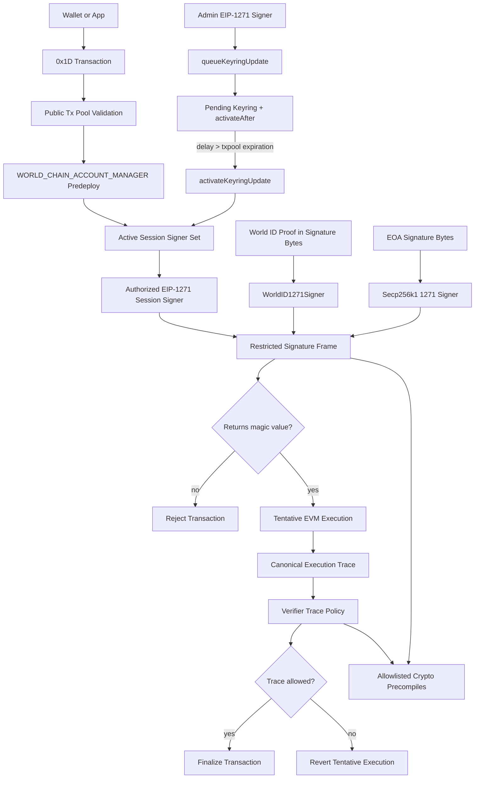

## Abstract

A *World Chain Account* is a predeploy-managed account whose 20-byte address is deterministic and lifetime-stable. Each account has one admin signer fixed at creation and an active **keyring** of session signers authorized to sign transactions on the account's behalf. Both admin authorization and session-key transaction authorization are verified exclusively through [EIP-1271](https://eips.ethereum.org/EIPS/eip-1271) smart contract signers.

This WIP extends [EIP-2718](https://eips.ethereum.org/EIPS/eip-2718) with a typed transaction envelope (`0x1D`) whose signature payload is passed to an authorized session signer's `isValidSignature(bytes32,bytes)` implementation under a restricted, metered validation frame. The protocol does not natively dispatch over secp256k1, P256, WebAuthn, EdDSA, BLS, World ID, or any other signature scheme. Those schemes are implemented by EIP-1271 signer contracts using reusable EVM precompiles.

Session signers also define programmable execution policy. The protocol does not store or interpret that policy. After signature verification and tentative transaction execution, the protocol supplies the resulting execution trace to the same session verifier contract. The verifier evaluates its internal policy as `f(transactionContext, executionTrace) -> bool`; if it returns false or fails, the transaction reverts.

Account state and keyring management live in the `WORLD_CHAIN_ACCOUNT_MANAGER` predeploy. The manager exposes default signer factories for common strategies, including a World ID signer that verifies World ID proofs encoded in EIP-1271 signature bytes, and a secp256k1 signer that wraps EOA-style signatures. These default signers are reference implementations, not privileged protocol paths.

Keyring updates are timelocked. An admin-authorized update first queues a full replacement keyring, and that keyring can only become active after a protocol-defined delay longer than the public transaction-pool expiration window. Default signer factories MUST apply the same delay discipline to signer authorization state so that EIP-1271 verification cannot fail between public transaction-pool validation and inclusion due to keyring or signer-state mutation.

## Motivation

### One Signature Abstraction

Ethereum already standardizes contract-based signature validation through EIP-1271. WIP-1001 makes EIP-1271 the only native authorization abstraction for World Chain Accounts. This keeps the transaction envelope small and scheme-agnostic while allowing wallets, applications, and future protocol features to introduce new signing policies without changing the transaction type.

An EOA wrapper, a passkey signer, a World ID proof verifier, a threshold signer, an EdDSA signer, or a BLS aggregate signer is simply a contract that returns the EIP-1271 magic value for a given hash and opaque signature bytes. The same signer can also own the session policy for what that session key may do.

### Reusable Cryptography

Cryptographic accelerators used for account validation should not be host-private. If WIP-1001 signers depend on an elliptic-curve, hash, pairing, EdDSA, or BLS primitive, the primitive MUST be exposed as a normal EVM precompile with the same behavior for contracts and protocol validation. This makes signer contracts the compatibility layer over public VM functionality.

### Programmable Keyrings

The keyring should be an elegant authorization registry, not a catalogue of native signature algorithms or call-scope rules. A World Chain Account stores signer contracts. The signer contract owns the verification strategy, recovery strategy, quorum rules, proof format, authenticator-specific state, and programmable execution policy. This gives the protocol one validation path while preserving a programmable account surface.

### Pool-Stable Validation

Public transaction pools validate transactions before inclusion. If a keyring or signer can invalidate a signature immediately after validation, a transaction can be accepted by the pool and then fail during block construction. WIP-1001 therefore requires keyring replacements and default signer authorization-state changes to be delayed by more than the public pool expiration window. A transaction that is pool-valid against the active keyring and a compliant default signer remains valid until it either expires from the pool or is included, assuming no other transaction fields become invalid.

## Specification

The key words "MUST", "MUST NOT", "REQUIRED", "SHALL", "SHALL NOT", "SHOULD", "SHOULD NOT", "RECOMMENDED", "NOT RECOMMENDED", "MAY", and "OPTIONAL" in this document are to be interpreted as described in [RFC 2119](https://www.rfc-editor.org/rfc/rfc2119) and [RFC 8174](https://www.rfc-editor.org/rfc/rfc8174).

### Constants

| Name | Value | Description |
| ---- | ----- | ----------- |
| `WORLD_TX_TYPE` | `0x1D` | EIP-2718 transaction type |
| `WORLD_CHAIN_ACCOUNT_MANAGER` | `TBD` | World Chain Account Manager predeploy address |
| `MAX_SESSION_SIGNERS` | `20` | Maximum active session signers per account |
| `EIP1271_MAGIC_VALUE` | `0x1626ba7e` | `bytes4(keccak256("isValidSignature(bytes32,bytes)"))` |
| `EIP1271_VALIDATION_GAS_LIMIT` | `TBD` | Fixed gas supplied to every protocol EIP-1271 validation frame |
| `EXECUTION_TRACE_VALIDATION_GAS_LIMIT` | `TBD` | Fixed gas supplied to every protocol execution-trace policy validation frame |
| `MAX_EXECUTION_TRACE_BYTES` | `TBD` | Maximum ABI-encoded execution trace size supplied to a verifier |
| `TXPOOL_TRANSACTION_EXPIRATION_WINDOW` | `TBD` | Maximum public transaction-pool lifetime for a `0x1D` transaction |
| `MIN_KEYRING_UPDATE_DELAY` | `> TXPOOL_TRANSACTION_EXPIRATION_WINDOW` | Minimum delay before a queued keyring can activate |
| `WORLD_ID_1271_SIGNER_FACTORY` | `TBD` | Default World ID EIP-1271 signer factory |
| `SECP256K1_1271_SIGNER_FACTORY` | `TBD` | Default secp256k1 EIP-1271 signer factory |
| `WORLD_CHAIN_RP_ID` | `480` | World Chain's registered World ID relying-party ID |
| `WORLD_ID_ACCOUNT_TAG` | `"WORLD_ID_ACCOUNT"` | Domain tag for World ID account/signer creation actions |

`EIP1271_VALIDATION_GAS_LIMIT`, `EXECUTION_TRACE_VALIDATION_GAS_LIMIT`, and `MAX_EXECUTION_TRACE_BYTES` are protocol constants. They are not selected by the transaction, account, signer, keyring entry, admin authorization, or factory.

`MIN_KEYRING_UPDATE_DELAY` MUST be strictly greater than the maximum configured public transaction-pool expiration window for `0x1D` transactions. If a client or network changes the public pool expiration window, this constant MUST remain larger than the new window before WIP-1001 public-pool admission is enabled under that configuration.

### Reusable Crypto Precompiles

Any accelerated cryptographic primitive used by protocol-valid EIP-1271 signers MUST be available through an EVM precompile with the same behavior for smart contracts and protocol/system callers. Implementations MUST NOT validate WIP-1001 signers with private host functions unavailable to contracts.

The restricted validation-frame precompile allowlist initially contains:

| Name | Address | Purpose |
| ---- | ------- | ------- |
| `ECRECOVER` | `0x0000000000000000000000000000000000000001` | Ethereum secp256k1 recovery |
| `SHA256` | `0x0000000000000000000000000000000000000002` | WebAuthn and other hash-based verification |
| `MODEXP` | `0x0000000000000000000000000000000000000005` | Modular exponentiation ([EIP-198](https://eips.ethereum.org/EIPS/eip-198)) |
| `BN254_ADD` | `0x0000000000000000000000000000000000000006` | BN254 G1 addition ([EIP-196](https://eips.ethereum.org/EIPS/eip-196)) |
| `BN254_MUL` | `0x0000000000000000000000000000000000000007` | BN254 G1 scalar multiplication ([EIP-196](https://eips.ethereum.org/EIPS/eip-196)) |
| `BN254_PAIRING` | `0x0000000000000000000000000000000000000008` | BN254 pairing check ([EIP-197](https://eips.ethereum.org/EIPS/eip-197)) |
| `P256VERIFY` | `0x0000000000000000000000000000000000000100` | P256/secp256r1 verification ([RIP-7212](https://github.com/ethereum/RIPs/blob/master/RIPS/rip-7212.md)) |
| `EDDSA_VERIFY` | `TBD` | EdDSA signature verification; specified by a separate WIP |
| `BLS12_381_VERIFY` | `TBD` | BLS12-381 verification or pairing suite; specified by a separate WIP |

The concrete address, supported curve(s), input/output encoding, malleability rules, failure behavior, and gas schedule for `EDDSA_VERIFY` and `BLS12_381_VERIFY` are out of scope for this WIP and MUST be specified before activation. Future curve, pairing, or proof-system precompiles MAY be added by a follow-on fork.

### Abstract Account Model

An account is created by an EIP-1271-admin-authorized `create` operation. Creation fixes:

- `adminSigner`, the EIP-1271 contract that authorizes future keyring updates;
- `accountSalt`, the admin-selected salt used for deterministic address derivation;
- the initial active keyring of session signers.

After creation, `adminSigner` and `accountSalt` are immutable for the lifetime of the account. Keyring mutation is performed by queueing a full replacement keyring, then activating it after the timelock delay has elapsed.

#### Account State

Per-account state stored by the `WORLD_CHAIN_ACCOUNT_MANAGER` predeploy:

```solidity
struct Account {
    address         adminSigner;
    bytes32         accountSalt;
    SessionSigner[] activeSessionSigners;
    bytes32         activeKeyringHash;
    PendingKeyringUpdate pendingKeyringUpdate;
    uint64          adminNonce;
}

struct PendingKeyringUpdate {
    bool            exists;
    bytes32         expectedCurrentKeyringHash;
    SessionSigner[] targetSessionSigners;
    bytes32         targetKeyringHash;
    uint64          activateAfter;
    uint64          queuedAtNonce;
}
```

`adminNonce` is initialized to `0` at creation and incremented by `1` whenever a keyring update is successfully queued. `activateKeyringUpdate` does not require a new admin authorization and does not increment `adminNonce`.

#### Session Signers

```solidity
struct SessionSigner {
    address signer;
}
```

`signer` MUST NOT be the zero address and MUST have non-empty code when it is added to a keyring. The signer MUST implement `IERC1271.isValidSignature(bytes32,bytes)` and `IWorldChainSessionVerifier.isValidExecutionTrace(WorldChainTransactionContext,WorldChainExecutionTrace)`.

Protocol native EIP-1271 signature verification is constrained to `EIP1271_VALIDATION_GAS_LIMIT`.

A keyring MUST contain at least one session signer and MUST NOT contain more than `MAX_SESSION_SIGNERS`.

Session signers carry no intrinsic privileges beyond signing `0x1D` transactions whose execution traces are accepted by their verifier policy.

#### Session Verifier Execution Policy Interface

Session signers MUST implement:

```solidity
interface IWorldChainSessionVerifier is IERC1271 {
    struct AccessListEntry {
        address account;
        bytes32[] storageKeys;
    }

    struct WorldChainTransactionContext {
        bytes32 signingHash;
        uint256 chainId;
        address account;
        address signer;
        uint64  nonce;
        uint256 maxPriorityFeePerGas;
        uint256 maxFeePerGas;
        uint64  gasLimit;
        bool    isCreate;
        address target;
        uint256 value;
        bytes   data;
        bytes4  selector;
        AccessListEntry[] accessList;
        bytes32 activeKeyringHash;
    }

    enum TraceCallKind {
        Call,
        StaticCall,
        DelegateCall,
        Create,
        Create2
    }

    struct CallTrace {
        uint32        depth;
        TraceCallKind kind;
        address       caller;
        address       target;
        uint256       value;
        bytes4        selector;
        bytes32       inputHash;
        bytes32       outputHash;
        bool          success;
        uint64        gasUsed;
    }

    struct LogTrace {
        address   emitter;
        bytes32[] topics;
        bytes32   dataHash;
    }

    struct WorldChainExecutionTrace {
        bool        success;
        uint64      gasUsed;
        bytes32     outputHash;
        CallTrace[] calls;
        LogTrace[]  logs;
    }

    function isValidExecutionTrace(
        WorldChainTransactionContext calldata context,
        WorldChainExecutionTrace calldata trace
    ) external view returns (bool allowed);
}
```

The protocol constructs `WorldChainTransactionContext` from the `0x1D` transaction after computing `signingHash` and loading the active keyring entry:

- `signingHash` is the canonical `0x1D` signing hash.
- `chainId`, `nonce`, fee fields, `gasLimit`, `value`, `data`, and `accessList` are copied from the transaction.
- `account` is the World Chain Account sender.
- `signer` is the declared session signer.
- For a call transaction, `isCreate == false` and `target == to`.
- For a contract-creation transaction, `isCreate == true`, `target == address(0)`, and `data` is init code.
- `selector` is the first four bytes of `data`; if `data.length < 4`, `selector == 0x00000000`.
- `activeKeyringHash` is the account's active keyring hash at validation time.

The protocol constructs `WorldChainExecutionTrace` from the tentative execution of the `0x1D` payload:

- `success` is the success status of the root transaction payload execution.
- `gasUsed` is the gas consumed by the root transaction payload execution before trace validation.
- `outputHash` is `keccak256(returnData)` for the root transaction payload execution.
- `calls` is the ordered, depth-annotated call/create trace emitted by the root execution. The root call itself is excluded because it is already represented by `WorldChainTransactionContext`.
- `logs` is the ordered log summary emitted by the root execution.

Full internal calldata, return data, and log data are not copied into the trace by default; their hashes are supplied to keep trace validation bounded. A verifier that needs to authorize exact internal calldata SHOULD require the caller to include the relevant commitments in the session signature or in root transaction calldata. The ABI-encoded trace supplied to the verifier MUST NOT exceed `MAX_EXECUTION_TRACE_BYTES`.

No block-context fields other than `chainId` are supplied. If a verifier policy depends on time, block number, or other context, it MUST bind that data through its own signature/proof payload rather than reading block opcodes during trace validation.

The execution-trace policy check is evaluated after tentative execution and before state commit, under the same call-target and opcode restrictions as EIP-1271 signature validation, with gas exactly `EXECUTION_TRACE_VALIDATION_GAS_LIMIT`. If the call reverts, runs out of gas, executes a forbidden opcode, calls a forbidden address, returns malformed data, or returns `false`, the transaction-level authorization fails and the tentative payload execution is reverted.

The policy function is intentionally `f(transactionContext, executionTrace) -> bool`: the protocol supplies what happened, while the verifier defines whether that execution is allowed. Examples include target/selector allowlists, method-argument commitments, value-flow limits, internal-call restrictions, log emission requirements, proof-bound permissions, per-session spending state, or app-specific invariants over the call trace.

#### Address Derivation

```text
account = bytes20(keccak256(abi.encodePacked(
    bytes32("WORLD_CHAIN_ACCOUNT"),
    block.chainid,
    WORLD_CHAIN_ACCOUNT_MANAGER,
    adminSigner,
    accountSalt
)))
```

The address is fixed for the lifetime of the account. Keyring updates, signer state changes, and admin-signer internal recovery do not change the account address.

The default World ID signer factory SHOULD derive different signer addresses for different World ID account nonces. A World ID holder who wants unlinkability across accounts SHOULD use distinct World ID signer instances and distinct `accountSalt` values.

#### Keyring Hash

The canonical keyring hash is:

```text
keyringHash = keccak256(abi.encode(sessionSigners))
```

where `sessionSigners` is the full ABI-encoded `SessionSigner[]` in its stored order. The order is admin-selected and consensus-significant. Clients SHOULD sort signers lexicographically by `signer` before submitting updates to avoid accidental duplicate representations.

#### Signal Semantics

Admin authorizations bind to a uniform `signalHash`. The hash supplied to an admin signer is always the 248-bit truncated keccak value:

```text
signalHash = bytes32(uint256(keccak256(abi.encode(signal))) >> 8)
```

The truncation keeps the value within the BN254 scalar field for World ID proof-backed EIP-1271 signers. It is uniform for all admin signers so that the signed value is independent of the signer implementation.

```solidity
struct CreateSignal {
    bytes32         tag;               // keccak256("WORLD_CHAIN_ACCOUNT_CREATE")
    address         adminSigner;
    bytes32         accountSalt;
    address         msgSender;
    SessionSigner[] initialSessionSigners;
}

struct QueueKeyringUpdateSignal {
    bytes32         tag;               // keccak256("WORLD_CHAIN_ACCOUNT_QUEUE_KEYRING_UPDATE")
    address         account;
    address         adminSigner;
    uint64          adminNonce;
    address         msgSender;
    bytes32         expectedCurrentKeyringHash;
    SessionSigner[] targetSessionSigners;
    bytes32         targetKeyringHash;
    uint64          activateAfter;
}
```

`msgSender` is the EVM `msg.sender` of the manager call. Binding it prevents an in-flight admin authorization observed in the mempool from being replayed by a different submitter. A public factory, relayer, or forwarding contract that calls the manager for multiple users MUST enforce its own caller/request binding before forwarding; otherwise those users share the same `msg.sender` for WIP-1001 authorization purposes.

#### Replay Protection

For `create`, replay is precluded by account existence: the manager MUST revert if the derived account already exists.

For `queueKeyringUpdate`, replay is prevented by `adminNonce`. The signal contains the current `adminNonce`; after a successful queue operation the manager increments `adminNonce`. An authorization for nonce `n` is invalid after the account advances to nonce `n + 1`.

Queueing a new keyring update while another update is pending is permitted. The new queue operation MUST be independently admin-authorized, MUST satisfy the same delay rules, and replaces the previous pending update.

### Manager Interface

```solidity
interface IWorldChainAccountManager {
    function create(
        address adminSigner,
        bytes32 accountSalt,
        SessionSigner[] calldata initialSessionSigners,
        bytes calldata adminAuthorization
    ) external returns (address account);

    function queueKeyringUpdate(
        address account,
        bytes32 expectedCurrentKeyringHash,
        SessionSigner[] calldata targetSessionSigners,
        uint64 activateAfter,
        bytes calldata adminAuthorization
    ) external;

    function activateKeyringUpdate(address account) external;

    function getAdminSigner(address account) external view returns (address);
    function getAdminNonce(address account) external view returns (uint64);
    function getActiveKeyringHash(address account) external view returns (bytes32);
    function getActiveSessionSigners(address account) external view returns (SessionSigner[] memory);
    function getPendingKeyringUpdate(address account) external view returns (PendingKeyringUpdate memory);
    function isAuthorized(address account, address signer) external view returns (bool);
    function getAuthorizedSigner(address account, address signer) external view returns (SessionSigner memory);
}
```

For `create`, the manager MUST:

1. Require `adminSigner` has non-empty code.
2. Validate all `initialSessionSigners` and keyring-size constraints.
3. Compute the deterministic account address from `(adminSigner, accountSalt)`.
4. Require the account does not already exist.
5. Recompute the `CreateSignal` `signalHash`.
6. Run the restricted EIP-1271 validation frame against `adminSigner` with `(hash = signalHash, signature = adminAuthorization)`.
7. Store `adminSigner`, `accountSalt`, `activeSessionSigners = initialSessionSigners`, `activeKeyringHash`, no pending update, and `adminNonce = 0`.

For `queueKeyringUpdate`, the manager MUST:

1. Require the account exists.
2. Validate all `targetSessionSigners` and keyring-size constraints.
3. Require `expectedCurrentKeyringHash == activeKeyringHash`.
4. Require `activateAfter >= block.timestamp + MIN_KEYRING_UPDATE_DELAY`.
5. Compute `targetKeyringHash = keccak256(abi.encode(targetSessionSigners))`.
6. Recompute the `QueueKeyringUpdateSignal` `signalHash` using the current `adminNonce`.
7. Run the restricted EIP-1271 validation frame against the account's `adminSigner` with `(hash = signalHash, signature = adminAuthorization)`.
8. Store the pending update, replacing any previous pending update.
9. Increment `adminNonce`.

For `activateKeyringUpdate`, the manager MUST:

1. Require the account exists.
2. Require a pending update exists.
3. Require `block.timestamp >= pending.activateAfter`.
4. Require `pending.expectedCurrentKeyringHash == activeKeyringHash`.
5. Replace `activeSessionSigners` with `pending.targetSessionSigners`.
6. Store `activeKeyringHash = pending.targetKeyringHash`.
7. Clear the pending update.

`activateKeyringUpdate` is permissionless. It applies only a previously admin-authorized update after the required delay.

### Restricted Validation Frames

Protocol signer validation is intentionally narrower than an ordinary EVM `STATICCALL`. Normal smart contracts MAY call any EIP-1271 or policy implementation according to Ethereum rules, but WIP-1001 protocol validation of an admin signer, session signer, or session policy MUST execute in a restricted validation frame.

The goal is:

```text
protocol -> WORLD_CHAIN_ACCOUNT_MANAGER -> signer validation hook -> allowlisted crypto precompiles only
```

There MUST NOT be an arbitrary EVM-to-EVM call graph during protocol signature or policy validation.

#### Signature Entry Call

For a signer contract `signer`, hash `hash`, and signature bytes `signature`, the protocol invokes:

```solidity
IERC1271(signer).isValidSignature(hash, signature)
```

with:

- call type: `STATICCALL` semantics;
- `CALLER`: `WORLD_CHAIN_ACCOUNT_MANAGER`;
- `ADDRESS`: `signer`;
- `CALLVALUE`: `0`;
- gas: exactly `EIP1271_VALIDATION_GAS_LIMIT`;
- calldata: `IERC1271.isValidSignature.selector || abi.encode(hash, signature)`;
- success condition: the call succeeds and returns ABI-encoded `bytes4(EIP1271_MAGIC_VALUE)`.

If the call reverts, runs out of gas, executes a forbidden opcode, calls a forbidden address, returns malformed data, or returns any value other than `EIP1271_MAGIC_VALUE`, the signature is invalid.

A `0x1D` transaction, account, keyring entry, admin signer, and session signer MUST NOT choose or override the signature-validation gas. The gas consumed by session-signer validation MUST be metered against the transaction's gas limit before execution of the transaction payload. Admin validation gas is metered against the EVM call to the manager.

#### Execution Trace Policy Entry Call

After tentative transaction payload execution, for a session signer `signer`, transaction context `context`, and execution trace `trace`, the protocol invokes:

```solidity
IWorldChainSessionVerifier(signer).isValidExecutionTrace(context, trace)
```

with:

- call type: `STATICCALL` semantics;
- `CALLER`: `WORLD_CHAIN_ACCOUNT_MANAGER`;
- `ADDRESS`: `signer`;
- `CALLVALUE`: `0`;
- gas: exactly `EXECUTION_TRACE_VALIDATION_GAS_LIMIT`;
- calldata: `IWorldChainSessionVerifier.isValidExecutionTrace.selector || abi.encode(context, trace)`;
- success condition: the call succeeds and returns ABI-encoded `bool(true)`.

If the call reverts, runs out of gas, executes a forbidden opcode, calls a forbidden address, returns malformed data, or returns `false`, trace validation fails and the tentative transaction payload execution MUST be reverted.

A `0x1D` transaction, account, keyring entry, admin signer, and session signer MUST NOT choose or override the trace-validation gas. The gas consumed by execution-trace policy validation MUST be metered against the transaction's gas limit after payload execution and before transaction finalization.

#### Call-Depth and Call-Target Rules

During the restricted validation frame:

- `STATICCALL` to an address in the validation precompile allowlist is permitted.
- `STATICCALL` to any non-allowlisted address is forbidden.
- `CALL`, `CALLCODE`, `DELEGATECALL`, `CREATE`, and `CREATE2` are forbidden.
- Precompile execution does not introduce an additional EVM-code frame for purposes of this rule.

Therefore a protocol-valid EIP-1271 signer contract MUST be self-contained except for direct calls to allowed precompiles. Proxy patterns, module systems, and library dispatch through `DELEGATECALL` are invalid in the restricted frame unless a future WIP relaxes this rule.

#### Opcode Policy

The restricted validation frame permits deterministic computation, calldata/memory access, own-code access, own-storage reads, `KECCAK256`, `CHAINID`, `GAS`, and `STATICCALL` to allowed precompiles. `GAS` is permitted because each frame starts with a fixed protocol gas limit rather than transaction-selected gas.

The following opcodes are forbidden if executed in the restricted validation frame:

```text
BLOCKHASH
COINBASE
TIMESTAMP
NUMBER
PREVRANDAO / DIFFICULTY
GASLIMIT
BASEFEE
BLOBHASH
BLOBBASEFEE
GASPRICE
ORIGIN
BALANCE
SELFBALANCE
EXTCODESIZE
EXTCODECOPY
EXTCODEHASH
SSTORE
TLOAD
TSTORE
LOG0
LOG1
LOG2
LOG3
LOG4
CALL
CALLCODE
DELEGATECALL
CREATE
CREATE2
SELFDESTRUCT
```

This list removes block-context, transaction-context, external-state, transient-state, logging, mutation, and arbitrary call-depth dependencies from protocol signature and execution-trace policy validation. EIP-1271 validity and trace-policy validity MAY depend on the signer's own persistent storage via `SLOAD`, subject to the signer-state timelock requirements below.

### Signer-State Timelock Requirements

To make public-pool validation stable, any signer state that can cause a previously valid signature or previously accepted execution trace to become invalid MUST transition through a delay of at least `MIN_KEYRING_UPDATE_DELAY` before it becomes effective.

For default manager-supported signer factories, this is mandatory:

- owner rotation in a secp256k1 signer MUST be queued before activation;
- World ID session verifier state that changes accepted session material MUST be queued before activation;
- threshold, key, revocation, recovery, or trace-policy state in any default signer MUST be queued before activation.

Custom EIP-1271 signers are protocol-compatible only if all storage values read during signature or trace-policy restricted frames obey the same delay discipline. Public transaction-pool implementations MUST NOT advertise full validation-stability guarantees for custom signers unless the signer bytecode or deployment is known to satisfy this property. Consensus validation still executes the signature and trace-policy calls at inclusion time; the timelock requirement defines WIP-1001-compliant signer behavior and public-pool admission policy.

### Default Signer Factories

Default signer factories are ordinary contracts, exposed by or discoverable from `WORLD_CHAIN_ACCOUNT_MANAGER`, that deploy deterministic EIP-1271 signer contracts with WIP-1001-compliant restricted-frame behavior and signer-state timelocks.

The default factories are not special validation paths. A signer produced by a default factory is authorized only if it appears in the active keyring or is fixed as an account's admin signer.

Default signer implementations MUST implement `isValidExecutionTrace`. A signer with no additional execution policy MAY return `true` for every well-formed trace after signature validation succeeds, but any configurable execution policy it exposes MUST be stored and updated inside the signer under the signer-state timelock rules.

#### Secp256k1 EIP-1271 Signer

The secp256k1 signer factory deploys signer contracts that store an Ethereum address `owner`.

`isValidSignature(hash, signature)` MUST:

1. Decode `signature` as an Ethereum secp256k1 ECDSA signature.
2. Enforce the Ethereum low-`s` rule from [EIP-2](https://eips.ethereum.org/EIPS/eip-2).
3. Recover the signer address over `hash` using `ECRECOVER`.
4. Return `EIP1271_MAGIC_VALUE` iff the recovered address equals the active `owner`.

Owner rotation, owner revocation, or any trace-policy update that can invalidate a previously valid signature or accepted execution trace MUST be timelocked by at least `MIN_KEYRING_UPDATE_DELAY`.

#### World ID EIP-1271 Signer

The World ID signer factory deploys signer contracts that verify World ID proofs encoded inside EIP-1271 signature bytes. World ID is a reference EIP-1271 verification strategy, not a native WIP-1001 admin or session-key type.

A World ID signer stores the public verifier state required to validate future proofs, including at minimum the relevant `sessionId` or equivalent World ID session-verification material.

For transaction or admin validation, `isValidSignature(hash, signature)` MUST:

1. Decode `signature` as a World ID proof payload.
2. Derive the World ID proof `signalHash` from `hash`, using `uint256(hash) >> 8` when the proof system requires a BN254-field signal.
3. Verify the World ID proof against the stored session-verification material and the decoded public inputs.
4. Return `EIP1271_MAGIC_VALUE` iff verification succeeds.

A conceptual session-proof signature payload is:

```solidity
struct WorldID1271Signature {
    uint256    proofNonce;
    uint64     issuerSchemaId;
    uint64     expiresAtMin;
    uint256    credentialGenesisIssuedAtMin;
    uint256[2] sessionNullifier;
    uint256[5] proof;
}
```

The signer MUST NOT persist `sessionNullifier` as account-manager state. Replay prevention for manager operations comes from account existence and `adminNonce`; replay prevention or nullifier tracking internal to a World ID signer is signer-policy-specific and MUST preserve the signer-state timelock guarantee if it can invalidate pooled transactions.

World ID signer creation MAY be gated by a World ID Uniqueness Proof. The creation proof, account nonce, signer salt, and initial session-verification material are factory-level concerns. Once deployed, the signer is just an EIP-1271 contract from the manager's perspective.

### Transaction Type `0x1D`

A `0x1D` transaction is signed by a session signer of a World Chain Account and submitted directly to the public transaction pool. `0x1D` transactions are signer-strategy-agnostic: transaction validation reads the active keyring, invokes EIP-1271 on the declared signer, tentatively executes the payload, then asks the same signer whether the resulting execution trace satisfies its internal policy.

#### Envelope

```text
0x1D || rlp([
    chain_id,                    // 0
    nonce,                       // 1
    max_priority_fee_per_gas,    // 2
    max_fee_per_gas,             // 3
    gas_limit,                   // 4
    to,                          // 5
    value,                       // 6
    data,                        // 7
    access_list,                 // 8
    account,                     // 9   -- sender's World Chain Account address
    signer,                      // 10  -- authorized EIP-1271 session signer
    signature,                   // 11  -- opaque bytes passed to isValidSignature
])
```

```text
signing_hash = keccak256(0x1D || rlp(fields[0..=10]))
```

The `signing_hash` covers every field except `signature` itself, binding the declared session signer to the transaction and ruling out signer-substitution attacks at the consensus layer.

The protocol does not interpret `signature`. It is passed unchanged to:

```solidity
IERC1271(signer).isValidSignature(signing_hash, signature)
```

#### Validation and Execution

The protocol MUST validate and execute a `0x1D` transaction as follows:

1. Compute `signing_hash`.
2. Load the active keyring entry for `(account, signer)`.
3. Reject if no matching active session signer exists.
4. Run the restricted EIP-1271 validation frame against `signer` with `(hash = signing_hash, signature = signature)`.
5. Reject if the frame does not return `EIP1271_MAGIC_VALUE`.
6. Tentatively execute the transaction payload under normal EVM rules, collecting the canonical `WorldChainExecutionTrace`.
7. Construct `WorldChainTransactionContext` from the transaction and active keyring state.
8. Require `abi.encode(trace).length <= MAX_EXECUTION_TRACE_BYTES`.
9. Run the restricted execution-trace policy validation frame against `signer` with `(context, trace)`.
10. If the frame does not return `true`, revert the tentative payload execution and mark the transaction as failed by policy.
11. If the frame returns `true`, finalize the transaction according to the tentative payload execution result.

Authorization is checked before any signer call so an attacker cannot use an unauthorized `0x1D` transaction to force arbitrary signature or trace-policy validation work.

The envelope is extensible to 2D nonces, batched transactions, and native paymaster support in follow-on WIPs.

### Visual Flow



### Extensions

- **Trace schema extensions.** The execution trace schema MAY be extended with additional bounded summaries such as storage-write commitments, balance-delta commitments, or transient-storage summaries. The verifier remains the policy owner; the protocol only defines the trace data it supplies.
- **Admin rotation.** Replacing an account's fixed `adminSigner` under a separate timelocked admin-rotation flow. Deferred in this WIP.
- **Multi-admin.** M-of-N admin authorization for a single account. Deferred as native manager state; near-term policies SHOULD be represented inside an EIP-1271 admin signer.
- **Additional crypto precompiles.** BLS12-381, EdDSA variants, secp256k1 verification without recovery, or other primitives MAY be added as VM precompiles. Once allowlisted for the restricted validation frame, EIP-1271 signer contracts can use them without changing the `0x1D` envelope.
- **Bundling, 2D nonces, paymasters.** Reserved for follow-on WIPs on the `0x1D` envelope.

## Rationale

**Account state as predeploy.** The keyring lives in the `WORLD_CHAIN_ACCOUNT_MANAGER` predeploy because `0x1D` validation must read the active signer set natively while preserving an ordinary Solidity/EVM-bytecode implementation surface for account management and default factories.

**EIP-1271-only verification.** A single contract-signature abstraction avoids protocol branches for every authenticator or cryptographic scheme. New signer strategies can be deployed as contracts and audited independently without changing the transaction type.

**Fixed validation gas.** Per-signer gas limits make keyring entries harder to reason about, expand the admin-authorized state surface, and let signer deployment choices affect transaction validation economics. A single `EIP1271_VALIDATION_GAS_LIMIT` gives every protocol 1271 validation frame the same execution budget.

**Verifier-owned programmable policy.** Static `(target, selector)` allowlists are too narrow for account-native sessions, and the manager should not store a policy language. Passing the post-execution trace to the same verifier that authenticated the session lets policy be expressed as `f(transactionContext, executionTrace) -> bool`, so the verifier can decide whether what actually happened is allowed.

**Reusable precompiles instead of host-only cryptography.** P256, EdDSA, BLS, pairing checks, and future curves are useful outside account validation. Exposing them as normal precompiles ensures the protocol and contracts agree on inputs, outputs, gas, and edge cases.

**Restricted validation frames.** Unrestricted contract signature or policy validation would allow an arbitrary read-only call graph before transaction execution. The restricted frame bounds gas, fixes the caller, forbids arbitrary call depth, and removes block-, transaction-, and external-state-sensitive opcodes while preserving own-storage policy and direct precompile calls.

**Full-keyring replacement.** Updates carry the complete target keyring rather than add/remove deltas. This makes every admin authorization commit to the exact post-update authorization set, avoids ordering-dependent delta semantics, and removes edge cases where separately authorized removals and additions compose into an unintended intermediate keyring.

**Timelocked activation.** Delaying keyring activation by more than the transaction-pool expiration window prevents manager-owned keyring changes from invalidating transactions that were already admitted to the public pool. Applying the same discipline to default signer authorization and policy state extends that guarantee through signer validation.

**World ID as reference signer.** World ID proofs are powerful authorization material, but they do not need a native WIP-1001 admin type. Encoding World ID proof payloads in EIP-1271 signatures makes World ID one programmable signer implementation among many and keeps the manager's account model uniform.

## Backwards Compatibility

This WIP introduces a new account type and transaction type. Existing EOAs and smart contract accounts are unaffected. Standard [EIP-1559](https://eips.ethereum.org/EIPS/eip-1559) transactions continue to work for legacy accounts; the `0x1D` envelope is required only for World-Chain-Account-authenticated execution.

This WIP is Draft. The move to EIP-1271-only session and admin verification, the replacement of native account-manager language with a manager predeploy, the removal of native signature-type dispatch, and timelocked keyring activation are breaking changes relative to earlier drafts. No production accounts exist.

Existing draft implementations or libraries that expose native P256, WebAuthn, EdDSA, or secp256k1 WIP-1001 transaction signature variants are obsolete relative to this specification. Those strategies SHOULD migrate to EIP-1271 signer contracts or default signer factories.

### Existing Safe Accounts

Existing [Safe](https://safe.global) accounts MAY integrate with World Chain Accounts without migrating assets or changing the Safe address by installing modules or guards that recognize a World Chain Account as an authorized caller. Existing Safe contracts are not automatically valid WIP-1001 protocol signers: the restricted validation frames forbid arbitrary call depth, `DELEGATECALL`, and external contract state reads. A Safe-style policy can be used as a protocol signer only through bytecode that satisfies the signature interface, execution-trace policy interface, restricted-frame rules, and signer-state timelock rules, or through ordinary application-level calls outside WIP-1001 protocol validation.

## Security Considerations

### Front-Running Admin Authorizations

Both `CreateSignal` and `QueueKeyringUpdateSignal` bind `msg.sender`, so a witnessed admin authorization observed in the mempool cannot be replayed by a different submitter. A griefer can still re-submit an authorization unchanged from the original `msg.sender`, but the resulting state is either identical or supersedes the same pending update under the same admin intent.

The binding is to the direct EVM caller of `WORLD_CHAIN_ACCOUNT_MANAGER`. A public factory, relayer, or forwarding contract that calls the manager on behalf of multiple users MUST enforce its own caller/request binding before forwarding.

### Admin Signer Compromise

An admin signer can queue a full keyring replacement, but the replacement cannot activate until `MIN_KEYRING_UPDATE_DELAY` has elapsed. The delay gives wallets and monitoring systems time to warn users or move funds using still-active session signers. If the admin signer remains compromised until activation, the attacker can eventually replace the keyring.

### Signer Validation DoS

Protocol signature validation is bounded by the fixed `EIP1271_VALIDATION_GAS_LIMIT`, execution-trace policy validation is bounded by the fixed `EXECUTION_TRACE_VALIDATION_GAS_LIMIT`, and trace size is bounded by `MAX_EXECUTION_TRACE_BYTES`. Transactions cannot select a higher gas budget for either validation frame, and keyring authorization is checked before signer calls. This prevents unauthorized transactions from using arbitrary signer contracts as validation gas sinks.

### Call-Graph and External-State Invalidation

Restricted validation frames forbid EVM-to-EVM calls except direct `STATICCALL`s to allowlisted precompiles. They also forbid external-code and external-balance inspection opcodes. As a result, protocol signature and trace-policy validity cannot depend on another contract's code, storage, or balance changing before inclusion.

### Context-Sensitive Opcode Invalidation

Block-context and transaction-context opcodes such as `TIMESTAMP`, `NUMBER`, `BASEFEE`, `GASPRICE`, `ORIGIN`, and blob context are forbidden in restricted validation frames. Signatures and trace-policy decisions therefore cannot become valid or invalid solely because a block producer selected a different block context.

### Own-Storage Invalidation

Signer validity and execution-trace policy validity MAY depend on the signer's own storage. This is the intentional programmable policy surface. To preserve public-pool stability, any own-storage change that can invalidate a previously valid signature or previously accepted execution trace MUST be timelocked by at least `MIN_KEYRING_UPDATE_DELAY` for WIP-1001-compliant signers.

### Custom Signer Safety

The manager can verify any signer that satisfies the signature and execution-trace policy restricted frames at inclusion time, but public transaction pools should distinguish default or otherwise known-safe signers from arbitrary custom signers. If a custom signer can immediately change own-storage validation or trace-policy state, it can invalidate pooled transactions before inclusion and should not receive the full WIP-1001 pool-stability guarantee.

### Contract Upgradeability

Upgradeable signer contracts can change account authorization policy without changing the World Chain Account keyring. Proxy patterns that require `DELEGATECALL` during validation are invalid under the restricted frame. Upgrade paths that can invalidate signatures MUST themselves obey the signer-state timelock discipline.

### Session Signer Deanonymization

A signer contract reused across accounts links those accounts. Clients SHOULD deploy fresh signer instances per account when unlinkability matters. World ID users who require unlinkability SHOULD use distinct World ID account nonces and signer instances.

### Signature-Signer Ambiguity

A World Chain Account may store up to `MAX_SESSION_SIGNERS`, but a `0x1D` transaction declares exactly one `signer`. The keyring lookup is by signer address and MUST be unique. There is no "first matching signer" ambiguity.

### WebAuthn Challenge Binding

For WebAuthn-based EIP-1271 signer contracts, the `0x1D` `signing_hash` SHOULD appear as the WebAuthn challenge, or be bound by an equivalent domain-separated digest inside the contract's validation logic. WIP-1001 does not prescribe the internal EIP-1271 signature format.

### World ID Stale Roots

World ID signer implementations that accept roots within a validity window inherit the stale-root risks of the underlying World ID verifier. A credential revoked shortly before root expiry may still authorize a signature until the verifier's root-validity and credential-expiration checks reject it. The signer implementation MUST surface and document those verifier trust parameters.
