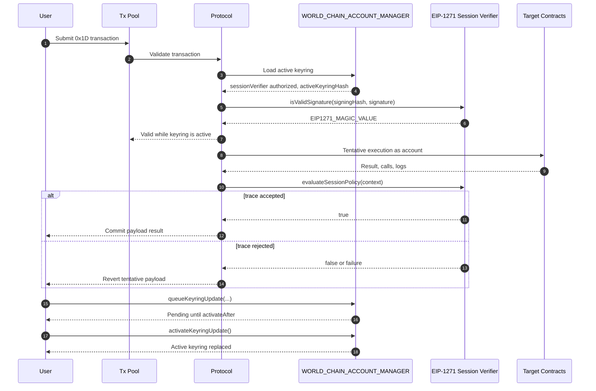

## Abstract

WIP-1001 defines a native World Chain account type managed by the `WORLD_CHAIN_ACCOUNT_MANAGER` predeploy.

Each account has one EIP-1271 admin signer and an active keyring of EIP-1271 session verifiers. The admin signer is the root authority for account management. Session verifiers are delegated authorities for `0x1D` transaction execution.

The protocol does not implement signature schemes directly. Instead, the protocol calls EIP-1271 signers in restricted validation frames. Signature schemes, proof systems, recovery policies, and execution policies are implemented by signer contracts. The protocol provides reusable cryptographic precompiles for common primitives.

Session verifiers also own their execution policy. After tentative transaction execution, the protocol asks the verifier whether the observed execution trace is valid. If the verifier rejects the trace, the tentative execution is reverted.

## Motivation

### One Authorization Path

World Chain accounts need programmable authentication without adding a protocol branch for every signature scheme or proof system. EIP-1271 gives the protocol one authorization path: call a signer contract and require the standard magic value.

Admin signers and session verifiers both use EIP-1271, but they have different protocol roles. An admin signer authorizes account-management operations. A session verifier authorizes transaction signatures and evaluates the resulting execution trace.

### Reusable Cryptography

Signer contracts need efficient cryptographic primitives, but those primitives should not define account semantics. WIP-1001 exposes reusable precompiles for supported curves and proof systems, while keeping account policy in contracts.

World ID is a reference signer implementation. It verifies an EIP-1271 signature that encodes a World ID proof. It is not a privileged protocol path.

### Programmability

Accounts need authorization logic that can evolve without protocol changes. EIP-1271 lets admin signers define arbitrary account-management authorization, including World ID, secp256k1, secp256r1, EdDSA, BLS12-381, multisig, programmable recovery, multi factor authentication and application-specific schemes.

Session verifiers extend that programmability to transaction execution. A verifier can authenticate a session key, inspect the canonical execution trace, and decide whether the transaction satisfies its policy. The protocol only provides deterministic inputs and enforces the verifier's boolean result.

### Stable Transaction Inclusion

Mempool validation and block inclusion must agree on which keyring is active. Keyring updates are therefore timelocked for longer than the transaction pool expiration window. A transaction that validates against an active keyring cannot become invalid before it expires from the pool because of a keyring update.

Default factories that support mutable signer or verifier state must apply the same rule to state that can invalidate already accepted transactions.

## Specification


The key words "MUST", "MUST NOT", "REQUIRED", "SHALL", "SHALL NOT", "SHOULD", "SHOULD NOT", "RECOMMENDED", "NOT RECOMMENDED", "MAY", and "OPTIONAL" in this document are to be interpreted as described in [RFC 2119](https://www.rfc-editor.org/rfc/rfc2119) and [RFC 8174](https://www.rfc-editor.org/rfc/rfc8174).


### Protocol Constants

| Name | Value | Meaning |
| --- | --- | --- |
| `WORLD_TX_TYPE` | `0x1D` | EIP-2718 transaction type for World Chain account transactions. |
| `MAX_SESSION_VERIFIERS` | `20` | Maximum active session verifiers per account. |
| `EIP1271_MAGIC_VALUE` | `0x1626ba7e` | Required return value from `isValidSignature`. |
| `WORLD_CHAIN_RP_ID` | `480` | World Chain relying-party identifier for WebAuthn challenge binding. |
| `WORLD_ID_ACCOUNT_TAG` | `"WORLD_ID_ACCOUNT"` | Domain tag for World ID account action derivation. |
| `WIP1001_ACCOUNT_DOMAIN` | `keccak256("WIP1001_ACCOUNT")` | Domain for account address derivation. |
| `WIP1001_ADMIN_CREATE_DOMAIN` | `keccak256("WIP1001_ADMIN_CREATE")` | Domain for account creation authorization. |
| `WIP1001_QUEUE_KEYRING_UPDATE_DOMAIN` | `keccak256("WIP1001_QUEUE_KEYRING_UPDATE")` | Domain for keyring update authorization. |
| `WIP1001_SIGNER_DOMAIN` | `keccak256("WIP1001_SIGNER")` | Domain for default factory `CREATE2` salts. |

### Activation Parameters

WIP-1001 MUST NOT activate until every parameter below is assigned in the fork configuration.

| Name | Value | Requirement |
| --- | --- | --- |
| `WORLD_CHAIN_ACCOUNT_MANAGER` | TBD | Predeploy address for the account manager. |
| `EIP1271_VALIDATION_GAS_LIMIT` | TBD | Fixed gas forwarded to `isValidSignature`. |
| `EXECUTION_TRACE_VALIDATION_GAS_LIMIT` | TBD | Fixed gas forwarded to `evaluateSessionPolicy`. |
| `MAX_EXECUTION_TRACE_BYTES` | TBD | Maximum ABI-encoded trace size passed to a session verifier. |
| `TXPOOL_TRANSACTION_EXPIRATION_WINDOW` | TBD | Maximum time a valid transaction remains in the pool. |
| `MIN_KEYRING_UPDATE_DELAY` | TBD | MUST be greater than `TXPOOL_TRANSACTION_EXPIRATION_WINDOW`. |
| `WORLD_ID_1271_SIGNER_FACTORY` | TBD | Default World ID EIP-1271 signer factory. |
| `SECP256K1_1271_SIGNER_FACTORY` | TBD | Default secp256k1 EIP-1271 signer factory. |
| `EDDSA_PRECOMPILE` | TBD | EdDSA verification precompile address and ABI. |
| `BLS12_381_PRECOMPILE` | TBD | BLS12-381 verification precompile address and ABI. |

### Reusable Crypto Precompiles

Signer contracts MAY call protocol-supported cryptographic precompiles from restricted validation frames.

The validation-frame precompile allowlist is:

| Primitive | Source |
| --- | --- |
| `ecrecover` | Ethereum precompile |
| `sha256` | Ethereum precompile |
| `ripemd160` | Ethereum precompile |
| `identity` | Ethereum precompile |
| `modexp` | Ethereum precompile |
| `bn254 add` | Ethereum precompile |
| `bn254 scalar multiplication` | Ethereum precompile |
| `bn254 pairing` | Ethereum precompile |
| `secp256r1 verify` | RIP-7212 |
| `EdDSA verify` | Activation parameter |
| `BLS12-381 verify` | Activation parameter |

World Chain clients MUST NOT expose private host validation APIs that are unavailable to contracts. Any primitive used by a default signer MUST be available through an allowlisted precompile.

### Account Model

World Chain accounts are created and managed by `WORLD_CHAIN_ACCOUNT_MANAGER`.

An account has:

- one immutable account address;
- one EIP-1271 admin signer;
- one active keyring of EIP-1271 session verifiers;
- at most one pending keyring update;
- one admin nonce.

Account authority is hierarchical:

1. The account manager owns account state and enforces account-management rules.
2. The admin signer is the root account authority. It authorizes account creation and keyring updates through EIP-1271.
3. Session verifiers are delegated transaction authorities. They authorize `0x1D` transactions through EIP-1271 and approve or reject the observed execution trace through `evaluateSessionPolicy`.

The manager MUST NOT use the admin signer to authorize `0x1D` transaction execution unless the same address is also present in the active session keyring. The manager MUST NOT use a session verifier to authorize account-management operations unless the same address is also configured as the admin signer.

The manager stores account state:

```solidity
struct Account {
    address adminSigner;
    bytes32 accountSalt;
    SessionVerifier[] activeSessionVerifiers;
    bytes32 activeKeyringHash;
    PendingKeyringUpdate pendingKeyringUpdate;
    uint64 adminNonce;
}

struct PendingKeyringUpdate {
    bool exists;
    bytes32 expectedCurrentKeyringHash;
    SessionVerifier[] targetSessionVerifiers;
    bytes32 targetKeyringHash;
    uint64 activateAfter;
    uint64 queuedAtNonce;
}

struct SessionVerifier {
    address verifier;
}
```

`Account.adminSigner` is an EIP-1271 contract. `SessionVerifier.verifier` is an EIP-1271 contract that also implements `IWorldChainSessionVerifier`.

The protocol does not inspect signer internals. It assigns semantics by account role: admin signer for account management, session verifier for transaction authorization and policy evaluation.

The active keyring MUST contain at least one session verifier and at most `MAX_SESSION_VERIFIERS` session verifiers. A keyring MUST NOT contain duplicate verifier addresses.

### Address Derivation

The manager derives an account address as:

```solidity
account = address(
    uint160(
        uint256(
            keccak256(
                abi.encode(
                    WIP1001_ACCOUNT_DOMAIN,
                    chainId,
                    WORLD_CHAIN_ACCOUNT_MANAGER,
                    adminSigner,
                    accountSalt
                )
            )
        )
    )
);
```

This binds the account address to the admin signer, salt, chain, and manager instance.

### Keyring Hash

The manager computes:

```solidity
activeKeyringHash = keccak256(abi.encode(activeSessionVerifiers));
```

The hash commits to verifier addresses and ordering. Clients SHOULD preserve ordering when displaying, exporting, or signing over a keyring.

### Admin Operation Hashes

For every admin authorization, the manager computes a domain-separated `adminOperationHash` and passes it to:

```solidity
adminSigner.isValidSignature(adminOperationHash, adminAuthorization)
```

`adminOperationHash` is the only protocol-defined hash passed to the admin signer. The protocol does not define a generic `signal` field.

The account-creation admin operation hash is:

```solidity
adminOperationHash = keccak256(
    abi.encode(
        WIP1001_ADMIN_CREATE_DOMAIN,
        chainId,
        WORLD_CHAIN_ACCOUNT_MANAGER,
        account,
        adminSigner,
        accountSalt,
        activeKeyringHash
    )
);
```

The keyring-update admin operation hash is:

```solidity
adminOperationHash = keccak256(
    abi.encode(
        WIP1001_QUEUE_KEYRING_UPDATE_DOMAIN,
        chainId,
        WORLD_CHAIN_ACCOUNT_MANAGER,
        account,
        expectedCurrentKeyringHash,
        targetKeyringHash,
        activateAfter,
        adminNonce
    )
);
```

The manager increments `adminNonce` when it queues a keyring update. Activating a queued update MUST NOT increment `adminNonce`.

### Replay Protection

The account address derivation, operation domains, chain ID, manager address, and admin nonce together provide replay protection for account creation and admin operations.

Session transactions use the transaction nonce in the `0x1D` envelope. This nonce is the EVM transaction nonce for `account`, is consumed by included `0x1D` transactions, and is separate from `adminNonce`.

### EIP-1271 Admin Signer Hierarchy

The admin signer is an EIP-1271 contract that authorizes account-management operations. It has no protocol ABI beyond EIP-1271:

```solidity
interface IWorldChainAdminSigner is IERC1271 {}
```

The protocol calls the admin signer with a manager-defined operation hash. The signer returns `EIP1271_MAGIC_VALUE` if the operation is authorized.

Admin signer implementations include:

- World ID admin signers;
- secp256k1 admin signers;
- multisig admin signers;
- recovery admin signers;
- custom application admin signers.

Only the EIP-1271 boundary is protocol-significant. The implementation class is signer contract state, not account manager state.

#### World ID Admin Signer

A World ID admin signer is an EIP-1271 contract whose authorization is a World ID proof bound to the manager-defined operation hash.

The default World ID admin signer MUST expose immutable account-binding state:

```solidity
interface IWorldIDAdminSigner is IWorldChainAdminSigner {
    function accountSalt() external view returns (bytes32);
    function account() external view returns (address);
    function worldIdRpId() external view returns (uint64);
    function worldIdAction() external view returns (uint256);
}
```

The default World ID admin signer uses the World ID v4 uniqueness-proof verifier shape. Its EIP-1271 signature payload is:

```solidity
struct WorldIDUniquenessProofSignature {
    uint256 nullifier;
    uint64 expiresAtMin;
    uint64 issuerSchemaId;
    uint256 credentialGenesisIssuedAtMin;
    uint256[5] zeroKnowledgeProof;
}
```

`account()` MUST return the account address derived by `WORLD_CHAIN_ACCOUNT_MANAGER` using `address(this)` as `adminSigner` and `accountSalt()` as `accountSalt`.

`worldIdRpId()` MUST return `WORLD_CHAIN_RP_ID`.

`worldIdAction()` MUST return:

```solidity
worldIdField(
    abi.encode(
        WORLD_ID_ACCOUNT_TAG,
        WORLD_CHAIN_RP_ID,
        WORLD_CHAIN_ACCOUNT_MANAGER,
        account(),
        address(this)
    )
)
```

where `worldIdField(input) = uint256(keccak256(input)) >> 8`, matching `FieldElement::from_arbitrary_raw_bytes` in the World ID v4 primitives.

`isValidSignature(hash, signature)` MUST:

- decode `signature` as `WorldIDUniquenessProofSignature`;
- compute `signalHash = worldIdField(abi.encode(hash))`;
- compute `nonce = worldIdField(abi.encode("WIP1001_WORLD_ID_ADMIN_NONCE", hash))`;
- require `issuerSchemaId` to equal the signer's configured issuer schema ID;
- require `zeroKnowledgeProof[4]` to be an accepted World ID registry root in the signer's verifier state;
- require `expiresAtMin` and `credentialGenesisIssuedAtMin` to satisfy the signer's configured credential freshness policy;
- verify the proof as a World ID v4 uniqueness proof equivalent to `IWorldIDVerifier.verify(nullifier, worldIdAction(), WORLD_CHAIN_RP_ID, nonce, signalHash, expiresAtMin, issuerSchemaId, credentialGenesisIssuedAtMin, zeroKnowledgeProof)`;
- return `EIP1271_MAGIC_VALUE` only if verification succeeds.

The signer MUST verify the same public inputs as the World ID v4 verifier: nullifier, issuer schema, credential issuer public key, credential expiration minimum, credential genesis minimum, Merkle root, tree depth, RP ID, action, OPRF public key, signal hash, nonce, and `sessionId = 0`.

The signer MUST NOT consume nullifiers as part of `isValidSignature`, because EIP-1271 validation is a `view` operation. Replay protection comes from the manager-defined operation hash, including `adminNonce`.

The signer MUST NOT call an external World ID verifier from a restricted validation frame. Any World ID registry roots, credential issuer public keys, OPRF public keys, verifier keys, tree depth, and credential freshness policy needed for verification MUST be available from the signer's own code, own storage, or allowlisted precompiles.

#### Secp256k1 Admin Signer

A secp256k1 admin signer is an EIP-1271 contract whose authorization is a secp256k1 signature by a configured owner.

The default secp256k1 admin signer MUST expose immutable owner state:

```solidity
interface ISecp256k1AdminSigner is IWorldChainAdminSigner {
    function owner() external view returns (address);
}
```

The EIP-1271 signature payload is the standard 65-byte payload:

```text
r || s || v
```

`isValidSignature(hash, signature)` MUST:

- require `signature.length == 65`;
- decode `r`, `s`, and `v`;
- require `s` to be in the lower half order as specified by EIP-2;
- require `v` to be `27` or `28`;
- recover the signer with `ecrecover(hash, v, r, s)`;
- return `EIP1271_MAGIC_VALUE` only if the recovered address equals `owner()`.

The secp256k1 admin signer verifies the hash passed by the manager directly. Wallets that need EIP-191, EIP-712, or WebAuthn wrapping MUST implement that wrapping inside a different EIP-1271 signer contract.

### Session Verifier Interface

Session verifier contracts MUST implement this interface in addition to EIP-1271. Admin-only signers only need to implement EIP-1271.

```solidity
interface IWorldChainSessionVerifier is IERC1271 {
    struct AccessListEntry {
        address account;
        bytes32[] storageKeys;
    }

    struct WorldChainTransactionContext {
        bytes32 signingHash;
        uint256 chainId;
        address account;
        address sessionVerifier;
        uint64 nonce;
        uint256 maxPriorityFeePerGas;
        uint256 maxFeePerGas;
        uint64 gasLimit;
        bool isCreate;
        address target;
        uint256 value;
        bytes data;
        bytes4 selector;
        AccessListEntry[] accessList;
        bytes32 activeKeyringHash;
    }

    enum TraceCallKind {
        Call,
        StaticCall,
        DelegateCall,
        Create,
        Create2
    }

    struct CallTrace {
        uint32 depth;
        TraceCallKind kind;
        address caller;
        address target;
        uint256 value;
        bytes4 selector;
        bytes32 inputHash;
        bytes32 outputHash;
        bool success;
        uint64 gasUsed;
    }

    struct LogTrace {
        address emitter;
        bytes32[] topics;
        bytes32 dataHash;
    }

    struct WorldChainExecutionTrace {
        bool success;
        uint64 gasUsed;
        bytes32 outputHash;
        CallTrace[] calls;
        LogTrace[] logs;
    }

    struct ExecutionTraceContext {
        WorldChainTransactionContext transaction;
        WorldChainExecutionTrace trace;
    }

    function evaluateSessionPolicy(
        ExecutionTraceContext calldata context
    ) external view returns (bool allowed);
}
```

The protocol MUST call `evaluateSessionPolicy` after tentative payload execution and before committing payload state.

`ExecutionTraceContext.transaction` is derived from the `0x1D` envelope, the active account state, and the computed signing hash. It does not include block-context values other than `chainId`.

For this context:

- `target` equals `to` when `isCreate == false`;
- `target` equals `address(0)` when `isCreate == true`;
- `selector` equals the first four bytes of `data` when `data.length >= 4`;
- `selector` equals `0x00000000` when `data.length < 4`.

`ExecutionTraceContext.trace` is canonical and MUST include:

- the final payload success flag;
- total gas used by payload execution;
- `keccak256` of payload return data;
- all internal calls, ordered by execution order and annotated with call depth;
- all logs emitted by payload execution, ordered by emission order.

The root transaction call is represented by `ExecutionTraceContext.transaction`, not by a `CallTrace` entry.

Full internal calldata, return data, and log data are not copied into the trace. The trace includes hashes. A verifier that needs exact bytes MUST bind those bytes through the session signature, transaction calldata, or an application-level commitment.

The ABI-encoded trace MUST be no larger than `MAX_EXECUTION_TRACE_BYTES`. If the trace exceeds this limit, the transaction MUST fail.

### Manager Interface

`WORLD_CHAIN_ACCOUNT_MANAGER` exposes:

```solidity
interface IWorldChainAccountManager {
    function create(
        address adminSigner,
        bytes32 accountSalt,
        SessionVerifier[] calldata initialSessionVerifiers,
        bytes calldata adminAuthorization
    ) external returns (address account);

    function queueKeyringUpdate(
        address account,
        bytes32 expectedCurrentKeyringHash,
        SessionVerifier[] calldata targetSessionVerifiers,
        uint64 activateAfter,
        bytes calldata adminAuthorization
    ) external;

    function activateKeyringUpdate(address account) external;

    function getAdminSigner(address account) external view returns (address);
    function getAdminNonce(address account) external view returns (uint64);
    function getActiveKeyringHash(address account) external view returns (bytes32);
    function getActiveSessionVerifiers(address account) external view returns (SessionVerifier[] memory);
    function getPendingKeyringUpdate(address account) external view returns (PendingKeyringUpdate memory);
    function isAuthorizedSessionVerifier(address account, address sessionVerifier) external view returns (bool);
    function getAuthorizedSessionVerifier(address account, address sessionVerifier) external view returns (SessionVerifier memory);
}
```

#### Account Creation Semantics

`create` MUST execute atomically:

1. Reject `adminSigner == address(0)` and any zero session verifier address.
2. Require `adminSigner` and every initial session verifier to have deployed code.
3. Require `initialSessionVerifiers.length` to be in `[1, MAX_SESSION_VERIFIERS]`.
4. Reject duplicate session verifier addresses.
5. Derive `account` from `adminSigner`, `accountSalt`, `WORLD_CHAIN_ACCOUNT_MANAGER`, and `chainId`.
6. Reject the call if `account` already exists.
7. Compute `activeKeyringHash = keccak256(abi.encode(initialSessionVerifiers))`.
8. Compute the account-creation `adminOperationHash`.
9. Verify `adminAuthorization` through `adminSigner.isValidSignature(adminOperationHash, adminAuthorization)` in a restricted validation frame.
10. Initialize account state with `adminNonce = 0`, no pending keyring update, and `activeSessionVerifiers = initialSessionVerifiers`.

If any step fails, account state MUST remain unchanged.

#### Keyring Update Queue Semantics

`queueKeyringUpdate` MUST execute atomically:

1. Require `account` to exist.
2. Require `expectedCurrentKeyringHash == activeKeyringHash`.
3. Require `targetSessionVerifiers.length` to be in `[1, MAX_SESSION_VERIFIERS]`.
4. Reject zero, duplicate, or undeployed target session verifier addresses.
5. Compute `targetKeyringHash = keccak256(abi.encode(targetSessionVerifiers))`.
6. Reject the update if `targetKeyringHash == activeKeyringHash`.
7. Require `activateAfter >= block.timestamp + MIN_KEYRING_UPDATE_DELAY`.
8. Let `authorizationNonce = adminNonce`.
9. Compute the keyring-update `adminOperationHash` using `authorizationNonce` as `adminNonce`.
10. Verify `adminAuthorization` through `adminSigner.isValidSignature(adminOperationHash, adminAuthorization)`.
11. Replace any existing pending update with the new pending update.
12. Store `queuedAtNonce = authorizationNonce`.
13. Increment `adminNonce` by one.

If any step fails, account state MUST remain unchanged and `adminNonce` MUST NOT change.

#### Keyring Update Activation Semantics

`activateKeyringUpdate` MAY be called by any address and MUST execute atomically:

1. Require `account` to exist.
2. Require a pending keyring update.
3. Require `block.timestamp >= activateAfter`.
4. Require `expectedCurrentKeyringHash == activeKeyringHash`.
5. Require every target session verifier to still have deployed code.
6. Replace `activeSessionVerifiers` with `targetSessionVerifiers`.
7. Set `activeKeyringHash = targetKeyringHash`.
8. Clear the pending update.

Activation MUST NOT increment `adminNonce`. If activation fails, account state MUST remain unchanged.

### Restricted Validation Frames

The protocol uses restricted validation frames for:

- admin authorization;
- session signature verification;
- session policy evaluation.

Restricted frames make validation deterministic and independent of mutable external contract state.

#### EIP-1271 Signature Call

For each EIP-1271 signature check, the protocol MUST perform:

- opcode: `STATICCALL`;
- caller: `WORLD_CHAIN_ACCOUNT_MANAGER`;
- callee: the signer contract;
- call value: `0`;
- gas: exactly `EIP1271_VALIDATION_GAS_LIMIT`;
- calldata: `IERC1271.isValidSignature.selector || abi.encode(hash, signature)`;
- success condition: call succeeds and returns `EIP1271_MAGIC_VALUE`.

Failure, revert, out-of-gas, malformed return data, or forbidden validation behavior MUST be treated as signature failure.

#### Session Policy Evaluation Call

After tentative payload execution, the protocol MUST perform:

- opcode: `STATICCALL`;
- caller: `WORLD_CHAIN_ACCOUNT_MANAGER`;
- callee: the session verifier used for the transaction;
- call value: `0`;
- gas: exactly `EXECUTION_TRACE_VALIDATION_GAS_LIMIT`;
- calldata: `IWorldChainSessionVerifier.evaluateSessionPolicy.selector || abi.encode(context)`;
- success condition: call succeeds and returns `true`.

Failure, revert, out-of-gas, malformed return data, forbidden validation behavior, or `false` MUST reject the trace and revert tentative payload execution.

#### Call Rules

Inside a restricted validation frame:

- `STATICCALL` to an allowlisted precompile is permitted;
- `STATICCALL` to any other address is forbidden;
- `CALL`, `CALLCODE`, `DELEGATECALL`, `CREATE`, and `CREATE2` are forbidden;
- precompile execution does not create an additional EVM code frame.

#### Opcode Policy

The following opcodes are forbidden inside restricted validation frames:

- block context: `BLOCKHASH`, `COINBASE`, `TIMESTAMP`, `NUMBER`, `PREVRANDAO`/`DIFFICULTY`, `GASLIMIT`, `BASEFEE`, `BLOBHASH`, `BLOBBASEFEE`;
- transaction context: `GASPRICE`, `ORIGIN`;
- external account inspection: `BALANCE`, `SELFBALANCE`, `EXTCODESIZE`, `EXTCODECOPY`, `EXTCODEHASH`;
- mutable state and transient state: `SSTORE`, `TLOAD`, `TSTORE`;
- logs: `LOG0`, `LOG1`, `LOG2`, `LOG3`, `LOG4`;
- external execution and creation: `CALL`, `CALLCODE`, `DELEGATECALL`, `CREATE`, `CREATE2`;
- destruction: `SELFDESTRUCT`.

The following operations are permitted:

- deterministic computation;
- calldata and memory access;
- reads of the signer contract's own bytecode;
- reads of the signer contract's own storage;
- `KECCAK256`;
- `CHAINID`;
- `GAS`;
- `STATICCALL` to allowlisted precompiles.

An implementation MUST reject the validation call if a forbidden opcode or forbidden call target is reached.

### Timelocked Signer-State Updates

Default factories that expose mutable signer or verifier state capable of invalidating a previously valid signature MUST timelock those updates by at least `MIN_KEYRING_UPDATE_DELAY`.

Examples include:

- root rotations;
- verification-key rotations;
- signer recovery changes;
- signer revocation lists;
- account binding changes.

Signer state that cannot affect validation of already accepted transactions MAY update without this delay.

### Transaction Type `0x1D`

#### Envelope

`WORLD_TX_TYPE` transactions use the following payload:

```solidity
rlp([
    chainId,
    nonce,
    maxPriorityFeePerGas,
    maxFeePerGas,
    gasLimit,
    account,
    sessionVerifier,
    isCreate,
    to,
    value,
    data,
    accessList,
    signature
])
```

If `isCreate == false`, `to` MUST be nonzero and `data` is call data for `to`.

If `isCreate == true`, `to` MUST be `address(0)` and `data` is contract init code.

The signing hash is:

```solidity
keccak256(
    0x1D ||
    rlp([
        chainId,
        nonce,
        maxPriorityFeePerGas,
        maxFeePerGas,
        gasLimit,
        account,
        sessionVerifier,
        isCreate,
        to,
        value,
        data,
        accessList
    ])
)
```

#### Validation and Execution

To validate and execute a `0x1D` transaction, the protocol MUST:

1. Compute the signing hash.
2. Load the account from `WORLD_CHAIN_ACCOUNT_MANAGER`.
3. Reject the transaction if `sessionVerifier` is not in the active keyring.
4. Verify `signature` by calling `sessionVerifier.isValidSignature(signingHash, signature)` in a restricted validation frame.
5. Reject the transaction unless the session verifier returns `EIP1271_MAGIC_VALUE`.
6. Execute the payload tentatively with `account` as the EVM transaction sender and collect the canonical execution trace.
7. Build `ExecutionTraceContext` from the envelope, signing hash, active keyring hash, and canonical execution trace.
8. Reject the transaction if `abi.encode(context.trace).length > MAX_EXECUTION_TRACE_BYTES`.
9. Call `sessionVerifier.evaluateSessionPolicy(context)` in a restricted validation frame.
10. If session policy evaluation fails, discard tentative payload state and logs, consume nonce and gas according to normal failed-transaction semantics, and mark the transaction failed.
11. If session policy evaluation succeeds, commit the payload result. If payload execution itself failed, commit the normal failed-call result.

### EIP-1271 Signer Factory Pattern

World Chain provides default EIP-1271 signer factories through predeploy addresses assigned at activation.

Factories are deployment helpers, not authorization registries. A factory-created signer has no account authority until it is used as the admin signer during `create` or added to an account keyring through `queueKeyringUpdate`.

Accounts MAY use any EIP-1271 admin signer or session verifier that satisfies this specification. They are not required to use a default factory.

#### Factory Interface

Default factories MUST implement:

```solidity
enum WorldChainSignerRole {
    AdminSigner,
    SessionVerifier
}

interface IWorldChainFactoryDeployedSigner {
    function signerFactory() external view returns (address);
    function signerRole() external view returns (WorldChainSignerRole);
    function signerVariantId() external view returns (bytes32);
    function signerConfigHash() external view returns (bytes32);
}

interface IWorldChain1271SignerFactory {
    event SignerCreated(
        address indexed signer,
        WorldChainSignerRole indexed role,
        bytes32 indexed variantId,
        bytes32 configHash,
        bytes32 salt
    );

    function worldChainAccountManager() external view returns (address);

    function computeAddress(
        WorldChainSignerRole role,
        bytes32 variantId,
        bytes calldata config,
        bytes32 salt
    ) external view returns (address signer);

    function createSigner(
        WorldChainSignerRole role,
        bytes32 variantId,
        bytes calldata config,
        bytes32 salt
    ) external returns (address signer);

    function isFactorySigner(address signer) external view returns (bool);
}
```

#### Factory Creation Semantics

`createSigner` MUST:

1. Reject unknown `role` or `variantId`.
2. Decode and validate `config` for the selected variant.
3. Compute `configHash = keccak256(config)`.
4. Deploy the signer with `CREATE2` using `keccak256(abi.encode(WIP1001_SIGNER_DOMAIN, chainId, WORLD_CHAIN_ACCOUNT_MANAGER, role, variantId, configHash, salt))` as the `CREATE2` salt.
5. Initialize immutable signer metadata: `signerFactory`, `signerRole`, `signerVariantId`, and `signerConfigHash`.
6. Return the deployed signer address.
7. Emit `SignerCreated`.

`computeAddress` MUST return the same address that `createSigner` would deploy for the same inputs.

The `SignerCreated.salt` event field MUST be the caller-supplied `salt`, not the derived `CREATE2` salt.

`createSigner` MUST be idempotent: if the expected signer is already deployed with matching metadata, it MUST return the existing address. It MUST revert if the expected address is occupied by a contract with different metadata.

`isFactorySigner(signer)` MUST return `true` only if `signer` was deployed by the factory and exposes matching factory metadata.

Factory deployment MUST NOT mutate `WORLD_CHAIN_ACCOUNT_MANAGER` state.

#### Signer Update Semantics

Factory-created signers MAY expose signer-specific update functions. Any update that can change the result of `isValidSignature` or `evaluateSessionPolicy` for an already accepted transaction MUST be timelocked by at least `MIN_KEYRING_UPDATE_DELAY`.

Examples include World ID root updates, owner rotations, recovery configuration changes, and policy configuration changes.

#### Session Policy Configuration

Session verifier variants MAY take `policyVariantId` and `policyConfig` in their factory config. These values are verifier configuration, not protocol fields.

A factory MUST reject unknown policy variants. A deployed session verifier MUST evaluate policy internally from its own code and storage. It MUST NOT depend on an external policy contract during restricted validation.

Every default session verifier MUST reject `evaluateSessionPolicy` unless:

- `context.transaction.account` equals the verifier's configured account;
- `context.transaction.sessionVerifier == address(this)`;
- the verifier's internal policy accepts `context`.

#### Secp256k1 Factory

`SECP256K1_1271_SIGNER_FACTORY` MUST support:

```solidity
bytes32 constant SECP256K1_ADMIN_SIGNER_V1 =
    keccak256("world-chain.secp256k1.admin.v1");

bytes32 constant SECP256K1_SESSION_VERIFIER_V1 =
    keccak256("world-chain.secp256k1.session-verifier.v1");

struct Secp256k1AdminSignerConfig {
    address owner;
}

struct Secp256k1SessionVerifierConfig {
    address account;
    address owner;
    bytes32 policyVariantId;
    bytes policyConfig;
}
```

The secp256k1 admin signer variant MUST implement `ISecp256k1AdminSigner` and verify EIP-1271 signatures against `owner`.

The secp256k1 session verifier variant MUST:

- implement `IWorldChainSessionVerifier`;
- verify `isValidSignature(signingHash, signature)` against `owner`;
- bind `evaluateSessionPolicy` to `account` and `address(this)`;
- evaluate the configured session policy internally.

#### World ID Factory

`WORLD_ID_1271_SIGNER_FACTORY` MUST support:

```solidity
bytes32 constant WORLD_ID_ADMIN_SIGNER_V1 =
    keccak256("world-chain.world-id.admin.v1");

bytes32 constant WORLD_ID_SESSION_VERIFIER_V1 =
    keccak256("world-chain.world-id.session-verifier.v1");

struct WorldIDAdminSignerConfig {
    bytes32 accountSalt;
    address stateUpdater;
    uint256 treeDepth;
    uint64 issuerSchemaId;
    uint256 credentialIssuerPubkeyX;
    uint256 credentialIssuerPubkeyY;
    uint256 oprfPubkeyX;
    uint256 oprfPubkeyY;
    uint64 minExpiresAt;
    uint256 minCredentialGenesisIssuedAt;
    uint256[] initialValidRoots;
}

struct WorldIDSessionVerifierConfig {
    address account;
    address stateUpdater;
    uint256 treeDepth;
    uint64 issuerSchemaId;
    uint256 credentialIssuerPubkeyX;
    uint256 credentialIssuerPubkeyY;
    uint256 oprfPubkeyX;
    uint256 oprfPubkeyY;
    uint64 minExpiresAt;
    uint256 minCredentialGenesisIssuedAt;
    uint256[] initialValidRoots;
    bytes32 policyVariantId;
    bytes policyConfig;
}
```

The World ID admin signer variant MUST implement `IWorldIDAdminSigner`. It derives its account from `address(this)` and `accountSalt`.

The World ID session verifier variant MUST:

- implement `IWorldChainSessionVerifier`;
- verify `isValidSignature(signingHash, signature)` as a World ID v4 session proof over `signingHash`;
- bind proof verification to `WORLD_CHAIN_RP_ID`, `WORLD_CHAIN_ACCOUNT_MANAGER`, `account`, `address(this)`, and the configured World ID verifier state;
- bind `evaluateSessionPolicy` to `account` and `address(this)`;
- evaluate the configured session policy internally.

World ID verifier state MUST be stored in the signer contract itself. If `stateUpdater == address(0)`, the initial verifier state is immutable. Otherwise, only `stateUpdater` may queue verifier-state updates, and updates that can invalidate accepted transactions MUST follow the signer update semantics above.

### Visual Flow



### Extensions

WIP-1001 is designed to support future signer contracts without protocol changes, including:

- multisig signers;
- social recovery signers;
- passkey signers;
- threshold signers;
- proof-system signers;
- enterprise policy signers;
- application-specific session verifiers.

New cryptographic primitives SHOULD be added as reusable precompiles, not as account-specific protocol branches.

## Rationale

### EIP-1271 as the Signer Boundary

EIP-1271 gives World Chain one protocol boundary for all authorization schemes. The protocol verifies a signer contract; the signer contract decides how to authenticate.

### Verifier-Owned Execution Policy

Execution policy belongs inside the session verifier. The protocol does not need to understand spending limits, method allowlists, intents, or application-specific policy. It only supplies the canonical transaction context and execution trace, then asks the verifier for a boolean decision.

### Fixed Validation Gas

Validation gas limits are protocol constants, not signer-selected values. This prevents signers from increasing validation cost per transaction and gives clients a fixed resource bound for mempool validation and block execution.

### Timelocked Keyring Updates

A keyring update can invalidate transactions that already passed mempool validation. Requiring `MIN_KEYRING_UPDATE_DELAY > TXPOOL_TRANSACTION_EXPIRATION_WINDOW` guarantees that a transaction cannot be invalidated by a keyring update while it is still eligible for inclusion.

### Restricted Validation Frames

Restricted validation frames prevent validation results from depending on mutable external state, block metadata, or external contract calls. Signers remain programmable, but validation stays reproducible across pool validation and block execution.

## Backwards Compatibility

WIP-1001 introduces a new EIP-2718 transaction type and a new account manager predeploy. Existing Ethereum transaction types, EOAs, contracts, and Safe accounts are unchanged.

Existing Safe accounts MAY deploy or delegate to EIP-1271 signer contracts that satisfy this specification, but WIP-1001 does not require Safe migration.

## Security Considerations

### Admin Authorization Front-Running

Admin authorization signatures MUST bind the admin operation domain, account address, manager address, chain ID, operation parameters, and nonce where applicable. A signature valid for one admin operation MUST NOT be valid for another.

### Admin Signer Compromise

The admin signer can queue keyring changes. Applications SHOULD support recovery or multisig admin signers where appropriate.

### Signer Validation DoS

Fixed validation gas limits bound signer execution. Signers that exceed the limit fail validation.

### Trace Size DoS

`MAX_EXECUTION_TRACE_BYTES` bounds memory and encoding cost for session policy evaluation. Transactions that exceed the bound fail before the context is passed to the signer.

### External-State Invalidation

Restricted frames forbid external contract reads and calls except allowlisted precompiles. This prevents unrelated contract state from changing signature or session policy outcomes.

### Block-Context Invalidation

Restricted frames forbid block-context opcodes. Signers that need time or block constraints MUST bind them into the signature or proof input.

### Own-Storage Invalidation

Signers and verifiers may read their own storage. Default factories that expose mutable state affecting validation MUST timelock those updates by at least `MIN_KEYRING_UPDATE_DELAY`.

### Upgradeable Signers

Upgradeable signer contracts can change validation behavior. Signer factories SHOULD make upgradeability explicit, and upgrades that affect validation SHOULD be timelocked.

### Session Verifier Deanonymization

The `0x1D` envelope exposes the selected session verifier. Applications that need stronger privacy should use verifier contracts that aggregate or rotate credentials.

### Signature-Verifier Ambiguity

The transaction envelope includes both `account` and `sessionVerifier`. The protocol MUST verify that `sessionVerifier` is active for `account` before calling EIP-1271.

### WebAuthn Challenge Binding

WebAuthn-based signers MUST bind challenges to the `0x1D` signing hash and `WORLD_CHAIN_RP_ID`.

### World ID Stale Verifier State

World ID signers MUST define freshness rules for verifier state, including roots, credential issuer public keys, OPRF public keys, verifier keys, tree depth, and credential freshness policy. Updates that can invalidate previously accepted transactions MUST follow the signer-state timelock requirement.
