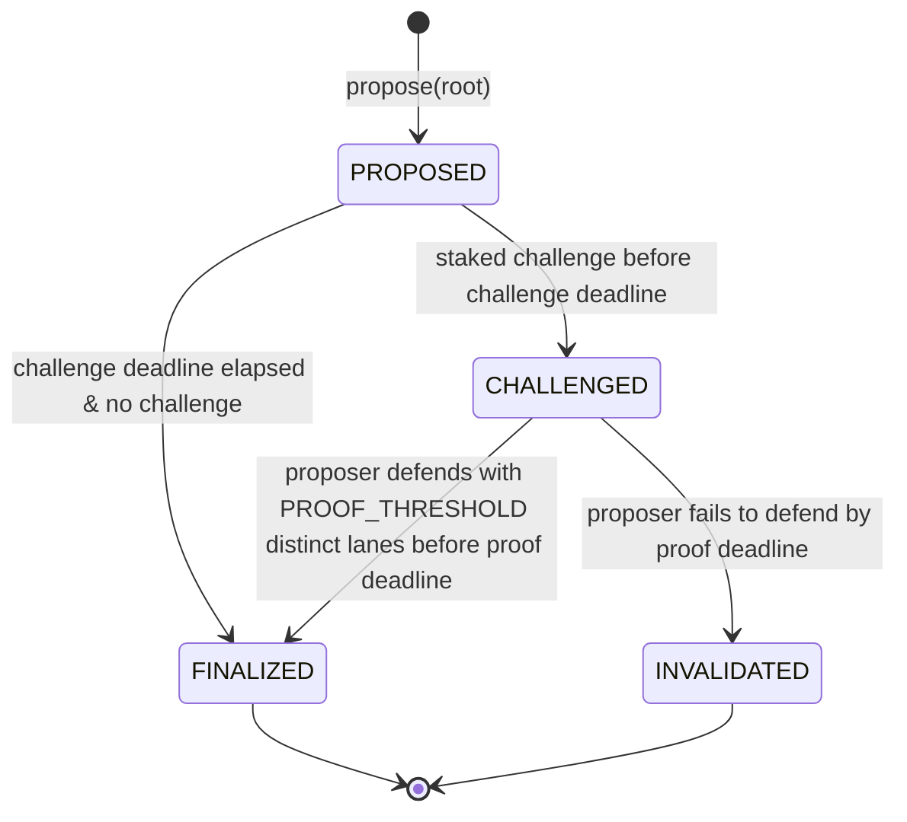

## Abstract

We outline an architecture for an optimistic fault proof system. A proposer posts a root optimistically without any proof. If no staked participant challenges the root within a one-day window, the root finalizes purely on the basis of elapsed time. A challenge goes through optimistically — the challenger submits no proof of invalidity — and the burden then shifts to the proposer to defend the root. Defending opens a 7 day proof window during which the proposer must assemble n / m proofs establishing the root's validity. If the proposer does not defend the root within this window, the root is invalidated and the proposer's bond is forfeited.

## Motivation

The vanilla OP Stack fault-proof system inherits a multi-day challenge window for every proposal and routes every dispute through a single interactive fault-proof lane. Base's Azul proof system reduces that window when two heterogeneous proofs (TEE and ZK) agree, but still requires a proof on the common path and still rests final resolution on at most two lanes.

World Chain targets two properties that neither model provides together:

- **A cheap common path.** No proof is paid for or produced when no staked participant objects to a root.
- **A diversified disputed path.** When a root is challenged, the proposer must defend it, and no single prover, TEE vendor, or council action can finalize that defense. At least two independent lanes must agree.

The result is fast finality in the common case and `n / m` threshold security in the dispute case.

## Specification

The key words "MUST", "MUST NOT", "REQUIRED", "SHALL", "SHALL NOT", "SHOULD", "SHOULD NOT", "RECOMMENDED", "NOT RECOMMENDED", "MAY", and "OPTIONAL" in this document are to be interpreted as described in [RFC 2119](https://www.rfc-editor.org/rfc/rfc2119) and [RFC 8174](https://www.rfc-editor.org/rfc/rfc8174).

### Constants

Protocol constants are fixed by this WIP and MUST NOT be changed without a new WIP.

| Name | Value | Meaning |
| --- | --- | --- |
| `PROOF_THRESHOLD` | `2` | Number of distinct proof lanes that MUST support a challenged root before it finalizes. |
| `PROOF_LANE_COUNT` | `3` | Number of configured proof lanes. |

### Activation Parameters

Activation parameters are set at hardfork activation and held as immutable values on the proof system contracts. They MAY be retuned only by a subsequent activation. All implementations MUST commit to these values in their deployed configuration and MUST NOT permit per-call overrides.

| Name | Initial Value | Meaning |
| --- | --- | --- |
| `CHALLENGE_PERIOD` | `1 day` | Duration after proposal creation during which a staked participant MAY challenge a root without submitting proof material. Per-proposal `challengeDeadline = createdAt + CHALLENGE_PERIOD`. |
| `PROOF_PERIOD` | `7 days` | Duration after a root is challenged during which the proposer MAY defend the root by accumulating lane submissions toward `PROOF_THRESHOLD`. Per-proposal `proofDeadline = challengedAt + PROOF_PERIOD`. A challenged root that the proposer has not defended to `PROOF_THRESHOLD` by `proofDeadline` MUST be invalidated. |
| `PROPOSER_BOND` | TBD | Slashable stake required of the proposer. Locked at proposal time, refunded if the root reaches `FINALIZED`, and forfeited if the root reaches `INVALIDATED`. |
| `CHALLENGER_BOND` | TBD | Slashable stake required of each challenger. Locked at challenge time and forfeited if the challenged root finalizes; refunded if the root is invalidated. |

### Proof Lanes

A challenged root finalizes only when at least `PROOF_THRESHOLD` distinct lanes support the same root commitment. Each lane counts at most once per root.

| Lane | Source | Submission |
| --- | --- | --- |
| `VALIDITY_PROOF` | A configured validity proof verifier (zkVM or SNARK). | Permissionless. |
| `TEE_ATTESTATION` | A registered TEE signer attesting to the transition. | Anyone MAY relay a valid signed attestation. |
| `SECURITY_COUNCIL` | A Security Council threshold signature or multisig action. | Council-controlled attestation. |

Multiple proofs from the same lane MUST NOT increase the threshold count.

### Root Commitments

The data bound by every proof and attestation is split into two layers so that the proposer's submission surface is the same as the OP Stack and Base Azul proposer surfaces. Per-proposal data is supplied by the proposer or captured by the factory at proposal creation. Domain constants are fixed on the verifier implementation and are not part of the proposer's calldata.

#### Proposal (per-proposal)

| Field | Source | Meaning |
| --- | --- | --- |
| `rootClaim` | Proposer | Claimed L2 output root, computed as in the [OP Stack output-root V1 encoding][op-output-root]. |
| `l2BlockNumber` | Proposer | L2 block number for `rootClaim`, matching the [`l2BlockNumber` field of an OP Stack L2 output proposal][op-proposals]. |
| `parentRef` | Proposer | Address of the parent — the `AnchorStateRegistry` for the first proposal, otherwise the parent proposal. Same convention as the OP Stack [Fault Dispute Game `extraData` parent reference][op-dgi] and the parent reference encoded in Base Azul's `AggregateVerifier` extra-data layout (see [Base Azul proof system][base-azul]). The parent's `rootClaim` and `l2BlockNumber` are read from this reference rather than re-supplied. |
| `intermediateRootsHash` | Proposer | Commitment to ordered intermediate output roots, compatible with Base Azul's intermediate-root commitment. Implementations that do not use intermediate roots MUST set this field to `bytes32(0)`. |
| `l1OriginHash` | Factory | L1 origin hash captured at proposal creation. The proposer does not pass it as calldata; it is read via `blockhash()` or [EIP-2935][eip-2935] history and pinned by the factory, mirroring the OP Stack [`l1Head` snapshot at clone creation][op-dgi] that Base Azul inherits. |
| `l1OriginNumber` | Factory | L1 block number paired with `l1OriginHash`. |

This matches the OP Stack and Base proposer surface field-for-field. Any OP Stack proposer that already submits `(rootClaim, l2BlockNumber)` against a parent reference can be reused without protocol-level change. See [Backwards Compatibility](#backwards-compatibility) for the full compatibility statement.

[op-output-root]: https://specs.optimism.io/protocol/proposals.html#l2-output-commitment-construction
[op-proposals]: https://specs.optimism.io/protocol/proposals.html
[op-fdg]: https://specs.optimism.io/fault-proof/stage-one/fault-dispute-game.html
[base-azul-extradata]: https://docs.base.org/base-chain/specs/protocol/proofs/contracts#game-extra-data
[base-azul-l1head]: https://docs.base.org/base-chain/specs/protocol/proofs/contracts#clone-arguments
[eip-2935]: https://eips.ethereum.org/EIPS/eip-2935

#### Domain (verifier-immutable)

| Field | Meaning |
| --- | --- |
| `chainId` | World Chain L2 chain ID. |
| `proofSystemVersion` | Version of this proof system's proof-domain encoding. |
| `rollupConfigHash` | Hash of the rollup configuration and World Chain hardfork schedule. |
| `blockInterval` | Distance in L2 blocks between a parent root and a proposed root. |
| `intermediateBlockInterval` | Distance in L2 blocks between intermediate roots inside one proposal. |

These values are set once on the verifier implementation (analogous to Base's `CONFIG_HASH`, `L2_CHAIN_ID`, `BLOCK_INTERVAL`, and `INTERMEDIATE_BLOCK_INTERVAL` immutables) and are not supplied per proposal. Lane-specific verifier constants — such as the active TEE image hash, the validity proof program key, and the fault proof game type — live in the lane verifiers' own configuration and are committed to in those lanes' proof journals.

#### Canonical identifiers

The contracts use two related identifiers:

- `proposalKey` is the factory lookup key. It is deterministic from proposer-supplied proposal data and excludes the factory-captured L1 origin, so proposers can discover existing games before knowing which L1 block created them.
- `rootId` is the proof-bound commitment. It includes the factory-captured L1 origin and is the value every proof lane MUST bind to.

The contract computes:

```text
domainHash = keccak256(abi.encode(
    chainId,
    proofSystemVersion,
    rollupConfigHash,
    blockInterval,
    intermediateBlockInterval
))

proposalKey = keccak256(abi.encode(
    domainHash,
    parentRef,
    rootClaim,
    l2BlockNumber,
    intermediateRootsHash
))

rootId = keccak256(abi.encode(
    domainHash,
    parentRef,
    rootClaim,
    l2BlockNumber,
    intermediateRootsHash,
    l1OriginHash,
    l1OriginNumber
))
```

The factory MUST reject duplicate games with the same `proposalKey`. All proofs and attestations MUST bind to `rootId`. A proof, game result, or attestation that binds to a different `domainHash`, parent, root, block range, or L1 origin MUST NOT be accepted for `rootId`.

### State Machine

A root moves through four states:



### Proposal Lifecycle

A root enters the system in the `PROPOSED` state.

1. The proposer submits the root commitment and locks `PROPOSER_BOND` as slashable collateral against the proposal.
2. The contract records `createdAt = block.timestamp` and `challengeDeadline = createdAt + CHALLENGE_PERIOD`.
3. The root remains open to challenges until `challengeDeadline`.

The proposer MUST NOT be required to submit material from any proof lane when creating the proposal, however they may choose to do so.

If the root reaches `FINALIZED`, the locked `PROPOSER_BOND` MUST be refunded to the proposer. If the root reaches `INVALIDATED`, the locked `PROPOSER_BOND` MUST be forfeited.

### Challenge Lifecycle

Any staked participant MAY challenge a proposed root before `challengeDeadline`. A challenge goes through optimistically: the challenger is not asked to prove that the root is invalid, and the challenge succeeds by default unless the proposer defends the root. The challenge merely shifts the burden of proof onto the proposer, who must then establish the root's validity per [Proposer Defense and Challenged Finality](#proposer-defense-and-challenged-finality).

The challenge transaction:

- MUST verify that the caller is currently staked according to the configured staking registry.
- MUST NOT require the caller to submit proof material.
- MUST lock `CHALLENGER_BOND` of the caller's stake as slashable collateral against the challenged root.
- MUST mark the root as `CHALLENGED`.
- MUST record `challengedAt = block.timestamp` and `proofDeadline = challengedAt + PROOF_PERIOD` on the root, the first time it transitions to `CHALLENGED`. Subsequent challenges MUST NOT extend `proofDeadline`.

If the challenged root finalizes through the proof-lane threshold, the locked `CHALLENGER_BOND` is forfeited. If the root is invalidated, the locked `CHALLENGER_BOND` is refunded to the challenger.

Multiple challenges MAY be recorded for accounting, but only the existence of at least one valid challenge affects the finality path. Each additional challenger locks their own `CHALLENGER_BOND`.

A challenge submitted at or after `challengeDeadline` MUST revert.

### Unchallenged Finality

If no valid challenge has been submitted by `challengeDeadline`, anyone MAY call `finalize(rootId)`.

The contract MUST finalize the root when all of the following hold:

- the root is still `PROPOSED`;
- `block.timestamp >= challengeDeadline`;
- the root's parent is the current finalized anchor or otherwise accepted by the anchor registry; and
- the root has not been invalidated, blacklisted, retired, or paused by a configured safety control.

An unchallenged root finalizes without any proof-lane submissions.

### Proposer Defense and Challenged Finality

Once a root is challenged, the burden of proof rests with the **proposer**, who MUST defend the root by establishing its validity. A challenged root MUST NOT finalize merely because time has elapsed. It finalizes only when the proposer's defense assembles support from at least `PROOF_THRESHOLD` distinct proof lanes for the root, and only if the threshold is met before `proofDeadline`.

Defending the root is the proposer's responsibility because the proposer's `PROPOSER_BOND` is forfeited if the root fails to reach the threshold. Lane submission itself remains permissionless — any party MAY relay a valid lane submission, and a proposer MAY coordinate independent provers, TEE signers, and the Security Council to do so — but the protocol assigns the economic responsibility for the defense to the proposer and to no other party.

Each root tracks a per-lane support set (the **proof bitmap**) with one bit per entry in [Proof Lanes](#proof-lanes). Each lane's bit is set at most once, so duplicate submissions from the same lane MUST NOT increase the threshold count.

For each lane submission, the contract MUST:

1. Verify that the root is in `CHALLENGED`.
2. Verify that `block.timestamp < proofDeadline`.
3. Verify that the proof or attestation binds to `rootId`.
4. Verify the proof or attestation according to the lane-specific verifier.
5. Set the lane's bit in the root's proof bitmap.
6. Finalize the root when the bitmap contains at least `PROOF_THRESHOLD` distinct lanes.

A lane submission at or after `proofDeadline` MUST revert. Finalization of a challenged root is permissionless once the threshold is met.

If `block.timestamp >= proofDeadline` and the root's proof bitmap contains fewer than `PROOF_THRESHOLD` distinct lanes, anyone MAY call `invalidate(rootId)`. The contract MUST move the root to `INVALIDATED` and forfeit `PROPOSER_BOND` per [Proposal Lifecycle](#proposal-lifecycle). This is the only path to `INVALIDATED`; see [Invalidity and Conflicts](#invalidity-and-conflicts).

### Invalidity and Conflicts

Invalidation occurs only via the `CHALLENGED → INVALIDATED` transition described in [Proposer Defense and Challenged Finality](#proposer-defense-and-challenged-finality): a challenged root that the proposer has not defended to `PROOF_THRESHOLD` distinct supporting lanes by `proofDeadline` MUST be invalidated. There is no fast-path invalidation from `PROPOSED`. A party in possession of evidence that a proposed root is incorrect MUST challenge the root; absence of supporting proofs within `PROOF_PERIOD` is the protocol's sole in-band signal of invalidity.

An invalidated root MUST NOT finalize, and descendants of an invalidated root MUST NOT become accepted anchors.

If invalidity of a finalized root is discovered after the fact — for example, via an offchain proof exhibiting a conflicting `(parent, l2BlockNumber) → rootId'` — the protocol MUST NOT silently roll back finalized state. The configured safety process MUST be triggered: pausing the proof game type, blacklisting the game, or routing the incident to governance.

### Lane-Specific Requirements

#### Validity Proof

The validity proof lane verifies that the transition from `parentRoot` at `parentL2BlockNumber` to `rootClaim` at `l2BlockNumber` is valid under `rollupConfigHash`. The verifier MAY be implemented with a zkVM, a SNARK, or another cryptographic proof system. The proof MUST bind to `rootId` and MUST be verified onchain or by an onchain verifier gateway.

#### TEE Attestation

The TEE lane accepts an attestation from a registered TEE signer over `rootId`. The verifier MUST check that the signer is registered, that the signer is valid for the active TEE image or measurement, that the attestation binds to `rootId`, and that the attestation has not expired or been revoked.

#### Security Council Attestation

The Security Council lane accepts a threshold signature, multisig transaction, or equivalent onchain action from the configured council. The attestation MUST bind to `rootId` and MUST be domain-separated from other council actions. A council attestation counts as one lane and MUST NOT finalize a challenged root by itself.

### Anchor Updates

Only finalized roots may update the canonical anchor. The anchor registry MUST enforce:

- parent validity;
- monotonically increasing L2 block numbers;
- at most one accepted root per `(parent, l2BlockNumber)`; and
- rejection of roots that are blacklisted, retired, paused, or invalidated.

The blacklist, retirement, and pause controls MUST be gated by the configured Security Council (or an equivalent guardian role). Setting these controls is the council's safety responsibility — they are not permissionless. Anchor updates themselves SHOULD be permissionless and self-validating once the root is finalized and not gated by any of these controls.

### Contract Interfaces

This WIP specifies interfaces only. Implementation details — storage layouts, clone-with-immutable-args payloads, journal encodings, verifier nullification, guardian controls, and bond escrow mechanics — follow Base Azul's [proof system specification][base-azul] and the OP Stack [dispute game interface][op-dgi], except where this WIP explicitly diverges.

| Interface | Role | Reference |
| --- | --- | --- |
| `IDisputeGameFactory` | Creates per-proposal game clones; indexes games by `proposalKey`; pins `l1OriginHash` at creation. | [`DisputeGameFactory`][base-factory] |
| `IProofSystemGame` | Per-proposal game: holds state, accepts lane submissions, finalizes, advances anchor. World Chain analogue of Base's `AggregateVerifier`. | [`AggregateVerifier`][base-aggregate] |
| `IAnchorStateRegistry` | Tracks the current anchor, finalized roots, blacklist, retirement, and pause. | [`AnchorStateRegistry`][base-anchor] |
| `IValidityProofVerifier` | Verifies the `VALIDITY_PROOF` lane against `rootId`. | [`ZKVerifier`][base-zk] |
| `ITEEVerifier` | Verifies the `TEE_ATTESTATION` lane against `rootId`. | [`TEEVerifier`][base-tee] |
| `ITEEProverRegistry` | Maintains accepted TEE signer identities, image hashes, and proposer allowlisting. | [`TEEProverRegistry`][base-tee-registry] |
| `ISecurityCouncil` | Submits and verifies `SECURITY_COUNCIL` attestations bound to `rootId`. | World Chain Security Council multisig. |
| `IStakingRegistry` | Checks challenger eligibility and locks, forfeits, or refunds `PROPOSER_BOND` and `CHALLENGER_BOND`. | World Chain–specific; no Base analogue. |

[base-contracts]: https://docs.base.org/base-chain/specs/protocol/proofs/contracts
[base-factory]: https://docs.base.org/base-chain/specs/protocol/proofs/contracts#disputegamefactory
[base-aggregate]: https://docs.base.org/base-chain/specs/protocol/proofs/contracts#aggregateverifier
[base-anchor]: https://docs.base.org/base-chain/specs/protocol/proofs/contracts#anchorstateregistry
[base-zk]: https://docs.base.org/base-chain/specs/protocol/proofs/contracts#zkverifier
[base-tee]: https://docs.base.org/base-chain/specs/protocol/proofs/contracts#teeverifier
[base-tee-registry]: https://docs.base.org/base-chain/specs/protocol/proofs/contracts#teeproverregistry

## Backwards Compatibility

This proposal is intended to be implemented as a new World Chain proof game type. Existing output roots and existing Cannon-style games do not need to be reinterpreted.

The proposer interface is preserved field-for-field with the OP Stack. Specifically:

- `rootClaim` follows the [OP Stack output-root V1 encoding](https://specs.optimism.io/protocol/proposals.html#l2-output-commitment-construction).
- `l2BlockNumber` matches the [`l2BlockNumber` field of an L2 output proposal](https://specs.optimism.io/protocol/proposals.html).
- `parentRef` follows the [Fault Dispute Game `extraData` parent reference convention](https://specs.optimism.io/fault-proof/stage-one/dispute-game-interface.html) — the `AnchorStateRegistry` for the first proposal, otherwise the parent proposal address.
- `l1OriginHash` is factory-captured at proposal creation, matching the L1 head snapshot taken by `DisputeGameFactory` at clone creation.
- The factory lookup key intentionally excludes `l1OriginHash` and `l1OriginNumber`, matching the OP Stack/Base pattern where game existence is keyed by deterministic proposal data and the L1 origin is stored on the created game.

An existing OP Stack proposer that already produces `(rootClaim, l2BlockNumber)` against a parent reference can be reused. Domain constants (`chainId`, `proofSystemVersion`, `rollupConfigHash`, `blockInterval`, `intermediateBlockInterval`) and lane-specific verifier constants live on the verifier implementation, not in the proposer's calldata, so changes to those values do not require a proposer change.

## Test Cases

Before this WIP can move beyond Draft, implementations SHOULD cover at least:

- an unchallenged root finalizes after exactly `CHALLENGE_PERIOD`;
- an unstaked account cannot challenge;
- a staked account can challenge without proof before the deadline;
- a challenge at or after the deadline reverts;
- a challenged root with one supporting lane does not finalize;
- a proposer defends a challenged root to finalization with two distinct supporting lanes;
- a challenged root the proposer fails to defend to `PROOF_THRESHOLD` lanes by `proofDeadline` invalidates and forfeits `PROPOSER_BOND`;
- a lane submission at or after `proofDeadline` reverts and does not affect the proof bitmap;
- subsequent challenges on an already-challenged root do not extend `proofDeadline`;
- duplicate submissions from the same lane do not increase the threshold count;
- every proof lane rejects material that does not bind to `rootId`;
- anchor updates reject non-finalized, invalidated, paused, retired, or non-monotonic roots.

## Security Considerations

**Unchallenged-path liveness depends on honest watchers.** Safety in the common case relies on at least one honest staked participant challenging an invalid root within `CHALLENGE_PERIOD`. The architecture does not protect against a root that no one watches.

**Disputed-path safety depends on lane independence.** A false challenged finality requires two lanes to accept the same invalid root. Implementations MUST avoid shared signing keys, shared verifier keys, shared operator control, and shared offchain infrastructure across lanes, because any such sharing collapses the effective threshold below two.

**TEE trust assumptions live in one lane.** The TEE lane rests on the hardware vendor, the enclave image measurement, the registrar that admits signers, and the revocation process. Each of these is a potential single point of failure for that lane. The TEE lane is therefore counted exactly once in the threshold and MUST NOT be used as the sole finality mechanism. A compromised registrar, stale signer set, or weakened image-measurement policy can turn this lane unsafe without affecting the other three.

**Security Council is a safety valve, not a finality mechanism.** Council signing keys, quorum rules, and action domains MUST be isolated from unrelated governance actions. A council attestation alone MUST NOT finalize a challenged root.

**`rootId` domain separation is critical.** Every lane MUST bind to the same `rootId`, and `rootId` itself MUST commit to `chainId`, `proofSystemVersion`, `rollupConfigHash`, and the parent/child block range. Missing domain separation allows replay across chains, hardfork schedules, game types, proof-system versions, or block ranges.

**`proposalKey` is not a proof target.** It exists to make factory duplicate prevention and proposer recovery deterministic. Proofs and attestations MUST bind to `rootId`, not merely to `proposalKey`, because `proposalKey` does not include the L1 origin captured at game creation.

**Bond and stake calibration are security-critical.** If `CHALLENGER_BOND` is too cheap, attackers can grief honest roots into the slow path. If `CHALLENGER_BOND` is too expensive, honest watchers may fail to challenge invalid roots. If `PROPOSER_BOND` is too cheap, invalid-proposal spam is cheap and forces honest watchers to lock capital per challenge; if `PROPOSER_BOND` is too expensive, only well-capitalized actors can propose, which centralizes the role. Exact economic parameters are out of scope for this WIP but MUST be tuned before mainnet deployment.

## Copyright

Copyright and related rights waived via [CC0](https://creativecommons.org/publicdomain/zero/1.0/).
