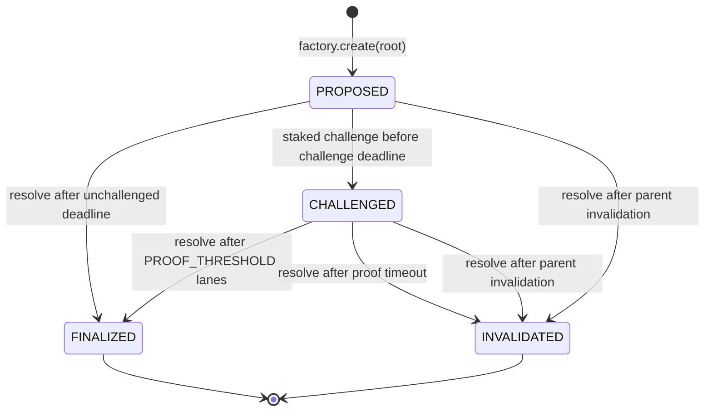

## Abstract

We outline an OP Stack dispute game in which every proposed output root carries a TEE proof at creation. The proof counts as one lane but does not finalize the root: if no staked participant challenges it within one day, the game may resolve in favor of the proposer; if challenged, the proposer has seven days from game creation to add an independent lane and reach the 2-of-3 threshold. A challenge submits no proof of invalidity. Failure to reach the threshold resolves the game in favor of the challenger. The stock `DisputeGameFactory`, `AnchorStateRegistry`, `OptimismPortal2`, and `DelayedWETH` remain responsible for game creation, claim validity, withdrawals, and bond custody.

## Motivation

The vanilla OP Stack fault-proof system inherits a multi-day challenge window for every proposal and routes every dispute through a single interactive fault-proof lane. Base's Azul proof system reduces that window when two heterogeneous proofs agree, but final resolution still rests on at most two lanes.

World Chain targets two properties that neither model provides together:

- **A proof-backed optimistic path.** Every proposal starts with one TEE-attested transition, remains challengeable, and can finalize after the challenge window without producing another proof.
- **A diversified disputed path.** When a root is challenged, its creation-time TEE lane is insufficient: the proposer must add an independent validity or council lane before the deadline.

The result is one-lane assurance plus watcher oversight in the common case and 2-of-3 threshold security in the disputed case.

## Specification

The key words "MUST", "MUST NOT", "REQUIRED", "SHALL", "SHALL NOT", "SHOULD", "SHOULD NOT", "RECOMMENDED", "NOT RECOMMENDED", "MAY", and "OPTIONAL" in this document are to be interpreted as described in [RFC 2119](https://www.rfc-editor.org/rfc/rfc2119) and [RFC 8174](https://www.rfc-editor.org/rfc/rfc8174).

### Constants

Protocol constants are fixed by this WIP and MUST NOT be changed without a new WIP.

| Name | Value | Meaning |
| --- | --- | --- |
| `PROOF_THRESHOLD` | `2` | Number of distinct proof lanes that MUST support a challenged root before it finalizes. |
| `PROOF_LANE_COUNT` | `3` | Number of configured proof lanes. |

### Activation Parameters

Activation parameters are set at hardfork activation and held as immutable values on the proof system contracts. They MAY be retuned only by a subsequent activation. All implementations MUST commit to these values in their deployed configuration and MUST NOT permit per-call overrides.

| Name | Initial Value | Meaning |
| --- | --- | --- |
| `CHALLENGE_PERIOD` | `1 day` | Duration after proposal creation during which a staked participant MAY challenge a root without submitting proof material. Per-proposal `challengeDeadline = createdAt + CHALLENGE_PERIOD`. |
| `PROOF_PERIOD` | `7 days` | Duration after proposal creation during which the proposer MAY defend a challenged root by accumulating lane submissions toward `PROOF_THRESHOLD`. Per-proposal `proofDeadline = createdAt + PROOF_PERIOD`. `PROOF_PERIOD` MUST be greater than `CHALLENGE_PERIOD`. A challenged root that the proposer has not defended to `PROOF_THRESHOLD` by `proofDeadline` MUST be invalidated. |
| `PROPOSER_BOND` | TBD | ETH bond supplied to `DisputeGameFactory.create` and held as `DelayedWETH` credit by the game. Paid to the proposer after `DEFENDER_WINS`, to the challenger after proof timeout, or refunded if the registry invalidates the game. |
| `CHALLENGER_BOND` | TBD | ETH bond supplied by the challenger and held as `DelayedWETH` credit by the game. Paid to the proposer after a successful defense, to the challenger after proof timeout, or refunded if the registry invalidates the game. `PROPOSER_BOND` and `CHALLENGER_BOND` MUST both be non-zero: a zero challenger bond makes stalling the descendant chain free, and a zero proposer bond makes invalid-proposal spam free. |
| `MAX_L1_ORIGIN_AGE` | `1800` blocks (~6h) | Maximum age, in L1 blocks, of the proposer-selected `l1OriginHash` at creation. The game MUST reject `block.number - l1OriginNumber > MAX_L1_ORIGIN_AGE`, and MUST reject an origin at or after the current block. It MUST NOT exceed the [EIP-2935][eip-2935] serve window of 8,191 blocks, beyond which the origin cannot be validated at all. This bound is consensus-critical and MUST NOT be left to offchain proposer software: a stale origin lets a proposal commit to an L2 range while omitting every L1 deposit posted after that origin, since those deposits fall outside the transition's derivation window. |

### Proof Lanes

A challenged root finalizes only when at least `PROOF_THRESHOLD` distinct lanes support the same root commitment. Each lane counts at most once per root.

| Lane | Source | Submission |
| --- | --- | --- |
| `VALIDITY_PROOF` | A configured validity proof verifier (zkVM or SNARK). | Permissionless. |
| `TEE_ATTESTATION` | A registered TEE signer attesting to the transition. | Anyone MAY relay a valid signed attestation. |
| `SECURITY_COUNCIL` | A Security Council threshold signature or multisig action. | Council-controlled attestation. |

Multiple proofs from the same lane MUST NOT increase the threshold count.

Each lane MUST be backed by a distinct verifier. An implementation MUST reject a configuration in which two lanes share a verifier address, since that silently collapses the threshold below `PROOF_THRESHOLD` distinct lanes. An address check cannot detect shared signing keys, shared verifier keys, or shared operator control behind distinct addresses; those remain a deployment-review responsibility per [Security Considerations](#security-considerations).

A lane verifier MUST report *why* it did not accept a proof, distinguishing at minimum a proof it judged and rejected from a dependency it could not reach — a key registry, a verifier gateway — that left the proof unjudged. Collapsing the two into a single boolean is a hidden failure: during a live proof window the first calls for a new proof and the second for a retry or a lane switch, and an operator cannot tell them apart.

### Root Commitments

The data bound by every proof and attestation is split into immutable domain configuration and per-game clone data. The implementation fixes the complete domain. Each proposal supplies that domain's hash in `extraData`, allowing the game to reject cross-domain proposals and ensuring that the factory UUID changes when the proof-system domain changes.

#### Proposal (per-proposal)

| Field | Source | Meaning |
| --- | --- | --- |
| `rootClaim` | Proposer | Claimed L2 output root, computed as in the [OP Stack output-root V1 encoding][op-output-root]. |
| `domainHash` | Proposer | Hash of the implementation's immutable domain. The game MUST reject a value that differs from its configured `domainHash`. |
| `l2BlockNumber` | Proposer | L2 block number for `rootClaim`, matching the [`l2BlockNumber` field of an OP Stack L2 output proposal][op-proposals]. |
| `parentRef` | Proposer | Address of the parent — the `AnchorStateRegistry` for the first proposal, otherwise the parent proposal. Same convention as the OP Stack [Fault Dispute Game `extraData` parent reference][op-dgi] and the parent reference encoded in Base Azul's `AggregateVerifier` extra-data layout (see [Base Azul proof system][base-azul]). The parent's `rootClaim` and `l2BlockNumber` are read from this reference rather than re-supplied. |
| `attempt` | Proposer | Retry nonce for the same transition. Attempt zero is the initial game; later attempts are permitted only after an eligible predecessor fails or is made obsolete by activation. |
| `retryOf` | Proposer | Previous concrete game for a non-zero attempt. It MUST represent the same transition and be eligible for retry. |
| `l1OriginHash` | Proposer | Recent L1 block selected by the proposer and verified against `blockhash(l1OriginNumber)` or [EIP-2935][eip-2935] history during creation, and bounded by `MAX_L1_ORIGIN_AGE`. This is not the factory-captured parent block hash in the clone arguments, which the proposer cannot choose. |
| `l1OriginNumber` | Proposer | L1 block number paired with `l1OriginHash`. |
| `creationProof` | Proposer | TEE proof verified during game initialization and counted as the initial `TEE_ATTESTATION` lane. |

The proposer calls `DisputeGameFactory.create(gameType, rootClaim, extraData)`, where:

```text
extraData = abi.encode(
    domainHash,
    l2BlockNumber,
    parentRef,
    attempt,
    retryOf,
    l1OriginHash,
    l1OriginNumber,
    creationProof
)
```

[op-output-root]: https://specs.optimism.io/protocol/proposals.html#l2-output-commitment-construction
[op-proposals]: https://specs.optimism.io/protocol/proposals.html
[op-fdg]: https://specs.optimism.io/fault-proof/stage-one/fault-dispute-game.html
[op-dgi]: https://specs.optimism.io/fault-proof/stage-one/dispute-game-interface.html
[base-azul]: https://docs.base.org/base-chain/specs/protocol/proofs/contracts
[base-azul-extradata]: https://docs.base.org/base-chain/specs/protocol/proofs/contracts#game-extra-data
[base-azul-l1head]: https://docs.base.org/base-chain/specs/protocol/proofs/contracts#clone-arguments
[eip-2935]: https://eips.ethereum.org/EIPS/eip-2935

#### Domain (verifier-immutable)

| Field | Meaning |
| --- | --- |
| `chainId` | World Chain L2 chain ID. |
| `proofSystemVersion` | Version of this proof system's proof-domain encoding. |
| `rollupConfigHash` | Hash of the rollup configuration and World Chain hardfork schedule. |
| `blockInterval` | Distance in L2 blocks between a parent root and a proposed root. |

These values are set once on the game implementation (analogous to Base's `CONFIG_HASH`, `L2_CHAIN_ID`, and `BLOCK_INTERVAL` immutables). Their hash is supplied in each game's `extraData` and MUST equal the implementation's immutable `domainHash`. Lane-specific constants, such as the active TEE image hash and validity-proof program key, live in the lane verifiers and are committed to by those lanes' proof material.

#### Canonical identifiers

The contracts use two related identifiers:

- `gameUUID` is the stock `DisputeGameFactory` lookup key. It commits to `gameType`, `rootClaim`, and the complete proof-backed `extraData`.
- `rootId` is the proof-bound transition commitment. It includes the proposer-selected L1 origin and is the value every proof lane MUST bind to.

The contract computes:

```text
domainHash = keccak256(abi.encode(
    chainId,
    proofSystemVersion,
    rollupConfigHash,
    blockInterval
))

extraData = abi.encode(
    domainHash,
    l2BlockNumber,
    parentRef,
    attempt,
    retryOf,
    l1OriginHash,
    l1OriginNumber,
    creationProof
)

gameUUID = keccak256(abi.encode(
    gameType,
    rootClaim,
    extraData
))

rootId = keccak256(abi.encode(
    domainHash,
    parentRef,
    startingRootClaim,
    startingL2BlockNumber,
    rootClaim,
    l2BlockNumber,
    l1OriginHash,
    l1OriginNumber
))
```

`startingRootClaim` and `startingL2BlockNumber` are the pre-state the game resolves at creation — read from the parent proposal, or from the anchor registry when `parentRef` is the sentinel. They MUST be committed explicitly rather than left implied by `parentRef`: for a concrete parent the address transitively determines its root, but the anchor sentinel's address is fixed while the anchor value moves, so two proposals reading different anchor roots would otherwise produce the same `rootId`. Committing the pre-state also means a lane verifier can bind a proof using `rootId` alone, without reading the game back.

The factory MUST reject duplicate games with the same `gameUUID`. All proofs and attestations MUST bind to `rootId`. A proof or attestation that binds to a different domain, parent, root, block range, or L1 origin MUST NOT be accepted for `rootId`.

### State Machine

The OP Stack lifecycle uses `GameStatus` for externally consumed resolution. The WIP-facing root states map onto it as follows:


```mermaid
stateDiagram-v2
    [*] --> PROPOSED: factory.create(root)
    PROPOSED --> FINALIZED: resolve after unchallenged deadline
    PROPOSED --> CHALLENGED: staked challenge before challenge deadline
    CHALLENGED --> FINALIZED: resolve after PROOF_THRESHOLD lanes
    CHALLENGED --> INVALIDATED: resolve after proof timeout
    PROPOSED --> INVALIDATED: resolve after parent invalidation
    CHALLENGED --> INVALIDATED: resolve after parent invalidation
    FINALIZED --> [*]
    INVALIDATED --> [*]
```

`FINALIZED` corresponds to `GameStatus.DEFENDER_WINS`; `INVALIDATED` corresponds to `GameStatus.CHALLENGER_WINS`. Game resolution alone does not make a claim withdrawable. The stock `AnchorStateRegistry` separately determines whether the game is proper, respected, beyond the finality delay, and claim-valid.

### Proposal Lifecycle

A root enters the system in the `PROPOSED` state.

1. The proposer calls the stock `DisputeGameFactory.create` with the WIP-1006 game type, `rootClaim`, and canonical `extraData`, supplying the configured initialization bond.
2. The factory creates a clone of the registered WIP-1006 implementation and calls `initialize`.
3. The game validates the domain, parent registration and eligibility, exact L2 block interval, retry predecessor, selected L1 head, creation proof, and bond.
4. The game records `createdAt = block.timestamp`, `challengeDeadline = createdAt + CHALLENGE_PERIOD`, and `proofDeadline = createdAt + PROOF_PERIOD`.
5. The game records the creation proof as support from the `TEE_ATTESTATION` lane.
6. The proposer bond is deposited into `DelayedWETH`, and the root remains open to challenge until `challengeDeadline`.

The proposer MUST attach a valid TEE proof at creation. Additional proof-lane material is submitted
only after a challenge.

An initial `attempt = 0` identifies the first game for a transition. A later attempt MUST identify its exact predecessor and MUST be accepted only for a protocol-defined recovery case, such as a proof timeout or a game created before WIP-1006 became respected.

### Challenge Lifecycle

Any staked participant MAY challenge a proposed root before `challengeDeadline`. A challenge goes through optimistically: the challenger is not asked to prove that the root is invalid, and the challenge succeeds by default unless the proposer defends the root. The challenge merely shifts the burden of proof onto the proposer, who must then establish the root's validity per [Proposer Defense and Challenged Finality](#proposer-defense-and-challenged-finality).

The challenge transaction:

- MUST verify that the caller is currently staked according to the configured staking registry.
- MUST reject the proposal's creator. A game has one challenger slot and the proposer receives both bonds whichever way its own game resolves, so self-challenging is costless and would let a proposer occupy the slot an honest watcher needs.
- MUST NOT require the caller to submit proof material.
- MUST require the caller to supply `CHALLENGER_BOND` as ETH and deposit it into the game's `DelayedWETH`;
- MUST mark the root as `CHALLENGED`.
- MUST record `challengedAt = block.timestamp` on the root the first time it transitions to `CHALLENGED`. The challenge MUST NOT change the `proofDeadline` recorded at proposal creation.

If the challenged root resolves in favor of the proposer, the proposer receives both bonds. If it times out below threshold, the challenger receives both bonds. A game accepts only one challenger.

A challenge submitted at or after `challengeDeadline` MUST revert.

### Unchallenged Finality

If no valid challenge has been submitted by `challengeDeadline`, anyone MAY call `resolve()`.

The game MUST resolve with `DEFENDER_WINS` when all of the following hold:

- the root is still `PROPOSED`;
- `block.timestamp >= challengeDeadline`;
- the parent is the anchor sentinel or has resolved with `DEFENDER_WINS`; and
- the parent is not blacklisted.

An unchallenged game resolves without additional proof-lane submissions. A self-blacklisted, retired, unrespected, or otherwise improper game may still have `DEFENDER_WINS` status, but the registry MUST reject its claim and the game MUST use refund-mode bond settlement.

### Proposer Defense and Challenged Finality

Once a root is challenged, the burden of proof rests with the **proposer**, who MUST defend the root by establishing its validity. A challenged root MUST NOT finalize merely because time has elapsed. It finalizes only when the proposer's defense assembles support from at least `PROOF_THRESHOLD` distinct proof lanes for the root, and only if the threshold is met before `proofDeadline`.

Defending the root is the proposer's responsibility because the proposer's `PROPOSER_BOND` is forfeited if the root fails to reach the threshold. Lane submission itself remains permissionless — any party MAY relay a valid lane submission, and a proposer MAY coordinate independent provers, TEE signers, and the Security Council to do so — but the protocol assigns the economic responsibility for the defense to the proposer and to no other party.

Each root tracks a per-lane support set (the **proof bitmap**) with one bit per entry in [Proof Lanes](#proof-lanes). Each lane's bit is set at most once, so duplicate submissions from the same lane MUST NOT increase the threshold count.

For each lane submission, the contract MUST:

1. Verify that the root is in `CHALLENGED`.
2. Verify that `block.timestamp < proofDeadline`.
3. Verify that the proof or attestation binds to `rootId`.
4. Verify the proof or attestation according to the lane-specific verifier.
5. Set the lane's bit in the root's proof bitmap.
6. Emit a threshold-reached signal when the bitmap first contains at least `PROOF_THRESHOLD` distinct lanes.

A lane submission at or after `proofDeadline` MUST revert. Once threshold is met, anyone MAY call `resolve()`, which MUST resolve the game with `DEFENDER_WINS`.

If `block.timestamp >= proofDeadline` and the proof bitmap contains fewer than `PROOF_THRESHOLD` distinct lanes, anyone MAY call `resolve()`. The game MUST resolve with `CHALLENGER_WINS`, record proof timeout as the invalidation reason, and credit both bonds to the challenger.

### Invalidity and Conflicts

Invalidation occurs either when a challenged root times out below threshold or when its parent is blacklisted or resolves with `CHALLENGER_WINS`. Parent invalidation MUST cascade before a descendant can resolve successfully. Because neither participant caused an ancestor failure, descendant proposer and challenger bonds MUST be refunded.

An invalidated root MUST NOT become claim-valid or update the anchor.

If invalidity of a finalized root is discovered after the fact — for example, via an offchain proof exhibiting a conflicting `(parent, l2BlockNumber) → rootId'` — the protocol MUST NOT silently roll back finalized state. The configured safety process MUST be triggered: pausing the proof game type, blacklisting the game, or routing the incident to governance.

### Lane-Specific Requirements

#### Validity Proof

The validity proof lane verifies that the transition from `parentRoot` at `parentL2BlockNumber` to `rootClaim` at `l2BlockNumber` is valid under `rollupConfigHash`. The verifier MAY be implemented with a zkVM, a SNARK, or another cryptographic proof system. The proof MUST bind to `rootId` and MUST be verified onchain or by an onchain verifier gateway.

#### TEE Attestation

The TEE lane accepts an attestation from a registered TEE signer over `rootId`. The verifier MUST check that the signer is registered, that the signer is valid for the active TEE image or measurement, that the attestation binds to `rootId`, and that the attestation has not expired or been revoked.

#### Security Council Attestation

The Security Council lane accepts a threshold signature, multisig transaction, or equivalent onchain action from the configured council. The attestation MUST bind to `rootId` and MUST be domain-separated from other council actions. A council attestation counts as one lane and MUST NOT finalize a challenged root by itself.

### Anchor Updates

Only claim-valid games may update the canonical anchor. The stock anchor registry MUST enforce:

- factory registration;
- respected-at-creation status;
- the dispute-game finality delay;
- `DEFENDER_WINS`;
- monotonically increasing L2 block numbers;
- rejection of games that are blacklisted, retired, or paused.

Blacklist, retirement, pause, and respected-game-type controls MUST remain gated by the stock OP guardian role. Anchor updates SHOULD be permissionless and self-validating. Failure to advance the anchor MUST NOT prevent an otherwise finalized game from closing or a claim-valid game from supporting a withdrawal.

### Bond Settlement

Resolution assigns normal-mode credits. After the stock dispute-game finality delay, anyone MAY call `closeGame()` to fix the bond distribution mode:

- `NORMAL` when `AnchorStateRegistry.isGameProper(game)` is true;
- `REFUND` when the game has been blacklisted, retired, or otherwise made improper.

Closing SHOULD attempt to advance the anchor but MUST treat an ineligible or stale anchor update as non-fatal. Credit claims MUST use the two-phase `DelayedWETH` flow: first unlock the recipient's credit, then withdraw it after the configured delay. Claiming MAY be permissionless, but funds MUST only be transferred to the credited recipient.

### Portal Withdrawals

`OptimismPortal2.proveWithdrawalTransaction` selects a game by its stock factory index. The Portal MUST require the game to be proper and respected and MUST verify the output-root proof against the game's `rootClaim`. Withdrawal finalization occurs only after the proof-maturity delay and `AnchorStateRegistry.isGameClaimValid(game)` returns true. A game does not need to be the current anchor to support a withdrawal.

### Contract Interfaces

WIP-1006 is implemented as a new game type on the stock OP Stack dispute infrastructure. The game follows the canonical clone-with-immutable-args and `IDisputeGame` ABI while retaining World Chain-specific challenge and proof-lane behavior.

| Interface | Role | Reference |
| --- | --- | --- |
| `IDisputeGameFactory` | Stock OP factory; registers the WIP-1006 implementation, creates clones, and indexes games by UUID and list index. | [`DisputeGameFactory`][base-factory] |
| `IDisputeGame` / `IMultiProofGame` | Per-proposal game; exposes the Portal-facing lifecycle and World Chain proof-lane extensions. | [`AggregateVerifier`][base-aggregate] |
| `IAnchorStateRegistry` | Stock OP registry; evaluates registration, respect, blacklist, retirement, finality, claim validity, and the current anchor. | [`AnchorStateRegistry`][base-anchor] |
| `IDelayedWETH` | Holds proposer and challenger bonds and enforces delayed two-phase credit withdrawal. | OP Stack `DelayedWETH`. |
| `IValidityProofVerifier` | Verifies the `VALIDITY_PROOF` lane against `rootId`. | [`ZKVerifier`][base-zk] |
| `ITEEVerifier` | Verifies the `TEE_ATTESTATION` lane against `rootId`. | [`TEEVerifier`][base-tee] |
| `ITEEProverRegistry` | Maintains accepted TEE signer identities, image hashes, and proposer allowlisting. | [`TEEProverRegistry`][base-tee-registry] |
| `ISecurityCouncil` | Submits and verifies `SECURITY_COUNCIL` attestations bound to `rootId`. | World Chain Security Council multisig. |
| `IStakingRegistry` | Checks challenger eligibility only. Bond custody and distribution remain in the game and `DelayedWETH`. | World Chain-specific; no Base analogue. |

[base-contracts]: https://docs.base.org/base-chain/specs/protocol/proofs/contracts
[base-factory]: https://docs.base.org/base-chain/specs/protocol/proofs/contracts#disputegamefactory
[base-aggregate]: https://docs.base.org/base-chain/specs/protocol/proofs/contracts#aggregateverifier
[base-anchor]: https://docs.base.org/base-chain/specs/protocol/proofs/contracts#anchorstateregistry
[base-zk]: https://docs.base.org/base-chain/specs/protocol/proofs/contracts#zkverifier
[base-tee]: https://docs.base.org/base-chain/specs/protocol/proofs/contracts#teeverifier
[base-tee-registry]: https://docs.base.org/base-chain/specs/protocol/proofs/contracts#teeproverregistry

## Backwards Compatibility

This proposal is implemented as a new World Chain game type registered on the existing OP Stack `DisputeGameFactory`. Existing output roots and Cannon-style games do not need to be reinterpreted. Activating the type consists of registering its implementation and initialization bond, then switching the stock `AnchorStateRegistry` respected game type after operational readiness.

The proposal data remains aligned with the OP Stack:

- `rootClaim` follows the [OP Stack output-root V1 encoding](https://specs.optimism.io/protocol/proposals.html#l2-output-commitment-construction).
- `l2BlockNumber` matches the [`l2BlockNumber` field of an L2 output proposal](https://specs.optimism.io/protocol/proposals.html).
- `parentRef` follows the [Fault Dispute Game `extraData` parent reference convention](https://specs.optimism.io/fault-proof/stage-one/dispute-game-interface.html) — the `AnchorStateRegistry` for the first proposal, otherwise the parent proposal address.
- `l1OriginHash` is selected by the proposer and checked against recent L1 block history at creation.
- factory identity uses the canonical `(gameType, rootClaim, extraData)` UUID;
- all per-proposal context, including the creation proof, is encoded canonically in `extraData`.

Offchain proposers, challengers, and defenders MUST use the stock factory indexing and creation APIs plus the WIP-1006 game extensions. They do not require a custom factory or anchor registry.

## Test Cases

Before this WIP can move beyond Draft, implementations SHOULD cover at least:

- an unchallenged root finalizes after exactly `CHALLENGE_PERIOD`;
- factory creation rejects an incorrect domain hash or malformed `extraData`;
- factory creation rejects an invalid proof or mismatched L1 origin;
- factory UUID lookup and `findLatestGames` preserve the complete WIP-1006 `extraData`;
- factory creation rejects an L1 origin older than `MAX_L1_ORIGIN_AGE`, and one at or after the current block;
- a configuration with a zero proposer or challenger bond is rejected, as is one reusing a verifier across two lanes;
- an unstaked account cannot challenge;
- a staked account can challenge without proof before the deadline;
- the proposal's creator cannot challenge its own game;
- a challenge at or after the deadline reverts;
- a configuration where `proofDeadline <= challengeDeadline` is rejected;
- a challenged root with one supporting lane does not finalize;
- a proposer defends a challenged root to finalization with two distinct supporting lanes;
- a challenged root the proposer fails to defend to `PROOF_THRESHOLD` lanes by `proofDeadline` invalidates and forfeits `PROPOSER_BOND`;
- a lane submission at or after `proofDeadline` reverts and does not affect the proof bitmap;
- challenging a root does not change its creation-time `proofDeadline`;
- duplicate submissions from the same lane do not increase the threshold count;
- every proof lane rejects material that does not bind to `rootId`;
- parent invalidation cascades and refunds both descendant participants;
- retry attempts reject an ineligible predecessor and accept each specified recovery case;
- close and claim use normal mode for proper games and refund mode for blacklisted or retired games;
- Portal withdrawal proof and finalization accept a claim-valid WIP-1006 game and reject blacklisted, retired, unrespected, challenger-winning, or insufficiently mature games.

## Security Considerations

**Unchallenged-path safety combines the TEE lane and honest watchers.** Every root has a verified TEE lane at creation, but an invalid root can still finalize if that lane is compromised and no honest staked participant challenges it within `CHALLENGE_PERIOD`. Watchers therefore remain an independent safety backstop on the common path.

**Disputed-path safety depends on lane independence.** A false challenged finality requires two lanes to accept the same invalid root. Implementations MUST avoid shared signing keys, shared verifier keys, shared operator control, and shared offchain infrastructure across lanes, because any such sharing collapses the effective threshold below two.

**TEE trust assumptions live in one lane.** The TEE lane rests on the hardware vendor, the enclave image measurement, the registrar that admits signers, and the revocation process. Each of these is a potential single point of failure for that lane. The TEE lane is therefore counted exactly once in the threshold and MUST NOT be used as the sole finality mechanism. A compromised registrar, stale signer set, or weakened image-measurement policy can turn this lane unsafe without affecting the other two.

**Security Council is a safety valve, not a finality mechanism.** Council signing keys, quorum rules, and action domains MUST be isolated from unrelated governance actions. A council attestation alone MUST NOT finalize a challenged root.

**`rootId` domain separation is critical.** Every lane MUST bind to the same `rootId`, and `rootId` itself MUST commit to `chainId`, `proofSystemVersion`, `rollupConfigHash`, and the parent/child block range. Missing domain separation allows replay across chains, hardfork schedules, game types, proof-system versions, or block ranges.

**`gameUUID` is not a proof target.** It exists for duplicate prevention of one concrete
proof-backed game. Proofs and attestations MUST bind to `rootId`, while offchain discovery groups
the proof-specific UUIDs by their decoded transition fields.

**Bond and stake calibration are security-critical.** If `CHALLENGER_BOND` is too cheap, attackers can grief honest roots into the slow path. If `CHALLENGER_BOND` is too expensive, honest watchers may fail to challenge invalid roots. If `PROPOSER_BOND` is too cheap, invalid-proposal spam is cheap and forces honest watchers to lock capital per challenge; if `PROPOSER_BOND` is too expensive, only well-capitalized actors can propose, which centralizes the role. Exact economic parameters are out of scope for this WIP but MUST be tuned before mainnet deployment.

## Copyright

Copyright and related rights waived via [CC0](https://creativecommons.org/publicdomain/zero/1.0/).
