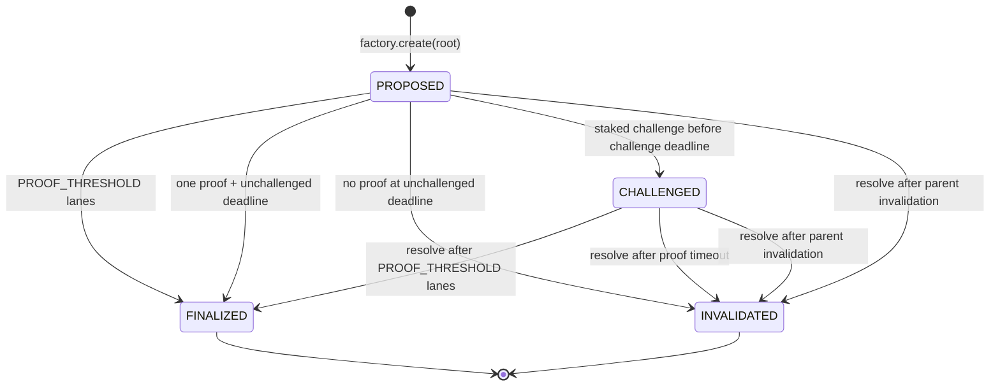

## Abstract

We outline an OP Stack dispute game in which a proposer posts an output root without embedding proof material in the factory identity. At least one configured proof lane must support the root during the initial one-day challenge window. If nobody challenges and a proof was submitted, the game may resolve in favor of the proposer; without a proof it resolves against the proposer. A challenge may be submitted whether or not the initial proof already exists and raises the requirement to two independent proof lanes by seven days from game creation. The stock `DisputeGameFactory`, `AnchorStateRegistry`, `OptimismPortal2`, and `DelayedWETH` remain responsible for game creation, claim validity, withdrawals, and bond custody.

## Motivation

The vanilla OP Stack fault-proof system inherits a multi-day challenge window for every proposal and routes every dispute through a single interactive fault-proof lane. Base's Azul proof system reduces that window when two heterogeneous proofs (TEE and ZK) agree, but still requires a proof on the common path and still rests final resolution on at most two lanes.

World Chain targets two properties that neither model provides together:

- **A stable factory identity.** Proof bytes are submitted to the created game rather than included in `extraData`, so the stock factory UUID remains predictable from the transition.
- **A cheap common path.** Only one configured proof lane is required when no staked participant objects to a root.
- **A diversified disputed path.** When a root is challenged, the proposer must defend it, and no single prover, TEE vendor, or council action can finalize that defense. At least two independent lanes must agree.

The result is fast finality in the common case and `n / m` threshold security in the dispute case.

## Specification

The key words "MUST", "MUST NOT", "REQUIRED", "SHALL", "SHALL NOT", "SHOULD", "SHOULD NOT", "RECOMMENDED", "NOT RECOMMENDED", "MAY", and "OPTIONAL" in this document are to be interpreted as described in [RFC 2119](https://www.rfc-editor.org/rfc/rfc2119) and [RFC 8174](https://www.rfc-editor.org/rfc/rfc8174).

### Constants

Protocol constants are fixed by this WIP and MUST NOT be changed without a new WIP.

| Name | Value | Meaning |
| --- | --- | --- |
| `PROOF_THRESHOLD` | `2` | Number of distinct proof lanes that MUST support a challenged root before it finalizes. |
| `PROOF_LANE_COUNT` | `3` | Number of configured proof lanes. |

### Activation Parameters

Activation parameters are set at hardfork activation and held as immutable values on the proof system contracts. They MAY be retuned only by a subsequent activation. All implementations MUST commit to these values in their deployed configuration and MUST NOT permit per-call overrides.

| Name | Initial Value | Meaning |
| --- | --- | --- |
| `CHALLENGE_PERIOD` | `1 day` | Duration after proposal creation during which a staked participant MAY challenge a root and any party MAY submit the initial proof. Per-proposal `challengeDeadline = createdAt + CHALLENGE_PERIOD`. |
| `PROOF_PERIOD` | `7 days` | Duration after proposal creation during which the proposer MAY defend a challenged root by accumulating lane submissions toward `PROOF_THRESHOLD`. Per-proposal `proofDeadline = createdAt + PROOF_PERIOD`. `PROOF_PERIOD` MUST be greater than `CHALLENGE_PERIOD`. A challenged root that the proposer has not defended to `PROOF_THRESHOLD` by `proofDeadline` MUST be invalidated. |
| `PROPOSER_BOND` | TBD | ETH bond supplied to `DisputeGameFactory.create` and held as `DelayedWETH` credit by the game. Paid to the proposer after `DEFENDER_WINS`, to the challenger after a challenged proof timeout, to the configured protocol recipient after an unchallenged proof timeout, or refunded if the registry invalidates the game. It MUST exceed `CHALLENGE_FEE`, so successfully challenging an invalid root has a positive gross reward before transaction costs. |
| `CHALLENGER_BOND` | TBD | ETH bond supplied by the challenger and held as `DelayedWETH` credit by the game. The non-refundable `CHALLENGE_FEE` is deducted whenever a challenge is accepted; the remainder is paid to the proposer after a successful defense, to the challenger after proof timeout, or refunded if the registry invalidates the game. |
| `PROTOCOL_FEE_RECIPIENT` | TBD | Nonzero protocol-controlled recipient credited with the proposer bond when an unchallenged proposal expires without any valid proof lane and with `CHALLENGE_FEE` whenever a challenge is accepted. |
| `CHALLENGE_FEE` | TBD | Nonzero flat amount deducted from `CHALLENGER_BOND` whenever a challenge is accepted. It MUST NOT exceed `CHALLENGER_BOND` and MUST remain charged under both normal and refund settlement. |

### Proof Lanes

A challenged root finalizes only when at least `PROOF_THRESHOLD` distinct lanes support the same root commitment. Each lane counts at most once per root.

| Lane | Source | Submission |
| --- | --- | --- |
| `VALIDITY_PROOF` | A configured validity proof verifier (zkVM or SNARK). | Permissionless. |
| `TEE_ATTESTATION` | A registered TEE signer attesting to the transition. | Anyone MAY relay a valid signed attestation. |
| `SECURITY_COUNCIL` | A Security Council threshold signature or multisig action. | Council-controlled attestation. |

Multiple proofs from the same lane MUST NOT increase the threshold count.

### Root Commitments

The data bound by every proof and attestation is split into immutable domain configuration and per-game clone data. The implementation fixes the complete domain. Each proposal supplies that domain's hash in `extraData`, allowing the game to reject cross-domain proposals and ensuring that the factory UUID changes when the proof-system domain changes.

#### Proposal (per-proposal)

| Field | Source | Meaning |
| --- | --- | --- |
| `rootClaim` | Proposer | Claimed L2 output root, computed as in the [OP Stack output-root V1 encoding][op-output-root]. |
| `domainHash` | Proposer | Hash of the implementation's immutable domain. The game MUST reject a value that differs from its configured `domainHash`. |
| `l2BlockNumber` | Proposer | L2 block number for `rootClaim`, matching the [`l2BlockNumber` field of an OP Stack L2 output proposal][op-proposals]. |
| `parentRef` | Proposer | Address of the parent — the `AnchorStateRegistry` for the first proposal, otherwise the parent proposal. Same convention as the OP Stack [Fault Dispute Game `extraData` parent reference][op-dgi] and the parent reference encoded in Base Azul's `AggregateVerifier` extra-data layout (see [Base Azul proof system][base-azul]). The parent's `rootClaim` and `l2BlockNumber` are read from this reference rather than re-supplied. |
| `attempt` | Proposer | Retry nonce for the same transition. Attempt zero is the initial game; later attempts are permitted only after an eligible predecessor fails or is made obsolete by activation. |
| `l1OriginHash` | Factory | L1 origin hash captured at proposal creation. The proposer does not pass it as calldata; it is read via `blockhash()` or [EIP-2935][eip-2935] history and pinned by the factory, mirroring the OP Stack [`l1Head` snapshot at clone creation][op-dgi] that Base Azul inherits. |
| `l1OriginNumber` | Game | L1 block number paired with the factory-captured `l1OriginHash`. |

The proposer calls `DisputeGameFactory.create(gameType, rootClaim, extraData)`, where:

```text
extraData = abi.encode(domainHash, l2BlockNumber, parentRef, attempt)
```

[op-output-root]: https://specs.optimism.io/protocol/proposals.html#l2-output-commitment-construction
[op-proposals]: https://specs.optimism.io/protocol/proposals.html
[op-fdg]: https://specs.optimism.io/fault-proof/stage-one/fault-dispute-game.html
[op-dgi]: https://specs.optimism.io/fault-proof/stage-one/dispute-game-interface.html
[base-azul]: https://docs.base.org/base-chain/specs/protocol/proofs/contracts
[base-azul-extradata]: https://docs.base.org/base-chain/specs/protocol/proofs/contracts#game-extra-data
[base-azul-l1head]: https://docs.base.org/base-chain/specs/protocol/proofs/contracts#clone-arguments
[eip-2935]: https://eips.ethereum.org/EIPS/eip-2935

#### Domain (verifier-immutable)

| Field | Meaning |
| --- | --- |
| `chainId` | World Chain L2 chain ID. |
| `proofSystemVersion` | Version of this proof system's proof-domain encoding. |
| `rollupConfigHash` | Hash of the rollup configuration and World Chain hardfork schedule. |
| `blockInterval` | Distance in L2 blocks between a parent root and a proposed root. |

These values are set once on the game implementation (analogous to Base's `CONFIG_HASH`, `L2_CHAIN_ID`, and `BLOCK_INTERVAL` immutables). Their hash is supplied in each game's `extraData` and MUST equal the implementation's immutable `domainHash`. Lane-specific constants, such as the active TEE image hash and validity-proof program key, live in the lane verifiers and are committed to by those lanes' proof material.

#### Canonical identifiers

The contracts use two related identifiers:

- `gameUUID` is the stock `DisputeGameFactory` lookup key. It commits to `gameType`, `rootClaim`, and the complete `extraData`, but excludes the factory-captured L1 origin.
- `rootId` is the proof-bound commitment. It includes the factory-captured L1 origin and is the value every proof lane MUST bind to.

The contract computes:

```text
domainHash = keccak256(abi.encode(
    chainId,
    proofSystemVersion,
    rollupConfigHash,
    blockInterval
))

extraData = abi.encode(
    domainHash,
    l2BlockNumber,
    parentRef,
    attempt
)

gameUUID = keccak256(abi.encodePacked(
    gameType,
    rootClaim,
    extraData
))

rootId = keccak256(abi.encode(
    domainHash,
    parentRef,
    rootClaim,
    l2BlockNumber,
    l1OriginHash,
    l1OriginNumber
))
```

The factory MUST reject duplicate games with the same `gameUUID`. All proofs and attestations MUST bind to `rootId`. A proof or attestation that binds to a different domain, parent, root, block range, or L1 origin MUST NOT be accepted for `rootId`.

### State Machine

The OP Stack lifecycle uses `GameStatus` for externally consumed resolution. The WIP-facing root states map onto it as follows:


```mermaid
stateDiagram-v2
    [*] --> PROPOSED: factory.create(root)
    PROPOSED --> FINALIZED: PROOF_THRESHOLD lanes
    PROPOSED --> FINALIZED: one proof + unchallenged deadline
    PROPOSED --> INVALIDATED: no proof at unchallenged deadline
    PROPOSED --> CHALLENGED: staked challenge before challenge deadline
    CHALLENGED --> FINALIZED: resolve after PROOF_THRESHOLD lanes
    CHALLENGED --> INVALIDATED: resolve after proof timeout
    PROPOSED --> INVALIDATED: resolve after parent invalidation
    CHALLENGED --> INVALIDATED: resolve after parent invalidation
    FINALIZED --> [*]
    INVALIDATED --> [*]
```

`FINALIZED` corresponds to `GameStatus.DEFENDER_WINS`; `INVALIDATED` corresponds to `GameStatus.CHALLENGER_WINS`. Game resolution alone does not make a claim withdrawable. The stock `AnchorStateRegistry` separately determines whether the game is proper, respected, beyond the finality delay, and claim-valid.

### Proposal Lifecycle

A root enters the system in the `PROPOSED` state.

1. The proposer calls the stock `DisputeGameFactory.create` with the WIP-1006 game type, `rootClaim`, and canonical `extraData`, supplying the configured initialization bond.
2. The factory creates a clone of the registered WIP-1006 implementation, captures the creator and L1 head, and calls `initialize`.
3. The game validates the domain, parent registration and eligibility, exact L2 block interval, retry predecessor, and bond.
4. The game records `createdAt = block.timestamp`, `challengeDeadline = createdAt + CHALLENGE_PERIOD`, and `proofDeadline = createdAt + PROOF_PERIOD`.
5. The proposer bond is deposited into `DelayedWETH`, and the root remains open to challenge until `challengeDeadline`.

Proof material MUST NOT be part of factory creation or `extraData`. After the game exists, any party MAY submit a valid configured proof lane before `challengeDeadline`. Offchain services MAY choose a preferred operational lane, but the onchain protocol MUST NOT privilege one lane for the initial proof.

An initial `attempt = 0` identifies the first game for a transition. A later attempt keeps the same `parentRef`, increments `attempt`, and MUST be accepted only after the preceding attempt enters a protocol-defined recovery case, such as a proof timeout or a game created before WIP-1006 became respected.

### Challenge Lifecycle

Any staked participant MAY challenge a proposed root before `challengeDeadline`, regardless of whether an initial proof lane already supports it. A challenge goes through optimistically: the challenger is not asked to prove that the root is invalid, and the challenge succeeds by default unless the proposer defends the root. The challenge raises the required support from one lane to `PROOF_THRESHOLD`.

The challenge transaction:

- MUST verify that the caller is currently staked according to the configured staking registry.
- MUST NOT require the caller to submit proof material.
- MUST require the caller to supply `CHALLENGER_BOND` as ETH and deposit it into the game's `DelayedWETH`;
- MUST irrevocably assign `CHALLENGE_FEE` of that bond to `PROTOCOL_FEE_RECIPIENT` in both normal and refund settlement modes;
- MUST mark the root as `CHALLENGED`.
- MUST record `challengedAt = block.timestamp` on the root the first time it transitions to `CHALLENGED`. The challenge MUST NOT change the `proofDeadline` recorded at proposal creation.

If the challenged root resolves in favor of the proposer, the proposer receives the proposer bond plus the challenger bond remainder. If it times out below threshold, the challenger receives the proposer bond plus its challenger bond remainder. The protocol receives `CHALLENGE_FEE` in either case. A game accepts only one challenger.

A challenge submitted at or after `challengeDeadline` MUST revert.

### Unchallenged Finality

An unchallenged root that reaches `PROOF_THRESHOLD` MAY resolve immediately with `DEFENDER_WINS`.
Otherwise, if no valid challenge has been submitted by `challengeDeadline`, anyone MAY call
`resolve()`. The game MUST resolve with `DEFENDER_WINS` when all of the following hold:

- the root is still `PROPOSED`;
- the parent is the anchor sentinel or has resolved with `DEFENDER_WINS`; and
- the parent is not blacklisted; and
- either at least `PROOF_THRESHOLD` configured lanes support `rootId`, or
  `block.timestamp >= challengeDeadline` and at least one configured lane supports `rootId`.

If no proof lane supports the root at `challengeDeadline`, the game MUST instead resolve with `CHALLENGER_WINS`, record proof timeout, and credit the proposer bond to the configured protocol recipient. This outcome MUST remain retryable even when no challenger exists.

A self-blacklisted, retired, unrespected, or otherwise improper game may still have `DEFENDER_WINS` status, but the registry MUST reject its claim and the game MUST use refund-mode bond settlement.

### Proposer Defense and Challenged Finality

Once a root is challenged, the burden of proof rests with the **proposer**, who MUST defend the root by establishing its validity. A challenged root MUST NOT finalize merely because time has elapsed. It finalizes only when the proposer's defense assembles support from at least `PROOF_THRESHOLD` distinct proof lanes for the root, and only if the threshold is met before `proofDeadline`.

Defending the root is the proposer's responsibility because the proposer's `PROPOSER_BOND` is forfeited if the root fails to reach the threshold. Lane submission itself remains permissionless — any party MAY relay a valid lane submission, and a proposer MAY coordinate independent provers, TEE signers, and the Security Council to do so — but the protocol assigns the economic responsibility for the defense to the proposer and to no other party.

Each root tracks a per-lane support set (the **proof bitmap**) with one bit per entry in [Proof Lanes](#proof-lanes). Each lane's bit is set at most once, so duplicate submissions from the same lane MUST NOT increase the threshold count.

For each lane submission, the contract MUST:

1. Verify that the game is still in progress.
2. Verify that `block.timestamp < challengeDeadline` when unchallenged, or `block.timestamp < proofDeadline` when challenged.
3. Verify that the proof or attestation binds to `rootId`.
4. Verify the proof or attestation according to the lane-specific verifier.
5. Set the lane's bit in the root's proof bitmap.
6. Emit a threshold-reached signal when the bitmap first contains at least `PROOF_THRESHOLD` distinct lanes.

A lane submission at or after its applicable deadline MUST revert. Once threshold is met, anyone MAY call `resolve()`, which MUST resolve the game with `DEFENDER_WINS` whether or not it was challenged.

If `block.timestamp >= proofDeadline` and the proof bitmap contains fewer than `PROOF_THRESHOLD` distinct lanes, anyone MAY call `resolve()`. The game MUST resolve with `CHALLENGER_WINS`, record proof timeout as the invalidation reason, and credit the proposer bond plus the challenger bond remainder to the challenger.

### Invalidity and Conflicts

Invalidation occurs either when a challenged root times out below threshold or when its parent is blacklisted or resolves with `CHALLENGER_WINS`. Parent invalidation MUST cascade before a descendant can resolve successfully. Because neither participant caused an ancestor failure, the descendant proposer bond and challenger bond remainder MUST be refunded. The challenge fee remains charged.

An invalidated root MUST NOT become claim-valid or update the anchor.

If invalidity of a finalized root is discovered after the fact — for example, via an offchain proof exhibiting a conflicting `(parent, l2BlockNumber) → rootId'` — the protocol MUST NOT silently roll back finalized state. The configured safety process MUST be triggered: pausing the proof game type, blacklisting the game, or routing the incident to governance.

### Lane-Specific Requirements

#### Validity Proof

The validity proof lane verifies that the transition from `parentRoot` at `parentL2BlockNumber` to `rootClaim` at `l2BlockNumber` is valid under `rollupConfigHash`. The verifier MAY be implemented with a zkVM, a SNARK, or another cryptographic proof system. The proof MUST bind to `rootId` and MUST be verified onchain or by an onchain verifier gateway.

#### TEE Attestation

The TEE lane accepts a signature from a registered TEE signer over transition data bound to `rootId`. Signer admission MUST verify the hardware attestation, approved image measurements, and attestation freshness before deriving and activating the signer's identity. For each proof, the lane verifier MUST check the transition binding, recover the signer from the signature, and require that signer to remain active in the registry. Revocation MUST prevent all subsequent proofs from that signer.

#### Security Council Attestation

The Security Council lane accepts a threshold signature, multisig transaction, or equivalent onchain action from the configured council. The attestation MUST bind to `rootId` and MUST be domain-separated from other council actions. A council attestation counts as one lane and MUST NOT finalize a challenged root by itself.

### Anchor Updates

Only claim-valid games may update the canonical anchor. The stock anchor registry MUST enforce:

- factory registration;
- respected-at-creation status;
- the dispute-game finality delay;
- `DEFENDER_WINS`;
- monotonically increasing L2 block numbers;
- rejection of games that are blacklisted, retired, or paused.

Blacklist, retirement, pause, and respected-game-type controls MUST remain gated by the stock OP guardian role. Anchor updates SHOULD be permissionless and self-validating. Failure to advance the anchor MUST NOT prevent an otherwise finalized game from closing or a claim-valid game from supporting a withdrawal.

### Bond Settlement

Resolution assigns normal-mode credits. After the stock dispute-game finality delay, anyone MAY call `closeGame()` to fix the bond distribution mode:

- `NORMAL` when `AnchorStateRegistry.isGameProper(game)` is true;
- `REFUND` when the game has been blacklisted, retired, or otherwise made improper.

Closing SHOULD attempt to advance the anchor but MUST treat an ineligible or stale anchor update as non-fatal. Credit claims MUST use the two-phase `DelayedWETH` flow: first unlock the recipient's credit, then withdraw it after the configured delay. Claiming MAY be permissionless, but funds MUST only be transferred to the credited recipient.

For every challenged game, `CHALLENGE_FEE` MUST be credited to `PROTOCOL_FEE_RECIPIENT` in both distribution modes. Blacklisting, retirement, invalid-parent resolution, and any other refund-mode outcome MUST NOT return that fee to the challenger.

### Portal Withdrawals

`OptimismPortal2.proveWithdrawalTransaction` selects a game by its stock factory index. The Portal MUST require the game to be proper and respected and MUST verify the output-root proof against the game's `rootClaim`. Withdrawal finalization occurs only after the proof-maturity delay and `AnchorStateRegistry.isGameClaimValid(game)` returns true. A game does not need to be the current anchor to support a withdrawal.

### Contract Interfaces

WIP-1006 is implemented as a new game type on the stock OP Stack dispute infrastructure. The game follows the canonical clone-with-immutable-args and `IDisputeGame` ABI while retaining World Chain-specific challenge and proof-lane behavior.

| Interface | Role | Reference |
| --- | --- | --- |
| `IDisputeGameFactory` | Stock OP factory; registers the WIP-1006 implementation, creates clones, indexes games by UUID and list index, and captures `l1Head`. | [`DisputeGameFactory`][base-factory] |
| `IDisputeGame` / `IMultiProofGame` | Per-proposal game; exposes the Portal-facing lifecycle and World Chain proof-lane extensions. | [`AggregateVerifier`][base-aggregate] |
| `IAnchorStateRegistry` | Stock OP registry; evaluates registration, respect, blacklist, retirement, finality, claim validity, and the current anchor. | [`AnchorStateRegistry`][base-anchor] |
| `IDelayedWETH` | Holds proposer and challenger bonds and enforces delayed two-phase credit withdrawal. | OP Stack `DelayedWETH`. |
| `IValidityProofVerifier` | Verifies the `VALIDITY_PROOF` lane against `rootId`. | [`ZKVerifier`][base-zk] |
| `ITEEVerifier` | Verifies the `TEE_ATTESTATION` lane against `rootId`. | [`TEEVerifier`][base-tee] |
| `ITEEProverRegistry` | Maintains accepted TEE signer identities, image hashes, and proposer allowlisting. | [`TEEProverRegistry`][base-tee-registry] |
| `ISecurityCouncil` | Submits and verifies `SECURITY_COUNCIL` attestations bound to `rootId`. | World Chain Security Council multisig. |
| `IStakingRegistry` | Checks challenger eligibility only. Bond custody and distribution remain in the game and `DelayedWETH`. | World Chain-specific; no Base analogue. |

[base-contracts]: https://docs.base.org/base-chain/specs/protocol/proofs/contracts
[base-factory]: https://docs.base.org/base-chain/specs/protocol/proofs/contracts#disputegamefactory
[base-aggregate]: https://docs.base.org/base-chain/specs/protocol/proofs/contracts#aggregateverifier
[base-anchor]: https://docs.base.org/base-chain/specs/protocol/proofs/contracts#anchorstateregistry
[base-zk]: https://docs.base.org/base-chain/specs/protocol/proofs/contracts#zkverifier
[base-tee]: https://docs.base.org/base-chain/specs/protocol/proofs/contracts#teeverifier
[base-tee-registry]: https://docs.base.org/base-chain/specs/protocol/proofs/contracts#teeproverregistry

## Backwards Compatibility

This proposal is implemented as a new World Chain game type registered on the existing OP Stack `DisputeGameFactory`. Existing output roots and Cannon-style games do not need to be reinterpreted. Activating the type consists of registering its implementation and initialization bond, then switching the stock `AnchorStateRegistry` respected game type after operational readiness.

The proposal data remains aligned with the OP Stack:

- `rootClaim` follows the [OP Stack output-root V1 encoding](https://specs.optimism.io/protocol/proposals.html#l2-output-commitment-construction).
- `l2BlockNumber` matches the [`l2BlockNumber` field of an L2 output proposal](https://specs.optimism.io/protocol/proposals.html).
- `parentRef` follows the [Fault Dispute Game `extraData` parent reference convention](https://specs.optimism.io/fault-proof/stage-one/dispute-game-interface.html) — the `AnchorStateRegistry` for the first proposal, otherwise the parent proposal address.
- `l1OriginHash` is factory-captured at proposal creation, matching the L1 head snapshot taken by `DisputeGameFactory` at clone creation.
- factory identity uses the canonical `(gameType, rootClaim, extraData)` UUID;
- `domainHash`, `l2BlockNumber`, `parentRef`, and `attempt` are encoded in `extraData`.

Offchain services MUST use the stock factory creation and lookup APIs plus the WIP-1006 game extensions. They do not require a custom factory or anchor registry. Proposers and defenders MAY reconstruct a selected lineage by looking up the expected transition from the current anchor; challengers use the factory index to inspect all games. A deployment MAY have its defender submit the TEE lane as the initial operational policy, but challenged games MUST still be escalated with an independent lane.

## Test Cases

Before this WIP can move beyond Draft, implementations SHOULD cover at least:

- a newly created game has no proof support and a factory UUID independent of later proof bytes;
- an unchallenged root with any one valid configured lane finalizes after exactly `CHALLENGE_PERIOD`;
- an unchallenged root with `PROOF_THRESHOLD` distinct lanes finalizes before `CHALLENGE_PERIOD`;
- an unchallenged proofless root invalidates after exactly `CHALLENGE_PERIOD`, forfeits its proposer bond to the configured protocol recipient, and can be retried;
- factory creation rejects an incorrect domain hash or malformed `extraData`;
- factory UUID lookup and `findLatestGames` preserve the complete WIP-1006 `extraData`;
- an unstaked account cannot challenge;
- a staked account can challenge without proof before the deadline;
- a staked account can challenge after an initial proof, and the game then requires `PROOF_THRESHOLD` lanes;
- a proposer that challenges its own valid game recovers at most both bonds minus `CHALLENGE_FEE`;
- normal-mode and refund-mode settlement both credit `CHALLENGE_FEE` to the protocol recipient;
- a challenge at or after the deadline reverts;
- a configuration where `proofDeadline <= challengeDeadline` is rejected;
- a challenged root with one supporting lane does not finalize;
- a proposer defends a challenged root to finalization with two distinct supporting lanes;
- a challenged root the proposer fails to defend to `PROOF_THRESHOLD` lanes by `proofDeadline` invalidates and forfeits `PROPOSER_BOND`;
- a lane submission at or after `proofDeadline` reverts and does not affect the proof bitmap;
- challenging a root does not change its creation-time `proofDeadline`;
- duplicate submissions from the same lane do not increase the threshold count;
- every proof lane rejects material that does not bind to `rootId`;
- parent invalidation cascades and refunds both descendant participants;
- retry attempts reject an ineligible predecessor and accept each specified recovery case;
- close and claim use normal mode for proper games and refund mode for blacklisted or retired games;
- Portal withdrawal proof and finalization accept a claim-valid WIP-1006 game and reject blacklisted, retired, unrespected, challenger-winning, or insufficiently mature games.

## Security Considerations

**Unchallenged-path safety relies on one proof lane.** Any single configured lane may support the common path. An invalid root can therefore finalize if one lane is compromised and no honest staked participant challenges it before `challengeDeadline`. A timely challenge escalates the game to the independent-lane threshold.

**Disputed-path safety depends on lane independence.** A false challenged finality requires two lanes to accept the same invalid root. Implementations MUST avoid shared signing keys, shared verifier keys, shared operator control, and shared offchain infrastructure across lanes, because any such sharing collapses the effective threshold below two.

**TEE trust assumptions live in one lane.** The TEE lane rests on the hardware vendor, the enclave image measurement, the registrar that admits signers, and the revocation process. Each of these is a potential single point of failure for that lane. The TEE lane is counted exactly once. Deployments MAY use it as their preferred initial proof, but a challenge MUST require an additional independent lane. A compromised registrar, stale signer set, or weakened image-measurement policy can turn this lane unsafe without affecting the other two.

**Security Council is a safety valve, not a finality mechanism.** Council signing keys, quorum rules, and action domains MUST be isolated from unrelated governance actions. A council attestation alone MUST NOT finalize a challenged root.

**`rootId` domain separation is critical.** Every lane MUST bind to the same `rootId`, and `rootId` itself MUST commit to `chainId`, `proofSystemVersion`, `rollupConfigHash`, and the parent/child block range. Missing domain separation allows replay across chains, hardfork schedules, game types, proof-system versions, or block ranges.

**`gameUUID` is not a proof target.** It exists for factory duplicate prevention and discovery. Proofs and attestations MUST bind to `rootId`, because the factory UUID does not include the L1 origin captured at game creation.

**Self-challenge bond recycling creates proof-amplification griefing.** A malicious proposer can create a consensus-valid game and challenge it through the same economic owner. Without a non-refundable charge, the owner recovers the nominal losing bond through the winning account while forcing third-party defenders to produce an additional proof lane. `CHALLENGE_FEE` makes that externalized proof burden carry a linear, unavoidable cost even if proposer and challenger collude. The fee deters but does not cryptographically prevent the attack, so its value MUST be calibrated against the marginal cost of the additional proof.

**Bond, fee, and stake calibration are security-critical.** If `CHALLENGER_BOND` or `CHALLENGE_FEE` is too cheap, attackers can grief honest roots into the slow path or force repeated proof work. If either is too expensive, honest watchers may fail to challenge invalid roots. A successful challenger earns `PROPOSER_BOND - CHALLENGE_FEE` before transaction costs, so `PROPOSER_BOND` MUST exceed the fee and SHOULD cover the challenger's expected execution costs with a meaningful safety margin. If `PROPOSER_BOND` is too cheap, invalid-proposal spam is cheap and honest challenges become uneconomical; if it is too expensive, only well-capitalized actors can propose, which centralizes the role. Exact economic parameters are out of scope for this WIP but MUST be tuned before mainnet deployment.

## Copyright

Copyright and related rights waived via [CC0](https://creativecommons.org/publicdomain/zero/1.0/).
