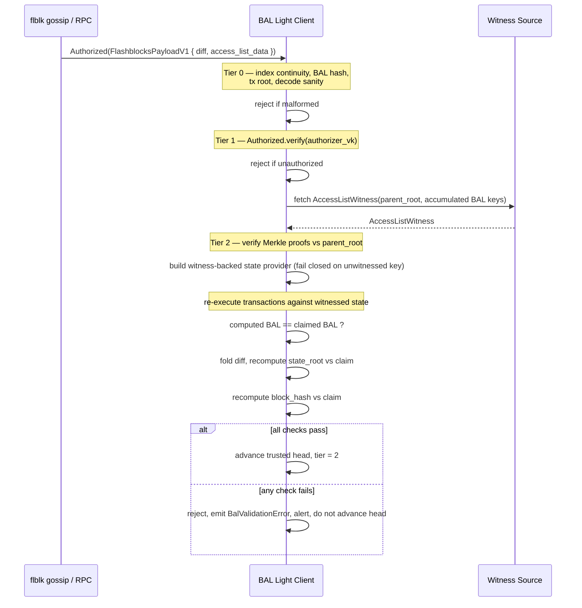

<!-- Status note for reviewers: first-pass Draft, not reviewed, no consensus. The interfaces marked "proposed" below (`AccessListWitness`, `WitnessedStateProvider`, the witness RPC) are sketches, not agreed interfaces — expect this document to change shape as the Open Questions in the Rationale section get answered. Remove this comment once the WIP moves to Review. -->

## Abstract

[WIP-1007][wip-1007] defines the Flashblock Access List (FBAL): a builder-produced [EIP-7928][eip-7928]-style Block Access List (BAL) attached to each flashblock pre-confirmation, letting a consumer reconstruct pre-state, execute in parallel, and derive the post-state root from the diff alone. Today the only consumer of that mechanism is a full node: it holds the parent state trie and uses the BAL to accelerate and cross-check execution it is already capable of doing on its own.

This WIP specifies a **stateless BAL light client**: a verifier that holds no account or storage state at all, and instead validates a claimed block or in-flight flashblock using (a) a trusted parent header, (b) the gossiped or fetched BAL, (c) the flashblocks P2P signature scheme already defined in [`p2p.md`][fbal-p2p], and, for full validity assurance, (d) a compact Merkle witness proving the BAL's pre-state values against the parent's state root. It defines three verification tiers of increasing cost and increasing guarantee, so an implementer can pick the tier that matches their trust requirement — a wallet surfacing pre-confirmation status has a different bar than a bridge relayer requiring cryptographic validity.

## Motivation

Every consumer of World Chain state today is either a full node (holds state, can execute) or a client that blindly trusts an RPC provider's response. There is no middle tier: something that can independently catch a lying or buggy sequencer/builder/RPC provider without the cost of syncing and maintaining full state. The BAL primitives WIP-1007 introduced already exist for a different purpose (accelerating full-node re-execution); this WIP repurposes them for trust-minimized light verification, following the same trajectory as Ethereum L1's stateless-client roadmap — EIP-7928 was designed with exactly this class of client in mind.

Concretely this unlocks:

- Wallets and bridges that want to react to pre-confirmations (flashblocks) with a cryptographic floor under "the sequencer said so" — today the Flashblocks P2P Authorization scheme (`p2p.md`) is the only check a consumer can perform.
- RPC aggregators / multi-provider clients that want to cross-check a provider's returned block against the network's flashblock gossip without running `world-chain reth` themselves.
- Monitoring and alerting on builder misbehavior (BAL/state-root mismatches) from a lightweight sidecar process rather than instrumenting the validator's hot path.

## Specification

The key words "MUST", "MUST NOT", "REQUIRED", "SHALL", "SHALL NOT", "SHOULD", "SHOULD NOT", "RECOMMENDED", "NOT RECOMMENDED", "MAY", and "OPTIONAL" in this document are to be interpreted as described in [RFC 2119](https://www.rfc-editor.org/rfc/rfc2119) and [RFC 8174](https://www.rfc-editor.org/rfc/rfc8174).

### Terminology

Inherited from WIP-1007 and `p2p.md`/`p2p_v2.md`: Sequencer, Block Builder, Rollup-Boost, Authorizer, Publisher, `flblk` protocol, Flashblock Access List (FBAL), `block_access_index`.

New terms introduced by this WIP:

- **Access List Witness (ALW)** — a proposed (not yet implemented) Merkle-Patricia multiproof covering every `(address, slot)` referenced by a BAL, anchored at a specific state root.
- **Verification tier** — one of three escalating levels of assurance a light client can achieve (Tier 0/1/2, defined below).
- **Sparse / witness-backed state provider** — an in-memory state view populated only from a verified witness, used to run the EVM without full state.

### Threat Model and Verification Tiers

A BAL by itself proves nothing about correctness — it is a claim, shaped like a diff, made by whoever signed it. Two independent things establish trust in that claim:

1. **Who signed it** — the flashblocks Authorization/Authorized double-signature scheme (`p2p.md`), or, once a block is canonical, the fact that the block's header itself commits to the BAL's hash.
2. **Whether the diff is the correct output of executing the block's transactions against the real parent state** — this can only be established by re-executing against state that is cryptographically tied to the parent's state root. A BAL hash matching a signature or a header field says nothing about this; it only says the signer did not change their story after signing.

Conflating these two is the main way a "BAL light client" becomes a false sense of security. This WIP keeps them separate as three explicit tiers, and an implementation MUST report which tier it achieved for a given block/flashblock rather than a single boolean "valid":

| Tier | Name | Requires | Proves | Does not prove |
|---|---|---|---|---|
| 0 | Structural self-consistency | Nothing beyond the gossiped/fetched data itself | The message is internally well-formed (indices contiguous, roots match declared bytes, hash fields match declared contents) | Authenticity or correctness |
| 1 | Authorization-bound / header-bound | Tier 0 + known authorizer/builder keys (pre-confirmation), or a trusted canonical header (finalized) | The BAL is the one the sequencer-authorized builder signed, or the one the canonical header commits to | That the BAL is a correct state transition — a colluding or buggy builder can sign or seal an internally-consistent but wrong diff |
| 2 | Witness-verified stateless execution | Tier 1 + an Access List Witness anchored at a trusted parent state root | The claimed diff is byte-identical to the diff produced by actually re-executing the block's transactions against proven parent state, and applying that diff reconstructs the claimed state root | Nothing beyond standard EVM/consensus assumptions — this is full validity |

Tier 0/1 failures MUST be treated as hard rejects (something is cryptographically broken or inconsistent). A Tier 2 failure on an already Tier-1-authorized message means an authorized builder signed something wrong — the same signal a full validator would reject on (`BalValidationError::BalHashMismatch` / `StateRootMismatch`) — and an implementation MUST treat it identically (reject, alert, do not build on it), even though a light client cannot itself punish the offending builder.

### Trust Anchors and Assumptions

This WIP does not define how the light client obtains a trusted parent header in the first place — that is a separate, harder problem (an L2 consensus/checkpoint light client, or bridging L1 finality through the OP Stack derivation pipeline). An implementation MUST use one of the following trust-anchor sources:

- **Checkpoint + signature trust (pre-confirmation-latency clients):** the client is configured with the current authorizer public key (rollup-boost's key, per `p2p.md`) and a recent trusted header (checkpoint sync, social trust, or a prior Tier-2-verified block). It MUST advance its trusted header forward only via Tier-2-verified blocks.
- **Derivation-anchored trust (finality-latency clients):** the client follows canonical, safe/finalized L2 headers via an OP Stack derivation light client (out of scope here) and performs Tier 1/2 BAL checks only against those.

Either way, the BAL light client's job starts at "I have a header I trust; is this claimed next block/flashblock a valid continuation of it?" — it is a fraud detector layered on top of a header source, not a replacement for one.

### Data Structures

#### Existing (defined by WIP-1007 and current implementation, not redefined here)

- `FlashblockAccessList { changes: List[AccountChanges], min_tx_index, max_tx_index }` and `FlashblockAccessListData { access_list, access_list_hash }`, per WIP-1007. `access_list_hash = keccak256(rlp(access_list))` hashes the whole `FlashblockAccessList` wrapper, including `min_tx_index`/`max_tx_index` — a World Chain-specific per-flashblock commitment, distinct from the EIP-7928 protocol-level `compute_block_access_list_hash(BlockAccessList)` used for a full block's header field.
- `AccountChanges { address, storage_changes, storage_reads, balance_changes, nonce_changes, code_changes }`, per EIP-7928 / WIP-1007's canonical form. `storage_reads` matters as much as the write fields for a light client: any slot listed there MUST be provable even though it never changes, because a re-execution check needs its value to run the EVM at all.
- `block_access_index`, per WIP-1007's [Block Access Index Semantics][wip-1007-index].
- `Authorization` / `Authorized` — the double ed25519-signature envelope (`p2p.md`) that every gossiped flashblock, including its `access_list_data`, rides inside.
- `header.block_access_list_hash` — populated once the Amsterdam hardfork (EIP-7928 activation) is live. **Caveat, load-bearing for this WIP:** per WIP-1007's [Block reconstruction][wip-1007-reconstruction] section, a header reconstructed purely from gossiped flashblocks currently always sets this field to the `EMPTY_BLOCK_ACCESS_LIST_HASH` placeholder — the real value is only known once the sequencer seals the block and the executor-derived BAL is assembled into the canonical header. A light client MUST NOT attempt Tier-1 header-hash verification before that seal; before sealing, Tier 1 trust for flashblocks comes from the Authorization/Authorized signatures over `FlashblockAccessListData.access_list_hash`, not from the header.

#### Proposed: Access List Witness

Not present in the codebase today. A minimal multiproof sufficient to verify, against a specific state root, every leaf a BAL either reads or writes:

```text
AccessListWitness {
    state_root:          B256,                          // root this witness proves against
    account_proof_nodes: List[Bytes],                    // deduplicated account-trie proof nodes
    accounts:            Map[Address, Option[Account]],  // pre-state leaves; None = did not exist
    storage_proofs:      Map[Address, StorageWitness],   // per-account storage proofs
    bytecode:            Map[B256, Bytes],                // code needed by CALL/DELEGATECALL targets
}

StorageWitness {
    storage_root: B256,
    proof_nodes:  List[Bytes],
    slots:        Map[U256, U256],
}
```

This is deliberately shaped like the standard `eth_getProof` multiproof format (account proof + storage proofs), batched across every account the BAL names, rather than a bespoke format, so it MAY be produced by extending existing trie-proof code paths rather than inventing a new one.

#### Proposed: Witness-Backed State Provider

An adapter satisfying exactly enough of a state-read surface (basic account, storage, bytecode-by-hash) to run the EVM, backed only by a verified `AccessListWitness`. It MUST verify every proof in the witness against `witness.state_root` before it is usable, and MUST fail closed: any read for a key the witness did not cover MUST return an explicit error, never a silent default (e.g. zero balance, empty storage). This is the single most important normative property in this WIP — a permissive default here silently turns Tier 2 back into Tier 1, because it would let execution proceed on an unproven value.

### Tier 0 — Structural Self-Consistency

An implementation MUST run the following checks on every flashblock/block before any other processing; they require no state and no witness.

1. **Index continuity.** `FlashblocksPayloadV1.index` MUST be exactly the next contiguous index for the payload_id; the first flashblock for a payload MUST carry `base`, subsequent ones MUST NOT.
2. **BAL index bounds.** `access_list.min_tx_index` MUST equal the running transaction offset, and `access_list.max_tx_index` MUST equal `min_tx_index + len(transactions)` (plus one for the trailing system transaction), per WIP-1007.
3. **Access list hash.** The implementation MUST recompute `access_list_hash(access_list)` and reject if it does not equal `access_list_data.access_list_hash`.
4. **Transactions root.** The implementation MUST recompute the ordered transaction trie root over the raw transaction bytes and reject if it does not match the block's `transactions_root` once reconstructed.
5. **Decode sanity.** Every transaction MUST decode (2718) and recover a signer; the implementation MUST reject on any decode/recovery failure rather than skipping the entry.

Failing any Tier 0 check means the message is malformed, not merely untrusted, and MUST be a hard reject.

### Tier 1 — Authorization / Header Binding

**In-flight flashblocks:** the implementation MUST verify `Authorized::verify(authorizer_vk)` — both the authorizer's signature over `(payload_id, timestamp, builder_vk)` and the builder's signature over `(msg, authorization)` — and MUST verify `authorization.payload_id` matches `FlashblocksPayloadV1.payload_id` and the timestamp is within the freshness bound `p2p.md` defines. This establishes that the currently sequencer-authorized builder signed exactly this BAL; it does not establish the BAL is correct.

**Finalized blocks (post-Amsterdam):** the implementation MUST recompute `compute_block_access_list_hash(bal)` over the full block's `BlockAccessList` and compare to `header.block_access_list_hash`. This check is only meaningful once the header itself is trusted as canonical (see [Trust Anchors](#trust-anchors-and-assumptions)); it lets a light client bind a fetched/gossiped BAL to a header it already trusts by a different means, without needing the flashblocks signature scheme once finality is reached.

### Tier 2 — Witness-Verified Stateless Execution

This is the tier that catches a builder that signs a wrong-but-well-formed diff. An implementation claiming Tier 2 MUST perform all of the following and MUST reject if any step fails:

1. **Obtain an Access List Witness** anchored at the trusted parent state root, covering every `(address, slot)` in the accumulated BAL up to the target flashblock index (see [Multi-Flashblock Accumulation](#multi-flashblock-accumulation)).
2. **Verify the witness.** Check every account/storage Merkle proof against `witness.state_root`, and check `witness.state_root == trusted_parent.state_root`. Construct the witness-backed state provider only after this succeeds.
3. **Re-execute.** Run the real block executor against the witnessed state, transaction by transaction, using the same per-transaction `block_access_index` bookkeeping WIP-1007 defines, with the witness-backed provider standing in for a live trie-backed database.
4. **Diff equality.** Compare the BAL the re-execution actually produced, field-for-field (or hash-for-hash), to the claimed BAL. Any mismatch is a validity failure equivalent to `BalValidationError::BalHashMismatch`.
5. **Root reconstruction.** Because step 4 already proved the claimed diff is byte-identical to the real diff, fold it onto the witnessed pre-state leaves and recompute the new state root using the witness's proof nodes — a partial/sparse trie update over only the touched paths. Compare to the claimed `state_root`.
6. **Block hash.** Reassemble the header with the now-verified `state_root` and compare the resulting hash to the claimed `block_hash`.

Any failure at steps 2, 4, 5, or 6 means the authorized builder signed a wrong state transition. An implementation MUST report it as a validity failure and MUST NOT fall back to trusting the claimed values.



### Multi-Flashblock Accumulation

A block is built as a sequence of flashblocks, each a diff over the previous one's speculative state, not over the last sealed block directly. A stateless light client MUST anchor its witness at the last sealed block's state root, not at a prior flashblock's speculative root, and extend it as later flashblocks reference new keys:

1. On flashblock index 0 for a payload, the client MUST request a witness covering that flashblock's BAL keys, anchored at `parent.state_root` (the last sealed block).
2. On flashblock index *n > 0*, the client MUST take the union of all `(address, slot)` keys across flashblocks `0..=n`. If the witness already held covers all of them, no new fetch is needed; otherwise the client MUST request a witness extension for only the newly referenced keys, still anchored at the same `parent.state_root`.
3. Re-execution at flashblock index *n* MUST replay committed transactions `0..n` plus the new flashblock's transactions against the original witnessed pre-state — always the true parent, never an intermediate flashblock's speculative state.

This keeps every verification anchored to a single, once-verified root per block, instead of building a chain of trust across speculative intermediate states that could compound witness/verification bugs.

### New Interfaces

This WIP requires two building blocks that do not exist yet:

1. **`flashblocks_getAccessListWitness(payload_id, upto_index, keys?)` RPC** — pull-based, served by any full node (validator or builder) that already holds the state needed to produce Merkle proofs. `keys` lets a light client request only an extension (see above) rather than the full witness each time. This is the minimum viable interface and SHOULD be implemented first.
2. **Persisted BAL for finalized blocks.** The existing `eth_blockAccessList` RPC recomputes the BAL by re-executing the entire block against parent state on every call; it is not a stored artifact. The BAL for a finalized block is, however, already computed exactly once at build time and briefly held in-process before being discarded. For Tier 1/2 verification of historical (non-tip) blocks to be viable without re-execution on every serving node, the produced BAL SHOULD be persisted alongside the block (or in a companion sidecar store, analogous to how L1 blob sidecars are retained for a window) rather than only ever recomputed on demand. This is flagged as an open question below rather than resolved here — it is a storage/retention design decision, not a light-client-side one.

A future optimization (not required for a first version) would push witnesses over `flblk` alongside the flashblock payload itself, so Tier 2 verification can happen within the flashblock cadence instead of requiring a round trip per flashblock. An implementation SHOULD start with the pull RPC and add push only if latency numbers demand it.

### Configuration Parameters

| Parameter | Default | Description |
|---|---|---|
| `witness_fetch_timeout` | 200ms | Deadline for a single `flashblocks_getAccessListWitness` call at chain tip |
| `witness_fetch_timeout_historical` | 5s | Deadline for historical (non-tip) witness/BAL fetches |
| `witness_fetch_max_retries` | 3 | Bounded retry count with exponential backoff + jitter |
| `witness_source_circuit_breaker_threshold` | 5 consecutive failures | Failures before a witness source is temporarily skipped |
| `witness_source_circuit_breaker_cooldown` | 30s | Cooldown before retrying a circuit-broken witness source |
| `max_witness_items` | 4x the BAL's own declared item count | Upper bound on accepted witness size before proof verification begins |
| `authorization_timestamp_skew` | consistent with `p2p.md`'s freshness check | Bound on Authorization timestamp staleness before rejecting as a replay |
| `enforcement_mode` | `observe` | `observe` (log/metric only) vs `enforce` (reject and refuse to advance on Tier 2 failure) — see [Rationale](#rollout) |

### Failure Handling and Observability

An implementation MUST treat every failure mode below as explicit, bounded, and observable — never a silent fallback to trusting unverified data.

- **Bounded timeouts and retries.** Witness and BAL fetches MUST use a bounded deadline (`witness_fetch_timeout`/`witness_fetch_timeout_historical`) with exponential backoff and jitter on retry, capped at `witness_fetch_max_retries`. A timed-out or exhausted fetch MUST degrade — the client reports "Tier 0/1 only, Tier 2 unavailable" for that block — rather than blocking indefinitely or silently skipping verification.
- **Circuit breaking on witness sources.** If a witness-serving peer/RPC repeatedly times out or returns proofs that fail verification, the client MUST stop sending it further requests for `witness_source_circuit_breaker_cooldown` and fail over to an alternate source, rather than retry-storm a degraded dependency.
- **Fail closed on unwitnessed keys.** Any EVM read outside the witness's coverage MUST be a hard verification failure, never a zero-value default.
- **Structured telemetry.** Every verification attempt SHOULD emit, at minimum: payload_id/block number, tier achieved, tier attempted, failure class (`timeout`, `witness_proof_invalid`, `bal_hash_mismatch`, `state_root_mismatch`, `block_hash_mismatch`, `unauthorized`), witness source identity, and per-stage latency (witness fetch, proof verification, re-execution, root reconstruction). Use metrics for steady-state tier/latency/failure-class counters; reserve logs for the specific mismatch details of a rejected block.
- **No hidden acceptance.** A block/flashblock that only reaches Tier 0 or Tier 1 MUST NOT be surfaced to a caller as "verified" without qualifying which tier — callers needing Tier 2 guarantees (e.g. a bridge relayer) MUST be able to distinguish "unauthorized data, rejected" from "authorized but not yet cryptographically checked" from "cryptographically verified."

## Rationale

**Why three tiers instead of one pass/fail check.** Collapsing Tier 0/1/2 into a single "valid" boolean is the main way this design could mislead an integrator. A hash check against a signature, and a hash check against a header field, are cheap and catch tampering-in-transit, but neither touches whether the underlying execution was correct — only re-execution against proven state does. Keeping the tiers explicit forces every consumer to state which guarantee they actually need, rather than assuming "the light client said valid" means the strongest guarantee is in effect.

**Why anchor witnesses at the last sealed block, not an intermediate flashblock.** Anchoring at a prior flashblock's speculative post-state would let verification errors compound across a chain of unproven intermediate roots. Anchoring every witness at the one root that is independently trusted (the last sealed block) keeps each block's verification a single, self-contained check, at the cost of replaying all of a block's committed transactions on each new flashblock rather than only the newest one — the same trade-off the existing full-node validator already makes.

**Why a pull RPC before a push/gossip extension.** A witness-serving RPC is enough to validate the design and measure real latency before committing to a new P2P message type and its authorization/DoS surface. This mirrors the project's own incremental approach to `p2p_v2.md` (ship v1 broadcast, then optimize fanout once it is a measured problem).

**Why the witness format mirrors `eth_getProof`.** Reusing the standard account-proof-plus-storage-proof shape, batched across every BAL-referenced account, means a witness-serving node can extend existing trie-proof code paths instead of inventing a new proof format from scratch.

### Rollout

Tier 2 verification is new, security-critical logic that could reject legitimate blocks if buggy (a false-positive diff mismatch would incorrectly flag an honest builder). An implementation SHOULD roll out in three stages: (1) shadow mode — run Tier 2 against live traffic without acting on the result, compared against a full validator node's independent verdict, until disagreement is zero over a soak period; (2) enforce behind a kill switch that can be flipped back to observe-only without a redeploy; (3) gradual exposure — internal monitoring consumers first, then informational UI, then high-stakes consumers (bridge/relayer logic) last, each gated on the previous stage showing zero false positives.

### Open Questions

- **No persisted BAL store.** `eth_blockAccessList` recomputes via full re-execution rather than serving a stored artifact. This is fine for tip verification (the BAL is fresh in the gossip stream) but makes historical Tier 1/2 verification expensive for whichever node serves it. This needs a storage/retention decision outside this WIP's scope before Tier 1/2 verification of historical blocks is practical.
- **`block_access_list_hash` placeholder in the pending-block reconstruction path.** As noted under [Data Structures](#data-structures), the P2P-reconstructed pending header currently always carries the `EMPTY_BLOCK_ACCESS_LIST_HASH` placeholder rather than a real value. Needs confirmation on whether this is intentional (pending blocks are inherently incomplete with respect to the full block's BAL) or worth wiring through once Amsterdam activates.
- **Witness generation cost on the serving side.** Producing an `AccessListWitness` requires the serving full node to walk the trie for every BAL key. This WIP specifies the client side only; the server-side cost/API design (batch proof generation, caching across requests for the same block) is separate follow-up work.
- **Root reconstruction algorithm detail.** Tier 2 step 5 ("recompute the new state root using the witness's proof nodes") is specified at the level of "a standard partial-trie update from a multiproof." The exact algorithm — particularly hash-embedded-vs-inline node encoding at the Merkle-Patricia boundary, and whether existing sparse-trie machinery can be reused rather than reimplemented — needs a follow-up design pass before implementation.
- **Verkle / Ethereum stateless-client alignment.** If World Chain ever inherits an Ethereum-L1-style Verkle state transition, the witness format above would need to change; the BAL layer and the tiered trust model should remain unaffected, since they are independent of the underlying trie's cryptographic construction.

## Backwards Compatibility

This WIP introduces no changes to the flashblock wire format defined by WIP-1007 — `FlashblockAccessList`/`FlashblockAccessListData` are consumed as-is. It adds one new optional RPC (`flashblocks_getAccessListWitness`) that existing nodes simply do not implement until they opt in; a light client that cannot reach a witness source degrades to Tier 0/1 rather than failing. No existing consumer's behavior changes as a result of this WIP.

## Security Considerations

**The witness is advisory until verified.** A light client MUST NOT construct a witness-backed state provider from an `AccessListWitness` whose proofs have not been checked against the target state root — an unverified witness is exactly as untrustworthy as an unverified BAL.

**Witness spam / resource exhaustion.** A malicious or buggy witness source could return a witness with a large number of proof nodes for a small BAL, or an internally inconsistent-but-large one designed to burn CPU during Merkle verification before failing. Implementations MUST bound witness size against the BAL's own declared key count before attempting proof verification, and MUST reject oversized witnesses outright.

**Unauthorized push.** If a future push-based witness/BAL gossip extension is added, it MUST NOT let unauthorized peers cause a light client to perform expensive verification work — the same authorization gate flashblocks already use (`p2p_v2.md`'s rule against unsolicited data delivery) applies.

**Distinguishing "invalid" from "unavailable".** A light client that cannot reach any witness source is in a degraded (Tier 0/1 only) state, not proof that a block is invalid. Alerting and UI MUST NOT conflate "we could not check" with "we checked and it is wrong" — these require very different operator/user responses.

**Builder equivocation across the flashblock chain.** A builder could sign two different flashblocks at the same index for the same payload_id before the network converges on `p2p_v2.md`'s single-publisher rule. Tier 1 alone does not catch this; a light client tracking accumulated state per payload_id SHOULD treat a second, conflicting, equally-well-authorized flashblock at the same index as a reason to distrust that payload_id entirely (reset accumulation) rather than picking one arbitrarily.

**Authenticity is inherited, not added, for Tier 0/1.** As with WIP-1007, this WIP adds no new trust assumption about who may publish flashblocks; Tier 1 relies entirely on the existing Flashblocks P2P authorization.

**This design does not replace slashing or punishment.** A light client can protect its own caller from acting on invalid data. It cannot itself penalize a misbehaving builder — that remains the responsibility of the full validator set and whatever economic mechanism, if any, is layered on top of full-node BAL validation.


[wip-1007]: ./wip-1007.md
[wip-1007-index]: ./wip-1007.md#block-access-index-semantics
[wip-1007-reconstruction]: ./wip-1007.md#block-reconstruction
[fbal-p2p]: ../specs/flashblocks/p2p.md
[eip-7928]: https://eips.ethereum.org/EIPS/eip-7928
